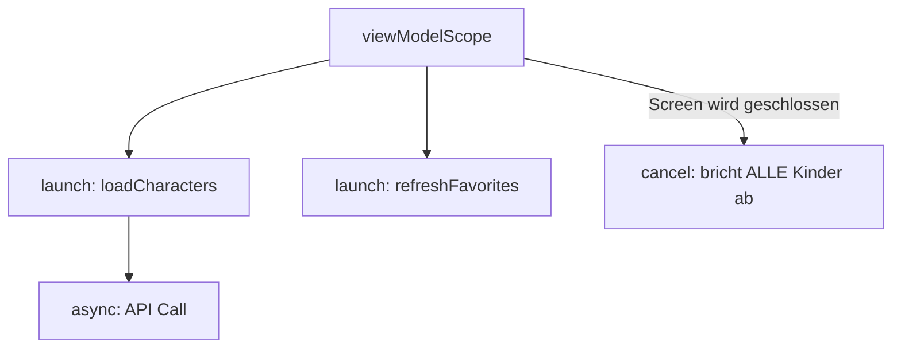
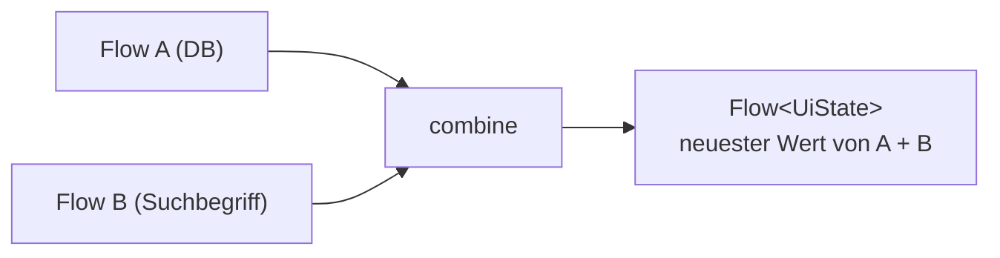
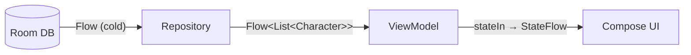
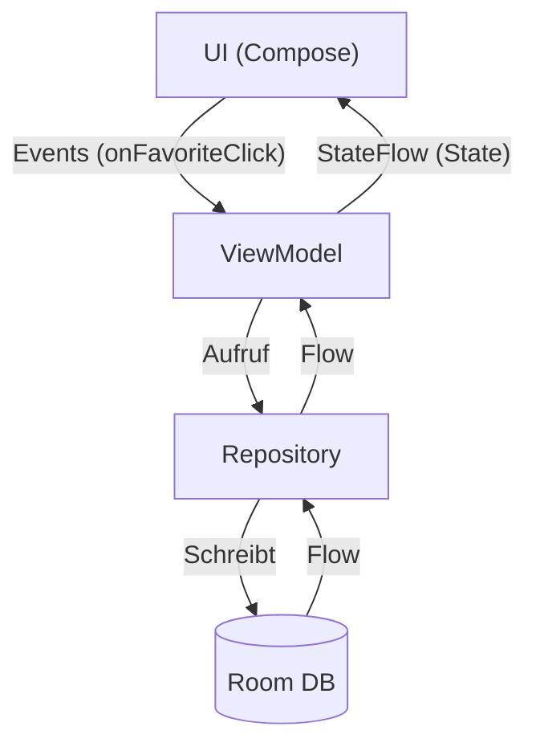
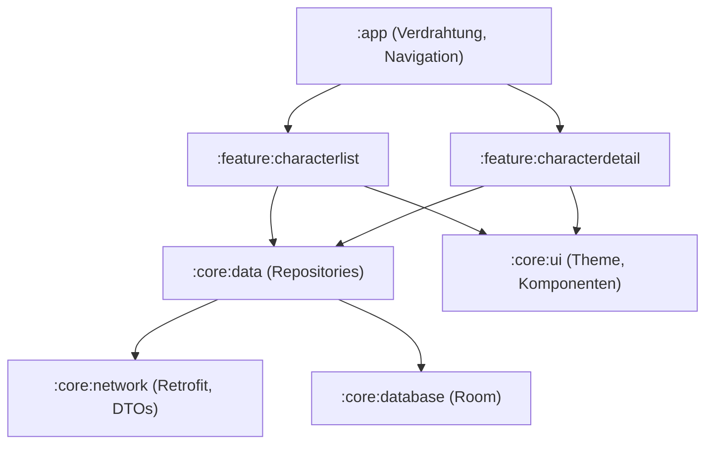
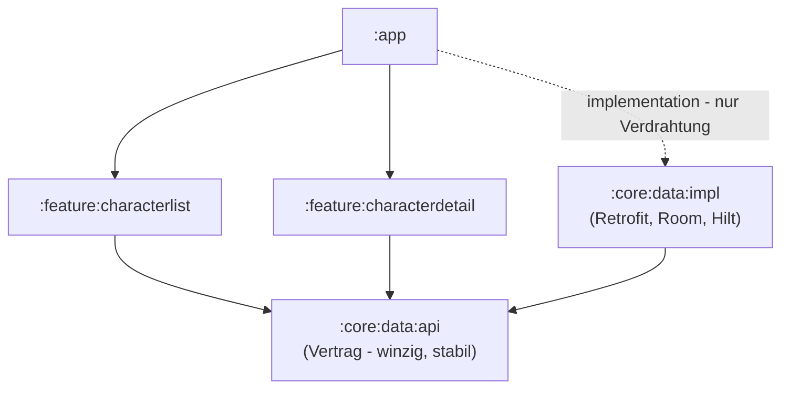
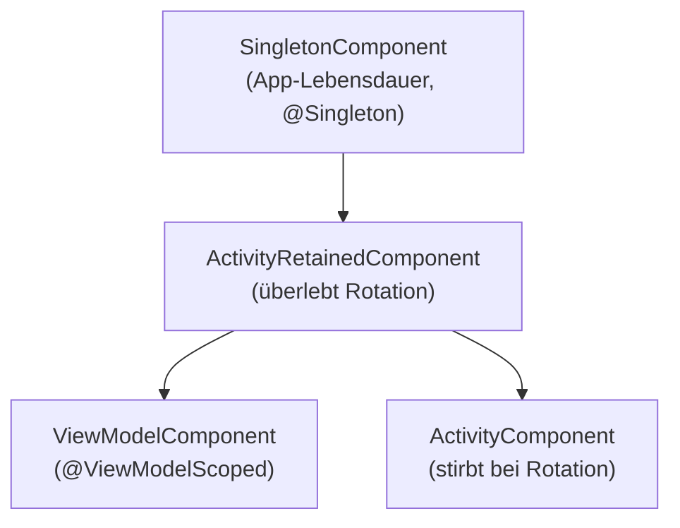
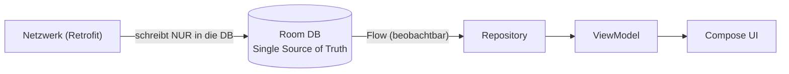
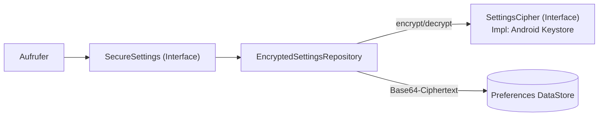

# Workshop: Advanced Android – Architektur für Enterprise-Projekte

## Einführung

Willkommen zurück! Im Einführungs-Workshop haben wir gemeinsam die **Rick & Morty App** gebaut: Compose UI, MVVM, StateFlow, Retrofit und Navigation 3. Die App funktioniert. Aber "funktioniert" heißt noch lange nicht "produktionsreif".

In diesem Workshop stellen wir die Frage, die in jedem Enterprise-Projekt irgendwann kommt: **Was passiert, wenn die App wächst?** Mehr Features, mehr Entwickler, mehr Teams, schlechtes Netz beim Kunden vor Ort. Genau dafür rüsten wir unsere App jetzt auf.

### Die Ausgangslage: Wo drückt der Schuh?

Unsere App aus dem Einführungs-Workshop hat drei Baustellen, die wir heute angehen:

1. **Manuelle Objekt-Erzeugung (`Dependencies.kt`):** Ein globales `object`, aus dem sich die ViewModels ihre Abhängigkeiten selbst holen. Das ist ein *Service Locator*. Bei 2 Screens funktioniert er noch, aber er skaliert nicht: versteckte Abhängigkeiten, keine Austauschbarkeit in Tests, keine Scopes.
2. **Kein lokaler Cache:** Jeder App-Start feuert einen Netzwerk-Request. Flugzeugmodus an? Die App zeigt nur noch eine Fehlermeldung. Für eine Enterprise-App (Außendienst, Lager, Keller-Meetingraum) ist das inakzeptabel.
3. **Ein Monolith:** Alles lebt in einem einzigen Gradle-Modul (`:app`). Architektur-Grenzen existieren nur als Package-Konvention, nichts hindert einen Screen daran, direkt Retrofit anzufassen.

### Die Agenda für Tag 1

| Block | Thema |
| --- | --- |
| Theorie | Kotlin-Idiome für Java-Entwickler (Modul 1) |
| Theorie | Asynchrone Programmierung: Coroutines & Flows (Modul 2) |
| Theorie | Modularisierung in Enterprise-Projekten (Modul 3) |
| Theorie | Dependency Injection mit Hilt (Modul 4) |
| Theorie | Offline-First-Strategien & SSOT (Modul 5) |
| **Praxis** | **Übung 1.1:** Vom Service Locator zu Hilt |
| **Praxis** | **Übung 1.2:** Lokaler Daten-Cache & Offline-First Repository mit Room |
| **Praxis** | **Übung 1.3:** Den Monolithen modularisieren |

> **Hinweis zur Arbeitsweise:** Wie im letzten Workshop gilt: Die Aufgabenstellung der aktuellen Übung steht immer im `README.md` des Branches, auf dem Sie gerade arbeiten. Der jeweils nächste Branch enthält die Musterlösung und gleichzeitig die Aufgabenstellung für die nächste Übung.

---

# Tag 1: Modularisierung, Dependency Injection & Offline-First

## Modul 1: Kotlin-Idiome für Java-Entwickler

Die Grundlagen (`val`/`var`, Null Safety, `data class`, Lambdas) kennen wir bereits. In diesem Modul geht es um die Idiome, die Kotlin-Code von "Java mit anderer Syntax" unterscheiden und uns in den heutigen Übungen ständig begegnen werden.

### 1.1 Extension Functions: Das Ende der Util-Klassen

**Das Problem (Java):**
Wir wollen eine fremde Klasse (z.B. `String` oder eine Library-Klasse) um eine Funktion erweitern. In Java landet so etwas in `StringUtils`, `DateHelper` & Co.: statische Methoden-Friedhöfe, die niemand findet.

```java
// Java: utility class graveyard
public class StringUtils {
    public static String capitalizeWords(String input) { ... }
}
StringUtils.capitalizeWords(name); // Who knows this class exists?
```

**Die Lösung (Kotlin):**
Wir "docken" die Funktion direkt an den Typ an. Der Aufruf sieht aus wie eine echte Methode, inklusive Autocomplete!

```kotlin
// Extension function on String
fun String.capitalizeWords(): String =
    split(" ").joinToString(" ") { it.replaceFirstChar(Char::uppercase) }

// Reads like a built-in method
"rick sanchez".capitalizeWords() // "Rick Sanchez"
```

**Wo wir das schon nutzen:**
Unser Mapping von DTO zu Domain-Modell ist eine Extension Function:

```kotlin
fun CharacterDto.toDomain(): Character = Character(id = id, name = name, ...)
```

> **Faustregel:**
> Extension Functions ändern die Klasse **nicht** (kein Zugriff auf `private`). Unter der Haube sind sie schlicht statische Funktionen mit besserer Aufruf-Syntax. Aber genau die macht Code auffindbar und lesbar. Ihre Sichtbarkeit hängt dabei nicht an der erweiterten Klasse, sondern am Deklarationsort: Eine `private`/`internal` Extension bleibt ein Implementierungsdetail ihrer Datei bzw. ihres Moduls. Mapping-Funktionen (`toDomain()`, `toEntity()`, `toUiModel()`) sind der klassische Anwendungsfall in der Datenschicht.

### 1.2 Null Safety für Java-Senioren: Die Interop-Falle

Die Grundwerkzeuge (`String?`, `?.`, `?:`, `let`) kennen wir aus dem Einführungs-Workshop. Im Enterprise-Alltag (mit gewachsenem Java-Code nebenan) gibt es aber drei Themen, die dort nicht vorkamen:

**1. Platform Types – wenn Java-Code ins Spiel kommt:**
Ruft Kotlin eine Java-Methode auf, kennt der Compiler die Nullability nicht: Der Typ ist ein *Platform Type* (in Fehlermeldungen als `String!` zu sehen). Der Compiler prüft dann nichts mehr; die NPE ist zurück im Spiel.

```kotlin
// LegacyUserService.java: public String getNickname() { return null; } // no annotation!
val nickname = legacyService.nickname   // Type is String! - compiler trusts blindly
nickname.length                         // Compiles fine. Crashes at runtime.
```

> **Faustregel:**
> Java-Code, der von Kotlin aus genutzt wird, mit `@Nullable` / `@NonNull` annotieren (JSR-305/JetBrains-Annotations), dann greift Kotlins Prüfung wieder. Bis dahin: Rückgaben aus unannotiertem Java-Code an der Grenze explizit in nullable Typen (`String?`) entgegennehmen und behandeln.

**2. `lateinit` für Framework-initialisierte Properties:**
Manche Properties *können* nicht im Konstruktor gesetzt werden (Field Injection in einer `Activity`, Test-Setup in `@Before`). Statt sie nullable zu machen und überall `?.` zu streuen:

```kotlin
@AndroidEntryPoint
class MainActivity : ComponentActivity() {
    @Inject lateinit var analytics: Analytics // set by Hilt before onCreate
}
```

Zugriff vor der Initialisierung wirft eine präzise `UninitializedPropertyAccessException` statt einer diffusen NPE. In unserem Workshop-Code brauchen wir das kaum, denn Constructor Injection (Modul 4) ist immer die bessere Wahl, wo sie möglich ist.

**3. `!!`, der Not-Aus-Schalter:**
Das Doppel-Ausrufezeichen wirft bei `null` sofort eine NPE. Er sagt: "Ich bin schlauer als der Compiler." Meistens stimmt das nicht.

```kotlin
// Smell: crashes with a meaningless stack trace
val character = cache[id]!!

// Better: crash with context...
val character = requireNotNull(cache[id]) { "Character $id not in cache" }

// ...or don't crash at all
val character = cache[id] ?: return
```

> **Faustregel:**
> `!!` ist in Code-Reviews ein rotes Tuch. Fast immer ist `?:` mit Default/Early-Return, `requireNotNull` mit Meldung oder ein besseres Datenmodell (Modul 5.5) die richtige Antwort.

### 1.3 Scope Functions: `let`, `run`, `apply`, `also`, `with`

Scope Functions führen einen Code-Block im "Kontext" eines Objekts aus. Sie unterscheiden sich in zwei Fragen: Wie heißt das Objekt im Block (`it` oder `this`)? Und was gibt der Block zurück (das Ergebnis oder das Objekt selbst)?

| Funktion | Objekt heißt | Rückgabe | Typischer Einsatz |
| --- | --- | --- | --- |
| `let` | `it` | Block-Ergebnis | Null-Check + Transformation |
| `run` | `this` | Block-Ergebnis | Objekt konfigurieren + Ergebnis berechnen |
| `with` | `this` | Block-Ergebnis | Mehrere Aufrufe auf einem Objekt bündeln |
| `apply` | `this` | **das Objekt** | Objekt-Konfiguration (Builder-Ersatz) |
| `also` | `it` | **das Objekt** | Seiteneffekte (z.B. Logging) in einer Kette |

```kotlin
// apply: configure and return the object (builder replacement)
val json = Json {
    ignoreUnknownKeys = true
}

// let: run only if not null, transform the value
val length = imageUrl?.let { loadImage(it) }

// also: side effect without breaking the chain
val characters = api.getCharacters()
    .also { Log.d("Repo", "Loaded ${it.results.size} characters") }
    .results
```

**Der Sonderling `with`:**
`with` ist die einzige Scope Function, die ihr Objekt als **Argument** bekommt. Alle anderen hängen als Extension daran. Es bündelt mehrere Zugriffe auf ein Objekt:

```kotlin
with(binding) {
    title.text = character.name
    status.text = character.status
    favorite.isVisible = character.isFavorite
}
```

`run` ist die Extension-Variante desselben Verhaltens (`this`-Kontext, Block-Ergebnis), deshalb gibt es `imageUrl?.run { ... }` für den Null-Fall, aber kein `?.with`.

Und für die Performance-Skeptiker unter den Java-Senioren: Alle fünf sind `inline`-Funktionen: Der Compiler setzt den Block direkt an der Aufrufstelle ein, zur Laufzeit existiert kein Lambda-Objekt. Scope Functions kosten nichts.

> **Faustregel:**
> Nicht übertreiben! Verschachtelte Scope Functions (`let` in `apply` in `run`) sind ein Anti-Pattern. Wenn `it` nicht mehr eindeutig ist: benannte Variable verwenden.

### 1.4 Delegation: `by lazy` & Co.

**Das Problem:**
Manche Objekte sind teuer in der Erzeugung (Datenbank, HTTP-Client). Wir wollen sie erst bauen, wenn sie wirklich gebraucht werden, aber ohne fehleranfälliges `if (instance == null)`-Geklapper (das in Java-Singletons gerne mal nicht thread-safe ist).

**Die Lösung (`by lazy`):**
Kotlin delegiert den Property-Zugriff an einen "Delegate", der die Initialisierung beim ersten Zugriff (thread-safe!) übernimmt.

```kotlin
// Created on FIRST access, cached afterwards, thread-safe by default
val retrofit: Retrofit by lazy {
    Retrofit.Builder()
        .baseUrl("https://rickandmortyapi.com/api/")
        .build()
}
```

*Feinjustierung für später: Die Thread-Sicherheit (Default `LazyThreadSafetyMode.SYNCHRONIZED`) kostet ein Lock pro Erstzugriff. Greift ohnehin nur der Main Thread zu (typisch bei UI-nahen Properties), spart `by lazy(LazyThreadSafetyMode.NONE) { ... }` die Synchronisation.*

**Das Prinzip dahinter (`by`):**
Das Keyword `by` bedeutet: "Reiche Zugriffe auf dieses Property/Interface an ein anderes Objekt weiter." Das gibt es auch für ganze Interfaces (Composition statt Vererbung):

```kotlin
// Decorator: override ONE function, delegate the rest
class TimingAnalytics(private val delegate: Analytics) : Analytics by delegate {
    override fun log(event: String) {
        delegate.log("$event (${elapsed()}ms)")
    }
}
```

*Übrigens: `var count by remember { mutableStateOf(0) }` aus Compose ist genau dieses Sprachfeature.*

### 1.5 Collections: Deklarativ statt Schleifen

**Das Problem (Java, klassisch):**
Datenverarbeitung mit `for`-Schleifen und mutablen Zwischenlisten: viel Code, viel Platz für Off-by-One-Fehler. Die Java Streams API hat das verbessert, bleibt aber sperrig (`collect(Collectors.toList())`).

**Die Lösung (Kotlin):**
Collections haben die Operationen direkt als Funktionen. Kein `stream()`, kein `collect()`.

```kotlin
val aliveBySpecies: Map<String, List<Character>> = characters
    .filter { it.status == "Alive" }
    .sortedBy { it.name }
    .groupBy { it.species }

// Common in the data layer: List<Dto> -> List<Domain>
val domainModels = response.results.map { it.toDomain() }

// Lookup tables
val byId: Map<Int, Character> = characters.associateBy { it.id }
```

**Wichtig für Enterprise-Datenmengen – Sequences:**
Jede Operator-Stufe (`filter`, `map`, ...) erzeugt bei Listen eine **neue Zwischenliste**. Bei großen Datenmengen und langen Ketten lohnt sich `asSequence()`, dann wird (wie bei Java Streams) lazy und elementweise verarbeitet:

```kotlin
val result = hugeList.asSequence()
    .filter { it.isActive }
    .map { it.name }
    .take(10)
    .toList() // Terminal operation triggers the evaluation
```

> **Faustregel:**
> Erst lesbar (Listen-Operatoren), dann messen, dann optimieren (`asSequence`). Für unsere 20 Charaktere ist eine Sequence Overkill.

### 1.6 `object`, `companion object` & Top-Level: Wo ist `static`?

Kotlin hat kein `static`. Stattdessen:

*   **Top-Level-Funktionen:** Funktionen dürfen direkt in einer Datei leben, ohne Klasse drumherum. Perfekt für Mapper und Helfer.
*   **`object`:** Ein thread-sicheres Singleton in einer Zeile. Unser `Dependencies`-Objekt ist genau das.
*   **`companion object`:** "Statische" Member innerhalb einer Klasse (Konstanten, Factory-Funktionen).

```kotlin
class CharacterRepository {
    companion object {
        const val PAGE_SIZE = 20 // like: public static final int
    }
}
```

> **Vorsicht, Architektur-Falle:**
> `object` ist verführerisch einfach, und genau deshalb entstehen daraus globale Service Locator wie unser `Dependencies.kt`. Globale Singletons sind versteckter, geteilter Zustand. Warum das ein Problem ist und was die Alternative ist: Modul 4.

### 1.7 Explicit Backing Fields: Das Ende des Underscore-Duos

**Das Problem:**
Ein ViewModel soll seinen Zustand intern ändern dürfen, nach außen aber nur eine lesbare Sicht anbieten. Das klassische Idiom dafür (Sie finden es in praktisch jeder gewachsenen Android-Codebasis) braucht **zwei** Properties für **eine** Sache:

```kotlin
class CharacterListViewModel : ViewModel() {
    // Internal, mutable...
    private val _uiState = MutableStateFlow<CharacterListUiState>(CharacterListUiState.Loading)
    // ...and the public read-only view of the SAME state
    val uiState: StateFlow<CharacterListUiState> = _uiState.asStateFlow()

    fun retry() {
        _uiState.update { CharacterListUiState.Loading } // don't forget the underscore!
    }
}
```

Das funktioniert, ist aber eine Namenskonvention mit Unterstrich (die es in Kotlin sonst nirgends gibt), eine doppelte Deklaration und ein Property mehr, das in Code-Completion und Reviews Rauschen erzeugt.

**Die Lösung (Explicit Backing Fields, stabil seit Kotlin 2.4, kein Compiler-Flag mehr nötig):**
Ein Property darf jetzt ein **explizites Backing Field mit eigenem, mutablem Typ** deklarieren. Genau so steht es in unserem `CharacterListViewModel`:

```kotlin
class CharacterListViewModel : ViewModel() {
    // ONE property: public type StateFlow, backing field type MutableStateFlow
    val uiState: StateFlow<CharacterListUiState>
        field = MutableStateFlow<CharacterListUiState>(CharacterListUiState.Loading)

    fun retry() {
        // Inside the class, uiState resolves to the backing field -> mutable
        uiState.update { CharacterListUiState.Loading }
    }
}
```

Innerhalb der Klasse verhält sich `uiState` wie ein `MutableStateFlow`, außerhalb ist es ein `StateFlow`: exakt die Kapselung von vorher, nur ohne Unterstrich-Zwilling. Die Spielregeln: nur für `val` ohne eigenen Getter (nicht `open`, nicht delegiert), und der Typ des Fields muss ein Subtyp des Property-Typs sein.

> **Vorsicht, Inferenz-Falle:**
> Das Typargument `MutableStateFlow<CharacterListUiState>(...)` ist kein Zierrat: Der Typ des Fields wird aus dem **Initialisierer** inferiert, nicht aus dem Property-Typ. Ohne das Argument wäre das Field ein `MutableStateFlow<CharacterListUiState.Loading>`, und das erste `update` auf `Success` ein Compile-Fehler. (Beim Underscore-Duo galt übrigens exakt dasselbe.)

> **Faustregel:**
> Unser Workshop-Code nutzt durchgehend den neuen Stil. Das Underscore-Duo werden Sie trotzdem noch jahrelang in Bestandscode lesen. Sie sollten also beide Formen fließend beherrschen.

> **Dokumentation:** [kotlinlang.org/docs/properties.html#explicit-backing-fields](https://kotlinlang.org/docs/properties.html#explicit-backing-fields)

---

## Modul 2: Asynchrone Programmierung – Coroutines & Flows

Im Einführungs-Workshop haben wir gelernt: `suspend` + `viewModelScope.launch` = UI friert nicht ein. Jetzt schauen wir unter die Haube, denn in den heutigen Übungen arbeiten wir mit Threading-Regeln, parallelen Requests und reaktiven Datenströmen aus der Datenbank.

### 2.1 Structured Concurrency: Kein Thread geht verloren

**Das Problem (Java):**
`new Thread(...)`, `ExecutorService`, `CompletableFuture`: Gestartete Arbeit hat keinen Bezug zu ihrem Aufrufer. Schließt der User den Screen, läuft der Request weiter, schreibt ins Nichts oder crasht (Memory Leaks, Zombie-Callbacks).

**Die Lösung (Kotlin):**
Jede Coroutine lebt in einem **Scope** und hat damit einen **Eltern-Job**. Daraus folgt ein einfacher Vertrag:

1.  Wird der Scope beendet, werden **alle** Kinder abgebrochen (Cancellation).
2.  Ein Scope endet erst, wenn alle Kinder fertig sind.
3.  Fehler propagieren strukturiert nach oben, nichts verschwindet im Nirwana.



**Im ViewModel:** `viewModelScope` ist an den Lebenszyklus des ViewModels gebunden. Screen zu → ViewModel weg → alle laufenden Coroutinen sauber abgebrochen. Das haben wir bisher "einfach so" benutzt. Jetzt wissen wir, warum es kein Memory Leak gibt.

**Cancellation ist kooperativ:**
Eine Coroutine wird nicht "hart getötet". Sie prüft an jedem Suspension Point (`delay`, Netzwerk-Call, ...) ob sie abgebrochen wurde und wirft dann eine `CancellationException`. Abbrechen heißt dabei nicht töten: Auf dem Weg nach draußen laufen `finally`-Blöcke ganz normal: Die Coroutine darf ihre Ressourcen (offene Dateien, Transaktionen) noch aufräumen.

> **Faustregel:**
> Niemals `catch (e: Exception)` schreiben, ohne an Cancellation zu denken! Wer die `CancellationException` schluckt, sabotiert Structured Concurrency. Im Zweifel: `CancellationException` wieder werfen (rethrow).

```kotlin
try {
    repository.getCharacters()
} catch (e: CancellationException) {
    throw e // Never swallow cancellation!
} catch (e: Exception) {
    uiState.value = UiState.Error(e.message ?: "Unknown error")
}
```

### 2.2 Dispatchers: Wer arbeitet auf welchem Thread?

Ein **Dispatcher** entscheidet, auf welchem Thread(-Pool) eine Coroutine läuft:

*   **`Dispatchers.Main`:** Der UI-Thread. Hier läuft Compose. Nur für kurze, nicht-blockierende Arbeit: Bei 60 Bildern pro Sekunde bleiben pro Frame nur 16 ms, jede Blockade hier ist ein sichtbarer Ruckler.
*   **`Dispatchers.IO`:** Optimiert für *wartende* Operationen (Netzwerk, Datei, Datenbank). Großer Thread-Pool (64 Threads im Default).
*   **`Dispatchers.Default`:** Optimiert für *rechnende* Operationen (JSON-Parsing großer Dateien, Sortieren, Bildverarbeitung). Pool-Größe = CPU-Kerne.

**Thread-Wechsel mit `withContext`:**

```kotlin
suspend fun loadReport(): Report = withContext(Dispatchers.IO) {
    // Runs on the IO pool, caller suspends without blocking
    fileSystem.readReport()
}
```

**Die wichtigste Konvention – Main-Safety:**

> **Faustregel:**
> **Jede `suspend` Funktion muss "main-safe" sein**, also gefahrlos vom Main Thread aufrufbar. Der *Aufgerufene* wechselt den Dispatcher (via `withContext`), nicht der Aufrufer.
> Gute Nachricht: Retrofit und Room machen das automatisch richtig. Deshalb steht in unserem ViewModel-Code nirgendwo `Dispatchers.IO`, und das ist korrekt so.

### 2.3 Parallelität: `async` / `await`

`launch` ist "fire and forget". Wenn wir ein **Ergebnis** brauchen (und mehrere Ergebnisse parallel), nutzen wir `async`. Erst die naive Variante, bei der die Requests aufeinander warten:

```kotlin
// Sequential: ~2 x request time
viewModelScope.launch {
    val character = repository.getCharacter(1)
    val episodes = repository.getEpisodes(1)
    val screen = DetailData(character, episodes)
}
```

Dann dieselben Requests parallel:

```kotlin
// Parallel: ~1 x request time
viewModelScope.launch {
    val characterDeferred = async { repository.getCharacter(1) }
    val episodesDeferred = async { repository.getEpisodes(1) }
    val screen = DetailData(characterDeferred.await(), episodesDeferred.await())
}
```

Auch hier greift Structured Concurrency: Schlägt einer der `async`-Blöcke fehl, wird der andere automatisch mit abgebrochen.

Voraussetzung für die Parallelisierung: Die Aufrufe dürfen nicht voneinander abhängen. Braucht der zweite Request die ID aus dem ersten, bleibt es sequenziell, daran ändert auch `async` nichts.

> **Und wenn Geschwister *nicht* sterben sollen?**
> Manchmal ist das Mit-Abbrechen unerwünscht: Drei unabhängige Dashboard-Kacheln laden parallel, eine darf scheitern, ohne die anderen mitzureißen. Dafür gibt es `supervisorScope { }` (bzw. `SupervisorJob`): Der Fehler eines Kindes lässt die Geschwister weiterlaufen, jedes Kind behandelt sein Scheitern selbst. Structured Concurrency bleibt dabei intakt: Der Scope wartet weiterhin auf alle Kinder. Eine der häufigsten Fragen in echten Projekten, deshalb hier der Name zum Nachschlagen.

### 2.4 Flow: Datenströme statt Einzelwerte

**Das Problem:**
Eine `suspend fun` liefert **einen** Wert und ist fertig. Aber viele Datenquellen liefern **mehrere Werte über die Zeit**: Datenbank-Änderungen, Standort-Updates, Suchergebnisse während des Tippens. Genau das brauchen wir für Offline-First: *"Sag mir Bescheid, wann immer sich die gecachten Charaktere ändern."*

**Die Lösung (`Flow<T>`):**
Ein Flow ist ein **asynchroner Strom** von Werten, konzeptuell eine `List<T>`, deren Elemente nach und nach eintreffen.

```kotlin
// A cold flow: the block runs PER collector, on collect()
fun countdown(): Flow<Int> = flow {
    for (i in 3 downTo 1) {
        delay(1000)
        emit(i) // Push a value into the stream
    }
}

// Consuming (inside a coroutine):
countdown().collect { value -> println(value) } // 3... 2... 1
```

**Cold vs. Hot, der wichtigste Unterschied:**

*   **Cold (z.B. `flow { }`, Room-Queries):** Der Strom "läuft" erst, wenn jemand `collect` aufruft, und zwar für jeden Collector von vorne. Kein Collector = keine Arbeit.
*   **Hot (z.B. `StateFlow`, `SharedFlow`):** Der Strom existiert unabhängig von Collectors. Wer später dazukommt, verpasst ggf. frühere Werte (bzw. bekommt bei `StateFlow` den aktuellen Zustand).

**Operatoren (wie bei Collections, aber asynchron):**

```kotlin
characterDao.observeAll()                  // Flow<List<CharacterEntity>> from Room
    .map { entities -> entities.map { it.toDomain() } } // transform each emission
    .filter { it.isNotEmpty() }
    .collect { characters -> ... }
```

### 2.5 Flows kombinieren: `combine`

**Das Problem:**
Ein UI-Zustand speist sich selten aus nur *einer* Quelle. Typisch: Die Charaktere kommen aus der Datenbank, der "Refresh fehlgeschlagen"-Status aus dem Netzwerk-Pfad, ein Suchbegriff aus dem Textfeld. Drei Ströme, aber die UI braucht einen konsistenten Zustand.

**Die Lösung (`combine`):**
`combine` verschmilzt mehrere Flows zu einem neuen Flow. Der Transformations-Block läuft, sobald **irgendeiner** der Quell-Flows einen neuen Wert liefert, immer mit den jeweils letzten Werten aller Quellen. Eine Anlaufregel gehört dazu: Das **erste** Ergebnis kommt erst, wenn *jede* Quelle mindestens einen Wert geliefert hat. Ein `MutableStateFlow` mit Startwert (wie der Suchbegriff `""` unten) erfüllt das sofort.

```kotlin
val characters: Flow<List<Character>> = dao.observeAll().map { ... }
val searchQuery = MutableStateFlow("")

// Re-evaluates when EITHER the database changes OR the user types
val filtered: Flow<List<Character>> =
    combine(characters, searchQuery) { list, query ->
        list.filter { it.name.contains(query, ignoreCase = true) }
    }
```



**Verwandte Operatoren (zur Abgrenzung):**

*   **`combine`:** Feuert bei *jeder* Änderung *irgendeiner* Quelle, mit den letzten Werten aller Quellen. → Der Standard für UI State.
*   **`zip`:** Wartet auf ein *Paar* (Wert 1 von A + Wert 1 von B). → Selten in UIs.
*   **`flatMapLatest`:** Wechselt auf einen *neuen* Upstream-Flow, wenn die Quelle einen neuen Wert liefert (z.B. neue DB-Query pro Suchbegriff), und bricht den alten ab.

Wie wir mit `combine` unseren kompletten Listen-UI-State bauen, sehen wir in Modul 5.5.

### 2.6 StateFlow & `stateIn`: Vom kalten Strom zum UI State

Unser `MutableStateFlow` im ViewModel kennen wir schon: ein **hot** Flow mit genau einem aktuellen Wert, perfekt für UI State.

Neu ist heute die Gegenrichtung: Wir bekommen von Room einen **kalten** Flow und wollen ihn als StateFlow an die UI geben. Dafür gibt es `stateIn`:

```kotlin
val uiState: StateFlow<CharacterListUiState> = repository
    .observeCharacters()                          // cold Flow from the database
    .map { CharacterListUiState.Success(it) }     // map to UI state
    .stateIn(
        scope = viewModelScope,
        // Stop collecting 5s after the last subscriber left.
        // Survives configuration changes, stops when app is backgrounded.
        started = SharingStarted.WhileSubscribed(5.seconds),
        initialValue = CharacterListUiState.Loading
    )
```

**Warum die magischen 5 Sekunden?**
Bei einer Rotation verschwindet der Collector kurz (UI wird neu aufgebaut). Ohne Timeout würde der Upstream-Flow (die DB-Query) gestoppt und sofort neu gestartet. Mit 5 Sekunden Puffer überlebt er die Rotation; geht die App aber wirklich in den Hintergrund, wird gestoppt und Ressourcen gespart. Dieser Wert ist der offizielle Google-Standard. *(Zur Schreibweise: `5.seconds` ist eine `kotlin.time.Duration`: Die Duration-Overloads von `WhileSubscribed`, `delay` & Co. machen die Einheit im Code sichtbar, wo `5_000` nur eine nackte Zahl wäre. Der Import dazu: `kotlin.time.Duration.Companion.seconds`.)*

**In der UI ändert sich: nichts.**
`collectAsStateWithLifecycle()` funktioniert für beide Varianten (manuell gepflegter `MutableStateFlow` und `stateIn`) identisch.



### 2.7 Das große Ganze: Unidirectional Data Flow (UDF)

Alles aus diesem Modul fügt sich zu **einem** Architektur-Muster zusammen, das wir schon aus dem Einführungs-Workshop kennen, nur dass der Kreis jetzt reaktiv und vollständig ist:

*   **State fließt abwärts:** Repository → `Flow` → ViewModel (`combine` + `stateIn`) → `StateFlow` → `collectAsStateWithLifecycle()` → UI. Die UI ist eine reine Funktion dieses Zustands (`UI = f(State)`).
*   **Events fließen aufwärts:** Klick → ViewModel-Funktion → Repository → Datenquelle.



Das Entscheidende: **Es gibt keine Abkürzungen.** Ein Klick auf das Favoriten-Herz ändert nicht die UI. Er ändert die *Datenbank*, und die geänderte Datenbank ändert (über den Flow) die UI. Dadurch ist der Zustand an jeder Stelle vorhersagbar, reproduzierbar und testbar. Genau dieses Muster bauen wir in Übung 1.2.

> **Dokumentation:** [developer.android.com/kotlin/flow](https://developer.android.com/kotlin/flow) und [developer.android.com/develop/ui/compose/architecture#udf](https://developer.android.com/develop/ui/compose/architecture#udf)

---

## Modul 3: Modularisierung in Enterprise-Android-Projekten

### 3.1 Warum modularisieren?

Unsere App ist ein einziges Modul (`:app`). Für ein Workshop-Projekt: völlig okay. Aber in Enterprise-Projekten mit 30+ Entwicklern und Millionen Zeilen Code bricht der Monolith zusammen:

*   **Build-Zeiten:** Gradle kompiliert nur geänderte Module neu (und Module parallel). Im Monolith heißt jede Änderung: fast alles neu bauen.
*   **Ownership:** Team "Checkout" besitzt `:feature:checkout`. Klare Verantwortung, weniger Merge-Konflikte.
*   **Erzwungene Grenzen:** Im Monolith kann jede Klasse jede andere aufrufen, Architektur-Regeln sind nur Konvention. Modul-Grenzen macht der **Compiler** zur Regel: Was nicht als Dependency deklariert ist, ist unsichtbar.
*   **Wiederverwendung:** `:core:network` kann von der Phone-App, der Wear-App und dem internen Tool genutzt werden.

### 3.2 Der typische Modul-Schnitt

Bewährt hat sich die Aufteilung in drei Kategorien (vgl. Google's "Now in Android"-Projekt):



*   **`:app`**: dünne Schale (`Application`, `MainActivity`, Navigation). Kennt alle Features, verdrahtet sie.
*   **`:feature:*`**: je ein User-Facing-Feature (Screen + ViewModel). Features kennen sich **gegenseitig nicht**.
*   **`:core:*`**: geteilte Infrastruktur (Datenzugriff, Netzwerk, Datenbank, Design System).

**Die goldene Regel:** Abhängigkeiten zeigen nur nach "unten" (app → feature → core). Niemals feature → feature, niemals core → feature.

**`api` vs. `implementation`:**
In `build.gradle.kts` entscheidet das Konfigurationswort, ob eine Dependency an die Konsumenten des Moduls "durchsickert":

```kotlin
dependencies {
    // Consumers of :core:data do NOT see Room types -> faster builds, clean API
    implementation(projects.core.database)

    // Consumers DO see these types (part of our public API) -> use sparingly!
    api(projects.core.model)
}
```

*(Die Schreibweise `projects.core.model` sind Gradles typsichere **Project Accessors**, aktiviert per `enableFeaturePreview("TYPESAFE_PROJECT_ACCESSORS")` in der `settings.gradle.kts`, in unserem Projekt bereits geschehen. Semantisch identisch zu `project(":core:model")`, aber mit Autocomplete und Compile-Fehler statt Tippfehler im String.)*

> **Faustregel:**
> Standardmäßig immer `implementation`. `api` nur, wenn Typen der Dependency in der eigenen öffentlichen Schnittstelle auftauchen. Jedes unnötige `api` verlangsamt inkrementelle Builds im ganzen Projekt.

### 3.3 Der nächste Reifegrad: api- und impl-Module

**Das Problem (auch mit sauberem Schnitt):**
Selbst wenn `:feature:characterlist` nur per `implementation` an `:core:data` hängt, gilt: Das Feature hängt am **ganzen** Modul. Jede Änderung an der Datenbank-Implementierung (ein neuer Room-Converter, ein Retrofit-Interceptor) kompiliert alle Features neu. Und nichts hindert ein Feature daran, statt eines Interfaces direkt die konkrete Repository-Klasse zu benutzen: Sie ist ja `public` im selben Modul.

**Die Lösung (api/impl-Trennung):**
Enterprise-Projekte spalten solche Module in ein Paar:

*   **`:core:data:api`** enthält nur den **Vertrag**: Interfaces und die Typen ihrer Signaturen. Winzig, ändert sich selten.
*   **`:core:data:impl`** enthält die **Implementierung**: Retrofit, Room, Hilt-Bindings. Ändert sich oft, kennt `:api`.

Die Regeln:

1.  **Konsumenten (Features) hängen nur an `:api`.** Die Implementierung ist für sie nicht einmal mehr sichtbar: Dependency Inversion, vom Compiler erzwungen.
2.  **Nur `:app` hängt (per `implementation`) an `:impl`**, damit die Hilt-`@Binds` beim Zusammenbau auf dem Klassenpfad landen (Modul 4.4).



**Der Build-Gewinn:** Ändert sich `:impl`, bleiben die Features unberührt: Ihr Klassenpfad (`:api`) hat sich nicht bewegt. In großen Projekten ist das der Unterschied zwischen Sekunden und Minuten pro inkrementellem Build.

> **Faustregel:**
> Ein api/impl-Paar lohnt sich erst, **wenn es einen Vertrag gibt**: Ein api-Modul ohne Interface ist eine leere Hülle. Deshalb gehen wir in zwei Schritten vor: In **Übung 1.3** vollziehen wir den einfachen Modul-Schnitt (das Repository ist dort noch eine konkrete Klasse). Sobald in **Übung 2.2** das Repository-Interface existiert, ziehen wir das api/impl-Upgrade nach, und Module, die danach neu entstehen (`:core:analytics` in Übung 2.1, `:core:settings` in Übung 3.3), starten von Anfang an als Paar.

### 3.4 Convention Plugins: Build-Logik ohne Copy-Paste

**Das Problem:**
Modularisierung hat einen Preis, den 3.1 verschwiegen hat: Jedes Modul bringt eine eigene `build.gradle.kts` mit, und die sehen einander verdächtig ähnlich. `compileSdk`, `minSdk`, Java-Version, der immer gleiche Compose- und Hilt-Block: alles Copy-Paste. Die api/impl-Trennung aus 3.3 verdoppelt die Modulzahl dann noch einmal. Bei 40 Modulen heißt "wir heben auf compileSdk 38 an": 40 Dateien anfassen, und bei Datei 23 vertippt sich jemand. Dieser **Copy-Paste-Drift** ist in gewachsenen Projekten der Normalfall: Kein Mensch weiß mehr, ob `:core:legacy` absichtlich anders konfiguriert ist oder aus Versehen.

**Die Lösung (Convention Plugins):**
Gradle kann die eigenen Build-Konventionen als **eigenes kleines Plugin** ausdrücken, das im Projekt mitgeliefert wird, und zwar in einem *Included Build*, üblicherweise `build-logic` genannt:

```text
build-logic/
├── settings.gradle.kts     // sees the same libs.versions.toml
├── build.gradle.kts        // `kotlin-dsl` + AGP as dependency, registers the plugin IDs
└── src/main/kotlin/
    ├── AndroidLibraryConventionPlugin.kt
    └── AndroidFeatureConventionPlugin.kt
```

Eingebunden wird der Build in der `settings.gradle.kts` des Hauptprojekts:

```kotlin
pluginManagement {
    includeBuild("build-logic")
    // ...
}
```

Ein Convention Plugin ist eine ganz normale `Plugin<Project>`-Klasse: Sie wendet die "echten" Plugins an und setzt darauf unsere Hausregeln, an **einer** Stelle:

```kotlin
class AndroidLibraryConventionPlugin : Plugin<Project> {
    override fun apply(target: Project) = with(target) {
        pluginManager.apply("com.android.library")
        extensions.configure<LibraryExtension> {
            compileSdk {
                version = release(37)
            }
            defaultConfig {
                minSdk = 24
            }
            compileOptions {
                sourceCompatibility = JavaVersion.VERSION_11
                targetCompatibility = JavaVersion.VERSION_11
            }
        }
    }
}
```

Darauf bauen weitere Konventionen auf: Ein Feature-Convention-Plugin wendet das Library-Plugin an und ergänzt alles, was *jedes* Feature-Modul braucht: Compose, Hilt, die Standard-Dependencies.

Referenziert werden die eigenen Plugins genauso typsicher wie alle anderen: per `alias` über den Version Catalog. Dafür bekommen die IDs einen Eintrag in der `libs.versions.toml`, **ohne Version**: Der Code kommt aus dem Included Build, nicht aus einem Repository.

```toml
[plugins]
# Convention plugins from build-logic (no version - resolved from the included build)
rickandmorty-android-library = { id = "rickandmorty.android.library" }
rickandmorty-android-feature = { id = "rickandmorty.android.feature" }
```

Die `build.gradle.kts` eines Feature-Moduls schrumpft damit auf ihren tatsächlichen Informationsgehalt:

```kotlin
plugins {
    alias(libs.plugins.rickandmorty.android.feature)
}

android {
    namespace = "ninja.droiddojo.rickandmorty.feature.characterlist"
}

dependencies {
    // only what THIS module specifically needs
    implementation(projects.core.data)
}
```

**Der Effekt:** Ein neues Feature-Modul anlegen kostet drei Zeilen statt dreißig, und die Konvention selbst steht an genau einer Stelle. Das compileSdk-Upgrade für alle 40 Module ist wieder ein Ein-Zeilen-Commit. *(Falls Sie in älteren Projekten `buildSrc` für denselben Zweck finden: gleiche Idee, aber jede Änderung dort invalidiert den gesamten Build-Cache. Der Included Build ist heute der empfohlene Weg.)*

> **Faustregel:**
> Convention Plugins lohnen sich ab einer Handvoll Module: genau dann, wenn das zweite oder dritte Copy-Paste einer `build.gradle.kts` ansteht. Für `:app` lassen wir die Build-Datei dagegen klassisch: Ein Convention Plugin für genau *ein* Modul wäre Indirektion ohne Gewinn (anders, sobald mehrere App-Module existieren: Phone, Wear, internes Tool).

**Und bei uns?** Unsere Packages sind bereits entlang dieser Linien geschnitten (`character/data`, `character/list`, `character/detail`). In **Übung 1.3** vollziehen wir den Schnitt dann physisch und zerlegen die App in echte Gradle-Module. Dabei verdrahten Sie die Module zuerst von Hand (damit Sie den Boilerplate-Schmerz einmal selbst spüren) und refactoren die Build-Dateien anschließend auf zwei Convention Plugins: `rickandmorty.android.library` und `rickandmorty.android.feature`. Alle Module, die später entstehen (`:core:analytics` in Übung 2.1, `:core:settings` in Übung 3.3), starten dann von Anfang an im Convention-Stil. Vorher müssen wir aber eine Frage klären, an der jede Modularisierung sonst scheitert: *Wie kommen Objekte über Modul-Grenzen hinweg zueinander?* Das ist das Thema von Modul 4.

> **Dokumentation:** [developer.android.com/topic/modularization](https://developer.android.com/topic/modularization); zu Convention Plugins: [docs.gradle.org/current/samples/sample_convention_plugins.html](https://docs.gradle.org/current/samples/sample_convention_plugins.html) und als Referenz in groß das [build-logic von "Now in Android"](https://github.com/android/nowinandroid/tree/main/build-logic)

---

## Modul 4: Dependency Injection mit Hilt

### 4.1 Das Verdrahtungs-Problem: Vom Service Locator zur Dependency Injection

**Das Problem (unser Status Quo):**
Werfen wir einen ehrlichen Blick auf unseren Code:

```kotlin
// Dependencies.kt - a global service locator
object Dependencies {
    private val retrofit = Retrofit.Builder()...build()
    val characterRepository = CharacterRepository(retrofit.create())
}

// CharacterListViewModel.kt - the ViewModel serves itself
class CharacterListViewModel : ViewModel() {
    private val repository = Dependencies.characterRepository // hidden dependency!
}
```

Das nennt man einen **Service Locator**, und er hat vier handfeste Probleme:

1.  **Versteckte Abhängigkeiten:** Von außen (Konstruktor!) sieht niemand, dass das ViewModel ein Repository braucht. Man muss den Body lesen.
2.  **Nicht testbar:** Im Unit Test können wir `Dependencies.characterRepository` nicht durch einen Fake ersetzen: Das `object` ist hart verdrahtet (und zieht Retrofit gleich mit hoch).
3.  **Keine Scopes:** Alles lebt für immer (App-Lebensdauer). "Ein Objekt pro Screen" oder "pro User-Session" ist nicht abbildbar.
4.  **Skaliert nicht mit Modulen:** In einem modularen Projekt müsste jedes Modul das globale `object` kennen: eine Abhängigkeit von jedem Modul auf einen zentralen Gott-Klumpen. Genau das wollten wir mit Modularisierung verhindern.

**Die Lösung (Dependency Injection):**
Wir drehen den Spieß um (*Inversion of Control*): Eine Klasse **bekommt** ihre Abhängigkeiten von außen (sichtbar im Konstruktor), statt sie sich selbst zu besorgen.

```kotlin
// Dependencies are visible, replaceable, testable
class CharacterListViewModel(
    private val repository: CharacterRepository
) : ViewModel()
```

Das Prinzip ist trivial. Die Fleißarbeit ist die **Verdrahtung**: *Irgendjemand* muss Retrofit bauen, daraus das Api-Objekt, daraus das Repository, daraus das ViewModel, in der richtigen Reihenfolge und mit der richtigen Lebensdauer. Bei 5 Klassen geht das von Hand. Bei 500 nicht.

### 4.2 Hilt: DI als Framework

**Hilt** ist Googles Standard-DI-Framework für Android (aufgebaut auf *Dagger*). Es generiert den Verdrahtungs-Code **zur Compile-Zeit**: Fehler wie "diese Abhängigkeit kann niemand liefern" sind Compile-Fehler, keine Laufzeit-Crashes. (Das unterscheidet Hilt von Spring, das zur Laufzeit reflektiert. Auf einem Smartphone wäre das zu teuer.)

**Baustein 1: Die Annotationen zum Start**

```kotlin
// 1. Application class: birthplace of the DI graph
@HiltAndroidApp
class RickAndMortyApplication : Application()

// 2. Android entry points get access to the graph
@AndroidEntryPoint
class MainActivity : ComponentActivity()
```

*Nicht vergessen: Die Application-Klasse muss im `AndroidManifest.xml` unter `<application android:name=".RickAndMortyApplication">` registriert werden!*

**Baustein 2: Constructor Injection, der Normalfall**

Für eigene Klassen reicht ein `@Inject` am Konstruktor. Hilt weiß dann: "So baue ich dieses Objekt."

```kotlin
// @Singleton: exactly ONE instance for the whole app
@Singleton
class CharacterRepository @Inject constructor(
    private val api: RickAndMortyApi
)
```

`@Singleton` ist dabei keine Bau-, sondern eine Scoping-Anweisung: Ohne Scope-Annotation baut Hilt für jeden Injektionspunkt ein frisches Objekt: beim zustandsbehafteten Repository falsch, bei einem zustandslosen Mapper genau richtig.

**Baustein 3: Module für Klassen, die uns nicht gehören**

An den Konstruktor von `Retrofit` können wir kein `@Inject` schreiben (fremde Library, Builder-Pattern). Für solche Fälle schreiben wir "Rezepte" in ein Modul:

```kotlin
@Module
@InstallIn(SingletonComponent::class) // These recipes live app-wide
object NetworkModule {

    @Provides
    @Singleton
    fun provideRetrofit(): Retrofit =
        Retrofit.Builder()
            .baseUrl("https://rickandmortyapi.com/api/")
            .addConverterFactory(...)
            .build()

    @Provides
    @Singleton
    fun provideRickAndMortyApi(retrofit: Retrofit): RickAndMortyApi =
        retrofit.create() // Hilt passes retrofit in - recipes compose!
}
```

Beachten Sie die Eleganz: `provideRickAndMortyApi` deklariert `retrofit` einfach als Parameter. Hilt findet das passende Rezept und reicht es durch. Die Reihenfolge der Erzeugung managt der Graph.

**Baustein 3b: `@Binds` bindet Interfaces an Implementierungen**

Ein Interface hat keinen Konstruktor, an den man `@Inject` schreiben könnte. Wer ein Interface injiziert, bekommt von Dagger nur die Fehlermeldung `CharacterRepository cannot be provided without an @Provides-annotated method`. Ein `@Provides`-Rezept, das die Implementierung bloß durchreicht, würde funktionieren, wäre aber reine Zeremonie: Bauen kann Hilt die Implementierung ja längst selbst, über deren `@Inject constructor`. Für genau diesen Fall gibt es `@Binds`:

```kotlin
@Module
@InstallIn(SingletonComponent::class)
interface DataModule {

    @Binds
    fun bindCharacterRepository(impl: OfflineFirstCharacterRepository): CharacterRepository
}
```

Der Unterschied in einem Satz: **`@Provides` beschreibt, *wie* ein Objekt entsteht; `@Binds` nur, *welcher Typ welchen erfüllt*** (und generiert dafür nicht einmal eine Factory). Die Merkregel: **Parameter = Implementierung, Rückgabetyp = Interface, nie umgekehrt.** Statt des `interface`-Moduls funktioniert auch eine `abstract class` mit `abstract fun` identisch; Googles "Now in Android" nutzt die Interface-Form.

*(Vorgriff: Unser `CharacterRepository` ist an Tag 1 noch eine konkrete Klasse; das Interface samt `OfflineFirstCharacterRepository` ziehen wir in Übung 2.2 ein. `@Binds` begegnet uns in Modul 7.3 und 8.1 wieder.)*

**Baustein 4: ViewModels**

```kotlin
@HiltViewModel
class CharacterListViewModel @Inject constructor(
    private val repository: CharacterRepository
) : ViewModel()
```

```kotlin
// In the composable: hiltViewModel() instead of viewModel()
import androidx.hilt.lifecycle.viewmodel.compose.hiltViewModel

@Composable
fun CharacterListScreen(
    viewModel: CharacterListViewModel = hiltViewModel(),
    ...
)
```

> **Hinweis zum Import:** `hiltViewModel()` kommt aus dem Artefakt `androidx.hilt:hilt-lifecycle-viewmodel-compose`. (Bis Version 1.3 lag die Funktion in `hilt-navigation-compose` unter `androidx.hilt.navigation.compose`, seit 1.4 lebt sie navigationsunabhängig, was perfekt zu Nav 3 passt.)

**Baustein 5: Assisted Injection für Laufzeit-Parameter**

Unser `CharacterDetailViewModel` braucht neben dem Repository (kommt aus dem Graphen) eine `id` (kommt zur **Laufzeit** aus der Navigation). Dafür gibt es *Assisted Injection*, und unsere handgeschriebene `ViewModelProvider.Factory` fliegt raus:

```kotlin
@HiltViewModel(assistedFactory = CharacterDetailViewModel.Factory::class)
class CharacterDetailViewModel @AssistedInject constructor(
    private val repository: CharacterRepository, // from the Hilt graph
    @Assisted private val id: Int,               // provided at call time
) : ViewModel() {

    @AssistedFactory
    interface Factory {
        fun create(id: Int): CharacterDetailViewModel
    }
}
```

```kotlin
// At the navigation entry:
entry<CharacterDetailRoute> { key ->
    CharacterDetailScreen(
        viewModel = hiltViewModel<CharacterDetailViewModel, CharacterDetailViewModel.Factory>(
            creationCallback = { factory -> factory.create(key.id) }
        ),
        ...
    )
}
```

### 4.3 Komponenten & Scopes: Die Landkarte

Hilt organisiert Objekte in einer Hierarchie von Komponenten, jede mit eigener Lebensdauer:



Wann stirbt was?

| Komponente | Scope-Annotation | Lebt bis … |
| --- | --- | --- |
| `SingletonComponent` | `@Singleton` | zum Ende des Prozesses |
| `ActivityRetainedComponent` | `@ActivityRetainedScoped` | die Activity *endgültig* endet, überlebt Rotation |
| `ViewModelComponent` | `@ViewModelScoped` | `onCleared()` des ViewModels |
| `ActivityComponent` | `@ActivityScoped` | die Activity-Instanz stirbt, also bei **jeder** Rotation |

> **Vorsicht, klassischer Fehlgriff:**
> Zustand ins `ActivityComponent` scopen und sich wundern, dass er die Rotation nicht überlebt. Was Rotation überleben soll, gehört in den `ActivityRetained`- oder `ViewModel`-Scope.

Für uns heute relevant: `SingletonComponent` (Retrofit, Repository, später die Datenbank) und ViewModels.

### 4.4 Hilt im modularen Projekt

Hier schließt sich der Kreis zu Modul 3, denn im modularen Projekt zahlt sich Hilt doppelt aus: Jedes Gradle-Modul bringt seine eigenen `@Module`-Rezepte mit (`:core:network` das `NetworkModule`, `:core:database` das `DatabaseModule`). Beim Kompilieren der App sammelt Hilt automatisch alle Rezepte aus allen Modulen ein und baut den Gesamtgraphen. Kein zentraler Gott-Klumpen: Jedes Modul bleibt für seine eigene Verdrahtung verantwortlich, und `:app` muss nur noch die Hilt-Plugins aktivieren. In api/impl-getrennten Projekten (Modul 3.3) heißt das konkret: Die `@Binds`-Rezepte wohnen im `:impl`-Modul, und `:app` ist die einzige Stelle, die die `:impl`-Module per `implementation` in den Graphen hebt.

Genau dieses Zusammenspiel erleben wir in den Übungen in beide Richtungen: In **Übung 1.1** führen wir Hilt im Monolithen ein, in **Übung 1.3** ziehen die `@Module`-Rezepte dann mit ihren Schichten in eigene Gradle-Module um, ohne dass sich an den ViewModels irgendetwas ändert.

> **Zwei Hilt-Werkzeuge zum Vormerken** (brauchen wir im Workshop nicht, im Enterprise-Alltag garantiert):
> *   **`@EntryPoint`:** Der saubere Zugang zum Hilt-Graphen aus Klassen, die Hilt nicht selbst instanziiert (`ContentProvider`, manche `WorkManager`-Setups). Statt zum Service Locator zurückzufallen, definiert man ein kleines Interface als getypten Einstiegspunkt.
> *   **Multibindings (`@IntoSet` / `@IntoMap`):** Mehrere Implementierungen desselben Interfaces als `Set` injizieren: das Plugin-Muster im DI-Graphen. Klassiker: mehrere Analytics-Tracker oder OkHttp-Interceptors, bei denen jedes Modul per `@Binds @IntoSet` seinen Beitrag liefert, ohne dass irgendwo eine zentrale Liste gepflegt wird.

> **Dokumentation:** [developer.android.com/training/dependency-injection/hilt-android](https://developer.android.com/training/dependency-injection/hilt-android)

---

## Modul 5: Offline-First-Strategien

### 5.1 Warum Offline-First?

**Das Problem (unser Status Quo):**
Unsere App ist **online-only**. Der Datenfluss: UI → ViewModel → Repository → API. Ohne Netz: Fehlermeldung, leere App.

Im echten Leben ist das Netz aber keine Konstante, sondern ein Spektrum: Fahrstuhl, ICE-Funkloch, Lagerhalle, Roaming, überlasteter Messe-Hotspot. Enterprise-Nutzer (Außendienst, Logistik, Pflege) arbeiten oft *gerade dann*, wenn kein Netz da ist.

**Die Lösung (Offline-First):**
Wir drehen die Standard-Annahme um: Die App arbeitet **primär gegen eine lokale Datenbank**. Das Netzwerk ist nur noch der Mechanismus, der diese Datenbank aktualisiert.

*   **Verfügbarkeit:** App startet immer mit Inhalt, auch im Flugzeugmodus.
*   **Geschwindigkeit:** Lokale Reads sind in Millisekunden da. Die UI fühlt sich sofort an, das Netz lädt im Hintergrund nach.
*   **Weniger Traffic:** Nicht bei jedem Screen-Aufruf die identischen 20 Charaktere neu laden.

### 5.2 Das SSOT-Prinzip: Single Source of Truth

Die zentrale Design-Entscheidung: **Es gibt genau eine Quelle der Wahrheit, und das ist die lokale Datenbank.**



Die Regeln:

1.  **Die UI liest niemals direkt aus dem Netzwerk.** Sie beobachtet (Flow!) ausschließlich die Datenbank.
2.  **Das Netzwerk schreibt niemals in die UI.** Ein erfolgreicher API-Call aktualisiert die Datenbank, fertig.
3.  Die UI aktualisiert sich dann **von selbst**, weil sie die Datenbank beobachtet.

**Warum ist das so mächtig?**
Der Lese-Pfad (DB → UI) und der Schreib-Pfad (API → DB) sind **entkoppelt**. Es gibt keinen Zustand "Netzwerkdaten und Cache-Daten widersprechen sich in der UI" mehr: Die UI zeigt immer das, was in der DB steht. Fehlerbehandlung wird trivial: Schlägt der Refresh fehl, bleiben einfach die alten Daten sichtbar.

**Zwei getrennte Operationen im Repository:**

```kotlin
class CharacterRepository @Inject constructor(
    private val api: RickAndMortyApi,
    private val dao: CharacterDao,
) {
    // READ path: observe the database (never suspends, never fails)
    fun observeCharacters(): Flow<List<Character>> =
        dao.observeAll().map { entities -> entities.map { it.toDomain() } }

    // WRITE path: network -> database (can fail, caller decides how to react)
    suspend fun refreshCharacters() {
        val characters = api.getCharacters().results
        dao.upsertAll(characters.map { it.toEntity() })
    }
}
```

> **Faustregel:**
> **Beobachten und Aktualisieren sind zwei getrennte Funktionen.** Eine Funktion, die "erst Cache, dann Netzwerk, dann irgendwas" zurückgibt, vermischt die Pfade wieder, genau das wollen wir nicht.

### 5.3 Cache-Strategien im Überblick

Offline-First ist ein Spektrum. Die gängigen Stufen:

| Strategie | Verhalten | Aufwand |
| --- | --- | --- |
| **HTTP-Cache** (OkHttp) | Antworten werden nach Cache-Headern wiederverwendet | Minimal, aber unzuverlässig (Server muss mitspielen) |
| **Cache-then-Network (SSOT)** | DB sofort anzeigen, parallel Refresh, DB-Update fließt automatisch in die UI | Mittel, **unser Ziel heute** |
| **Offline-Write & Sync** | Auch Schreiboperationen landen lokal und werden später synchronisiert (Queue, `WorkManager`) | Hoch (Konflikt-Auflösung!) |

Für Lese-lastige Apps (wie unsere) ist Cache-then-Network der Sweet Spot. Offline-Writes mit Synchronisation und Konfliktbehandlung (Wer gewinnt, wenn zwei Geräte offline denselben Datensatz ändern?) sind ein eigenes, großes Thema. Dafür sei auf `WorkManager` und das "outbox pattern" verwiesen.

**Was passiert mit unseren Favoriten?**
Aktuell leben Favoriten nur im `StateFlow`: App-Neustart, alles weg. Mit SSOT wandern sie als Spalte in die Datenbank und überleben. Aber Achtung: Der API-Refresh darf lokale Zustände nicht überbügeln! Konkret: Ersetzt der `@Upsert` (Modul 5.4) die ganze Zeile durch die API-Antwort, ist das Favoriten-Flag weg. Der Refresh muss deshalb die lokalen Flags vor dem Schreiben auslesen und in die neuen Entities übernehmen. Das ist unsere erste Kostprobe von "Sync-Konflikten" und ein bewusster Teil von Übung 1.2.

### 5.4 Room: Die Datenbank-Schicht

**Room** ist Googles Abstraktionsschicht über SQLite (dieselbe Rolle, die JPA/Hibernate in der Java-Enterprise-Welt spielt), nur ohne Laufzeit-Magie: SQL wird **zur Compile-Zeit validiert**.

Room besteht aus drei Bausteinen:

**1. Entity, die Tabelle:**

```kotlin
@Entity(tableName = "characters")
data class CharacterEntity(
    @PrimaryKey val id: Int,
    val name: String,
    val status: String,
    val imageUrl: String,
    val isFavorite: Boolean,
)
```

**2. DAO (Data Access Object), die Queries:**

```kotlin
@Dao
interface CharacterDao {
    // Returns a Flow: Room re-emits automatically on EVERY table change!
    @Query("SELECT * FROM characters ORDER BY id")
    fun observeAll(): Flow<List<CharacterEntity>>

    // suspend: Room handles the IO dispatcher for us (main-safe)
    @Upsert
    suspend fun upsertAll(characters: List<CharacterEntity>)
}
```

**3. Database, die Klammer:**

```kotlin
@Database(entities = [CharacterEntity::class], version = 1, exportSchema = false)
abstract class RickAndMortyDatabase : RoomDatabase() {
    abstract fun characterDao(): CharacterDao
}
```

**Zwei Features machen Room zum Motor hinter SSOT:**

1.  **Observable Queries:** Eine `@Query`, die einen `Flow` zurückgibt, feuert **automatisch neu**, sobald sich die Tabelle ändert. Das ist der Motor hinter SSOT: Niemand muss die UI manuell benachrichtigen.
2.  **`@Upsert`:** *Update or Insert*: Neue Datensätze werden eingefügt, existierende (gleicher Primary Key) aktualisiert. Perfekt für "API-Antwort in die DB mergen".

> **Vorsicht, Produktions-Falle – Migrationen:**
> `version = 1` bleibt nicht ewig. Wer das Schema ändert, schreibt eine `Migration`, und wer stattdessen `fallbackToDestructiveMigration()` aus einem Tutorial übernimmt, löscht beim ersten Schema-Update **die komplette lokale Datenbank aller Nutzer**. In einer Offline-First-App ist das Datenverlust, kein Komfort-Feature: Unsere Favoriten wären weg. Destruktive Migration höchstens für rein wiederbeschaffbare Caches, nie für Daten, die nur lokal existieren.

> **Hinweis: noch ein DTO?**
> Ja: Wir haben jetzt `CharacterDto` (API-Format), `CharacterEntity` (DB-Format) und `Character` (Domain-Modell). Das wirkt redundant, ist aber Absicht: API und DB-Schema können sich unabhängig voneinander ändern, ohne dass ViewModels und UI etwas merken. Die Mapper (`toDomain()`, `toEntity()`) sind der Preis, Extension Functions machen ihn klein (siehe Modul 1.1).

> **Dokumentation:** [developer.android.com/training/data-storage/room](https://developer.android.com/training/data-storage/room)

### 5.5 Der neue UI-Zustand: Wenn Daten *und* Fehler koexistieren

Online-only war der UI-Zustand eine simple Weiche: Loading **oder** Daten **oder** Fehler. Offline-First macht die Zustände reicher: *"Ich habe gecachte Daten **und** der Refresh ist gerade fehlgeschlagen"*. Die UI soll die Liste zeigen **und** dezent auf das Netzproblem hinweisen (z.B. Snackbar), statt die Liste durch einen Fehler-Screen zu ersetzen.

Das exklusive `sealed interface` ergänzen wir dafür um orthogonale Flags:

```kotlin
sealed interface CharacterListUiState {
    data object Loading : CharacterListUiState
    data class Success(
        val characters: List<Character>,
        val isRefreshFailed: Boolean = false, // data AND error can coexist now
    ) : CharacterListUiState
    data class Error(val message: String) : CharacterListUiState // only if cache is empty too
}
```

**Und wie entsteht dieser Zustand?**
Hier kommt alles aus Modul 2 zusammen. Der Zustand hat zwei Quellen: den Datenbank-Flow (die Charaktere) und einen kleinen `MutableStateFlow` für den Refresh-Status. `combine` (Modul 2.5) verschmilzt beide, `stateIn` (Modul 2.6) macht daraus den `StateFlow` für die UI:

```kotlin
@HiltViewModel
class CharacterListViewModel @Inject constructor(
    private val repository: CharacterRepository,
) : ViewModel() {

    // Source 2: did the last refresh fail?
    private val isRefreshFailed = MutableStateFlow(false)

    // Source 1 (DB flow) + Source 2 -> ONE consistent UI state
    val uiState: StateFlow<CharacterListUiState> =
        combine(repository.observeCharacters(), isRefreshFailed) { characters, refreshFailed ->
            when {
                // Cache has data -> always show it (offline hint via flag)
                characters.isNotEmpty() -> CharacterListUiState.Success(characters, refreshFailed)
                // Cache empty AND refresh failed -> now it's a real error
                refreshFailed -> CharacterListUiState.Error("Keine Verbindung")
                // Cache empty, refresh still running -> loading
                else -> CharacterListUiState.Loading
            }
        }.stateIn(
            scope = viewModelScope,
            started = SharingStarted.WhileSubscribed(5.seconds),
            initialValue = CharacterListUiState.Loading,
        )

    init {
        refresh()
    }

    fun refresh() {
        viewModelScope.launch {
            isRefreshFailed.value = false
            try {
                repository.refreshCharacters()
            } catch (e: CancellationException) {
                throw e // never swallow cancellation (Modul 2.1)!
            } catch (e: Exception) {
                isRefreshFailed.value = true // no error screen - just flip the flag
            }
        }
    }
}
```

Beachten Sie, was hier **nicht** mehr passiert: Kein manuelles `uiState.value = ...` weit und breit. Das ViewModel *beschreibt*, wie sich der Zustand aus den Quellen ableitet. Die Neuberechnung übernimmt `combine` bei jeder Änderung automatisch. Ändert der Refresh die Datenbank, feuert der DB-Flow; schlägt er fehl, feuert das Flag. Die UI bekommt in beiden Fällen den korrekten neuen Zustand.

### 5.6 Offline-First testen

Der Umbau auf DI + SSOT macht das Repository zum ersten Mal *wirklich* testbar, und zwar ohne Emulator, ohne Netzwerk, als schneller JVM-Unit-Test:

*   **Fakes statt Mocks:** Wir schreiben eine `FakeRickAndMortyApi` (liefert feste DTOs oder wirft `IOException`) und einen `FakeCharacterDao` (eine `MutableStateFlow`-basierte In-Memory-"Tabelle"). Fakes sind kleine, echte Implementierungen der Interfaces, robuster und lesbarer als Mock-Frameworks.
*   **`runTest`:** Aus `kotlinx-coroutines-test`. Führt suspend-Code in einer Test-Umgebung aus, in der `delay` übersprungen wird (virtuelle Zeit).

```kotlin
@Test
fun `refresh failure keeps cached data available`() = runTest {
    val api = FakeRickAndMortyApi(failing = true)
    val dao = FakeCharacterDao(initial = listOf(rickEntity))
    val repository = CharacterRepository(api, dao)

    assertFailsWith<IOException> { repository.refreshCharacters() }

    // SSOT: the cache is untouched, UI would still show Rick
    assertEquals(listOf(rick), repository.observeCharacters().first())
}
```

Genau solche Tests schreiben wir in Übung 1.2: Sie sind die "Definition of Done" für unser Offline-Verhalten.

---

# Tag 2: Clean Error Handling, Analytics & Logging, JVM-Testing

Willkommen zu Tag 2! Unsere App ist seit gestern modular, Hilt-verdrahtet und offline-fähig. Heute machen wir sie **betriebstauglich**: Wir behandeln Fehler als Teil der Architektur statt als Überraschung, bauen Analytics und Logging ein, ohne die Architektur zu verschmutzen, und beweisen mit JVM-Tests, dass unsere reaktiven ViewModels tun, was sie sollen.

### Die Agenda für Tag 2

| Block | Thema |
| --- | --- |
| Theorie | Fehlerbehandlung auf Architektur-Ebene (Modul 6) |
| Theorie | Architektur-konformes Analytics & Logging (Modul 7) |
| Theorie | Testbarkeit & moderne Testwerkzeuge (Modul 8) |
| **Praxis** | **Übung 2.1:** Entkoppelte Analytics- & Logging-Schnittstellen |
| **Praxis** | **Übung 2.2:** ViewModel-Unit-Tests mit virtueller Zeit |

### Setup für Tag 2

Übung 2.1 kommt komplett ohne neue Dependencies aus. Für Übung 2.2 brauchen wir **Turbine** (Flow-Testing) und **kotlin-test** (für `assertIs`, Modul 8.7) sowie JUnit und `kotlinx-coroutines-test` im Feature-Modul:

```toml
[versions]
# ... existing versions ...
turbine = "1.2.1"

[libraries]
# ... existing libraries ...
turbine = { group = "app.cash.turbine", name = "turbine", version.ref = "turbine" }
kotlin-test = { group = "org.jetbrains.kotlin", name = "kotlin-test", version.ref = "kotlin" }
```

```kotlin
// feature/characterlist/build.gradle.kts
dependencies {
    // ... existing dependencies ...
    testImplementation(libs.junit)
    testImplementation(libs.kotlinx.coroutines.test)
    testImplementation(libs.turbine)
    testImplementation(libs.kotlin.test)
}
```

---

## Modul 6: Fehlerbehandlung auf Architektur-Ebene

### 6.1 Das Problem: Exceptions kennen keine Schichten

**Das Problem (Java-Gewohnheit):**
In Java zwingen *Checked Exceptions* den Aufrufer, die Fehler zu behandeln (`throws IOException`). Kotlin hat **keine** Checked Exceptions: Der Compiler sagt uns nirgendwo, dass `api.getCharacters()` scheitern kann. Die Folge in vielen Codebasen:

```kotlin
// Somewhere in the UI layer, far away from the network code:
try {
    viewModel.doSomething()
} catch (e: Exception) { // What can even be thrown here? Nobody knows.
    // ...
}
```

Exceptions durchtunneln unsichtbar alle Schichten. Wer sie wo fängt, ist Zufall, und ein vergessener `catch` ist ein Crash beim Kunden.

**Die zwei Rollen von Fehlern:**

1. **Erwartbare Fehler** (kein Netz, Server down, Datensatz nicht gefunden): Das sind **fachliche Zustände**, keine Ausnahmen. Der User braucht eine Reaktion darauf.
2. **Programmierfehler** (Bug, kaputte Invariante): Die dürfen ruhig laut knallen: Sie sollen im Testing auffallen, nicht stumm weggefangen werden.

> **Faustregel:**
> **Exceptions sind ein Implementierungsdetail einer Schicht.** Über Schicht-Grenzen hinweg reisen Fehler als **Werte** (Zustände, Result-Typen), niemals als ungefangene Exceptions.

### 6.2 Fehler als Domain-Zustand: Das kennen wir schon

Die gute Nachricht: Wir arbeiten seit Tag 1 nach diesem Prinzip, ohne es so genannt zu haben.

*   `CharacterListUiState` ist ein `sealed interface`: `Error` ist ein **gleichberechtigter Zustand** neben `Loading` und `Success`, kein Sonderfall.
*   `isRefreshFailed` in `Success` modelliert den Teilfehler "Daten da, Aktualisierung fehlgeschlagen", also einen Zustand, den eine Exception nie transportieren könnte: Eine geworfene Exception bedeutet immer *"es gibt kein Ergebnis"* und kann "Daten **und** Fehler" prinzipiell nicht ausdrücken.
*   Das exhaustive `when` zwingt die UI, **jeden** Fehlerzustand zu behandeln. Der Compiler ist unser Sicherheitsnetz.

Das skaliert aber nur, solange "irgendein Fehler" als Information reicht. Sobald die UI unterscheiden muss ("kein Netz" → Retry-Button, "nicht gefunden" → zurück zur Liste, "Session abgelaufen" → Login), brauchen wir **typisierte Fehler**.

### 6.3 Der Ergebnis-Wrapper: Typisierte Fehler

**Die Lösung (sealed Result-Typ):**
Wir modellieren das Ergebnis einer Operation als geschlossene Typ-Hierarchie, Erfolg *oder* ein konkreter, benannter Fehler:

```kotlin
// The closed set of errors our data layer can produce
sealed interface DataError {
    data object NoConnection : DataError
    data object NotFound : DataError
    data class Unexpected(val cause: Throwable) : DataError
}

// A result is EITHER data OR a typed error - never both, never neither
sealed interface DataResult<out T> {
    data class Success<T>(val data: T) : DataResult<T>
    data class Failure(val error: DataError) : DataResult<Nothing>
}
```

Der Aufrufer kann den Fehler nicht mehr vergessen, denn er kommt am Erfolg nur per `when` vorbei, und das `when` ist exhaustiv:

```kotlin
when (val result = repository.refreshCharacters()) {
    is DataResult.Success -> { /* ... */ }
    is DataResult.Failure -> when (result.error) {
        DataError.NoConnection -> showOfflineBanner()
        DataError.NotFound -> navigateBack()
        is DataError.Unexpected -> showGenericError()
    }
}
```

**Und `kotlin.Result`?**
Die Standardbibliothek bringt `Result<T>` mit (`runCatching { ... }`). Für schnelle interne Zwecke okay, aber der Fehler-Typ ist dort immer nur `Throwable`, also wieder untypisiert. Für Architektur-Grenzen im Enterprise-Umfeld: eigener sealed Typ.

> **Vorsicht, `runCatching`-Falle:**
> `runCatching` fängt **alle** Throwables, auch die `CancellationException`, die Structured Concurrency am Leben hält (Modul 2.1)! Wer `runCatching` in suspend-Code nutzt, muss Cancellation explizit wieder werfen. Genau deshalb schreiben Enterprise-Projekte sich eine eigene `safeCall`-Hilfsfunktion (siehe Modul 6.4).

### 6.4 Exception-Mapping an der Schicht-Grenze

Die Übersetzung "Exception → typisierter Fehler" passiert an **genau einer Stelle**: der Grenze der Datenschicht. Dahinter existieren nur noch Werte.

```kotlin
// The ONLY place where network exceptions get caught and translated
private suspend fun <T> safeCall(block: suspend () -> T): DataResult<T> =
    try {
        DataResult.Success(block())
    } catch (e: CancellationException) {
        throw e // structured concurrency stays intact!
    } catch (e: IOException) {
        DataResult.Failure(DataError.NoConnection)
    } catch (e: HttpException) {
        when (e.code()) {
            404 -> DataResult.Failure(DataError.NotFound)
            else -> DataResult.Failure(DataError.Unexpected(e))
        }
    } catch (e: Exception) {
        DataResult.Failure(DataError.Unexpected(e))
    }

suspend fun refreshCharacters(): DataResult<Unit> = safeCall {
    val favoriteIds = dao.getFavoriteIds().toSet()
    dao.upsertAll(api.getCharacters().results.map { it.toEntity(it.id in favoriteIds) })
}
```

**Wo bleibt unsere App?**
Unsere zwei Screens unterscheiden bisher nur "Refresh hat (nicht) geklappt": Dafür ist das `isRefreshFailed`-Flag die angemessen kleine Lösung, und dabei bleibt es heute. Der Umbau auf `DataResult` ist die **Herausforderung** am Ende von Tag 2. Die Architektur dafür haben Sie jetzt im Koffer.

> **Dokumentation:** [kotlinlang.org/docs/exceptions.html](https://kotlinlang.org/docs/exceptions.html)

---

## Modul 7: Architektur-konformes Analytics & Logging

### 7.1 Das Problem: Der Tracking-Teppich

Analytics wird in gewachsenen Apps gerne so nachgerüstet:

```kotlin
class CharacterListViewModel @Inject constructor(...) : ViewModel() {
    fun toggleFavorite(id: Int) {
        FirebaseAnalytics.getInstance(context).logEvent("toggle_favorite", ...) // 1, 2, 3 problems
        viewModelScope.launch { repository.toggleFavorite(id) }
    }
}
```

Drei Probleme in einer Zeile:

1.  **Vendor Lock-in:** Der konkrete Anbieter (Firebase) klebt in jeder Klasse. Ein Anbieterwechsel wird zur Operation am offenen Herzen.
2.  **Context im ViewModel:** Android-Framework-Typen im ViewModel machen es untestbar auf der JVM.
3.  **Verantwortung verrutscht:** Das ViewModel verwaltet UI-Zustand; "welcher Screen wurde gesehen" ist gar nicht sein Wissen. Es weiß nicht einmal zuverlässig, ob die UI gerade sichtbar ist.

### 7.2 Die Zuständigkeits-Landkarte

Wir sortieren Observability nach der Frage: **Wessen Wissen ist das?**

| Was | Wessen Wissen? | Wohin? |
| --- | --- | --- |
| Screen-Impressions ("List wurde angezeigt") | Nur die UI weiß, was sichtbar ist | **UI-Schicht** (Lifecycle-Nebeneffekt) |
| User-Events (Klick auf Favorit) | Die UI fängt die Interaktion | **UI-Schicht** (am Interaktionspunkt) |
| Technisches Logging (Refresh fehlgeschlagen, Cache-Größe) | Nur die Datenschicht kennt ihre Interna | **Datenschicht** (Repository) |
| **Nichts davon** | – | **ViewModel** bleibt komplett frei! |

Das ViewModel ist die Schnittmenge aller Datenflüsse, und genau deshalb ist es der *verführerischste* und der *falscheste* Ort für Tracking. Bleibt es frei, bleibt es trivial testbar (Modul 8).

### 7.3 Die Schnittstellen: Abstraktion statt Anbieter

Beide Welten bekommen ein schmales Interface, deklariert bei uns, implementiert gegen den jeweiligen Anbieter:

```kotlin
interface AnalyticsTracker {
    fun trackScreen(screenName: String)
    fun trackEvent(name: String, params: Map<String, String> = emptyMap())
}

interface AppLogger {
    fun debug(tag: String, message: String)
    fun error(tag: String, message: String, throwable: Throwable? = null)
}
```

**Der Hilt-Baustein dafür ist `@Binds` (Modul 4.2):**
Für "Interface X wird durch Implementierung Y erfüllt" braucht es kein `@Provides`-Rezept: Hilt kennt das Rezept für `LogcatAnalyticsTracker` ja schon über dessen `@Inject constructor`. Hier in der `abstract class`-Form (die Wirkung ist identisch zur Interface-Form aus Modul 4.2):

```kotlin
class LogcatAnalyticsTracker @Inject constructor() : AnalyticsTracker { /* Log.i(...) */ }

@Module
@InstallIn(SingletonComponent::class)
abstract class AnalyticsModule {

    @Binds
    @Singleton
    abstract fun bindAnalyticsTracker(impl: LogcatAnalyticsTracker): AnalyticsTracker

    @Binds
    @Singleton
    abstract fun bindAppLogger(impl: LogcatLogger): AppLogger
}
```

Im Workshop loggen die Implementierungen nach Logcat. In Produktion tauscht man **nur dieses Modul**: `FirebaseAnalyticsTracker`, `SentryLogger`, und kein einziger Aufrufer ändert sich. Das ist die "Schnittstellen-Entkopplung", die Modularisierung verspricht.

### 7.4 UI-Schicht: Screen-Tracking als Lifecycle-Nebeneffekt

**Warum ein Nebeneffekt (Side Effect)?**
Composables werden bei jeder State-Änderung neu ausgeführt (Recomposition): Ein `tracker.trackScreen(...)` direkt im Composable-Body würde pro Frame feuern. Ein `LaunchedEffect` läuft dagegen genau **einmal pro Key** (Modul 7.4 des Einführungs-Workshops lässt grüßen): eine Impression pro Screen-Aufruf.

**Wie kommt der Tracker ohne ViewModel in die UI?**
Über ein `CompositionLocal`: "Umgebungs-Infrastruktur", die einmal ganz oben bereitgestellt wird und überall im UI-Baum verfügbar ist: dasselbe Muster, mit dem `MaterialTheme` seine Farben verteilt.

```kotlin
// In :core:analytics - a no-op default keeps previews and tests quiet
val LocalAnalyticsTracker = staticCompositionLocalOf<AnalyticsTracker> { NoOpAnalyticsTracker }

@Composable
fun TrackScreen(screenName: String) {
    val tracker = LocalAnalyticsTracker.current
    // Exactly ONE impression per screen visit, not one per recomposition
    LaunchedEffect(screenName) {
        tracker.trackScreen(screenName)
    }
}
```

Der `NoOpAnalyticsTracker` als Default ist eine bewusste Wahl: Previews und Tests laufen damit einfach still weiter. Die Alternative (ein Default, der `error(...)` wirft) würde jeden Zugriff auf `LocalAnalyticsTracker.current` ohne Provider crashen lassen. Für Infrastruktur, die fehlen darf, ist No-Op die robustere Vorgabe.

```kotlin
// In :app - the ONLY place that knows the real tracker
@AndroidEntryPoint
class MainActivity : ComponentActivity() {
    @Inject lateinit var analyticsTracker: AnalyticsTracker // field injection (Modul 1.2!)

    override fun onCreate(savedInstanceState: Bundle?) {
        // ...
        setContent {
            CompositionLocalProvider(LocalAnalyticsTracker provides analyticsTracker) {
                RickAndMortyTheme { /* NavDisplay ... */ }
            }
        }
    }
}
```

```kotlin
// In the feature - one line per screen, one line per interesting event
@Composable
fun CharacterListScreen(...) {
    TrackScreen("character_list")
    val tracker = LocalAnalyticsTracker.current
    // ...
    CharacterListContent(
        onFavoriteClick = { id ->
            tracker.trackEvent("toggle_favorite", mapOf("character_id" to id.toString()))
            viewModel.toggleFavorite(id)
        },
        // ...
    )
}
```

Das ViewModel hat von alldem nichts mitbekommen. Genau so soll es sein.

### 7.5 Datenschicht: Logging hinter der injizierten Schnittstelle

Technisches Logging gehört dorthin, wo die Technik passiert: ins Repository, über den injizierten `AppLogger`:

```kotlin
@Singleton
class CharacterRepository @Inject constructor(
    private val api: RickAndMortyApi,
    private val dao: CharacterDao,
    private val logger: AppLogger, // an interface - not android.util.Log!
) {
    suspend fun refreshCharacters() {
        try {
            val favoriteIds = dao.getFavoriteIds().toSet()
            val entities = api.getCharacters().results.map { it.toEntity(it.id in favoriteIds) }
            dao.upsertAll(entities)
            logger.debug(TAG, "Cached ${entities.size} characters")
        } catch (e: CancellationException) {
            throw e
        } catch (e: Exception) {
            // Log-and-rethrow: the data layer records the technical detail,
            // the caller still decides what the failure MEANS
            logger.error(TAG, "Refreshing characters failed", e)
            throw e
        }
    }

    companion object {
        private const val TAG = "CharacterRepository"
    }
}
```

Das Muster im `catch`-Block hat einen Namen: **Log-and-Rethrow**. Die Datenschicht protokolliert das technische Detail (Stacktrace, Kontext), wirft den Fehler aber weiter, denn was er *bedeutet*, entscheidet weiterhin der Aufrufer (Modul 6).

**Warum nicht einfach `android.util.Log`?**
Drei Gründe: Es ist (1) nicht abschaltbar/umleitbar (Produktion will Logs an Crashlytics/Sentry, nicht nach Logcat), (2) statisch (im Unit Test auf der JVM knallt es oder schweigt), und (3) ein Android-Typ in einer Schicht, die sonst framework-frei testbar wäre. Mit dem Interface wird Logging **testbar**: Ein `FakeAppLogger` im Test kann sogar *verifizieren*, dass Fehlerpfade protokolliert werden.

> **Vorsicht, DSGVO:**
> Logs und Analytics-Events sind Datenabflüsse. Nutzer-IDs, Tokens oder Klartext-Payloads haben in keiner Log-Zeile etwas verloren: Was an Crashlytics/Sentry geht, liegt auf fremden Servern und taucht im Zweifel im Auskunftsersuchen auf. Auch hier zahlt sich das injizierte Interface aus: Die Produktions-Implementierung kann zentral maskieren und filtern, statt auf die Disziplin an hundert einzelnen Log-Aufrufen zu hoffen.

> **Faustregel:**
> Jede Infrastruktur, die "überall gebraucht wird" (Logging, Analytics, Clock, Feature Flags), verdient ein eigenes schmales Interface in einem eigenen kleinen Core-Modul. Konkrete Anbieter bleiben austauschbare Implementierungsdetails hinter `@Binds`.

---

## Modul 8: Testbarkeit & moderne Testwerkzeuge

### 8.1 Testbare Architektur: Interfaces an den Nahtstellen

**Das Problem:**
Wir wollen `CharacterListViewModel` auf der JVM testen. Sein Konstruktor verlangt ein `CharacterRepository`, eine **konkrete Klasse**, die Retrofit und Room mitbringt. Ein echtes Repository im ViewModel-Test hieße: Netzwerk und SQLite im Unit Test. Nein.

**Die Lösung (Dependency Inversion):**
An der Nahtstelle zwischen den Schichten trennen wir Vertrag und Implementierung:

```kotlin
// The contract - what the ViewModel is allowed to know
interface CharacterRepository {
    fun observeCharacters(): Flow<List<Character>>
    fun observeCharacter(id: Int): Flow<Character?>
    suspend fun refreshCharacters()
    suspend fun refreshCharacter(id: Int)
    suspend fun toggleFavorite(id: Int)
}

// The implementation - keeps its Retrofit/Room secrets
@Singleton
class OfflineFirstCharacterRepository @Inject constructor(...) : CharacterRepository { ... }
```

Hilt verdrahtet das per `@Binds` (Modul 7.3). Die ViewModels ändern sich **gar nicht**: Sie verlangen weiterhin `CharacterRepository`, bekommen aber je nach Kontext die echte Implementierung (App) oder ein Fake (Test).

Und weil der Vertrag jetzt existiert, holen wir auch das Modul-Upgrade aus **Modul 3.3** nach: `:core:data` wird zum **api/impl-Paar**: Die Features kompilieren fortan nur noch gegen `:core:data:api`, und allein `:app` kennt `:core:data:impl`. Die Dependency Inversion aus diesem Kapitel bekommt damit ihre physische Entsprechung im Modul-Graphen.

> **Faustregel:**
> Nicht jede Klasse braucht ein Interface! Ein Interface verdient sich seinen Platz an **Schicht-Grenzen** (Repository, Logger, Tracker): dort, wo Austauschbarkeit (Test, Anbieterwechsel, Modul-Grenze) real gebraucht wird. Ein Interface pro Klasse "aus Prinzip" ist Java-EE-Nostalgie.

### 8.2 Fakes statt Mocks

Ein **Fake** ist eine kleine, echte Implementierung des Interfaces (In-Memory statt SQLite). Ein **Mock** ist ein zur Laufzeit generiertes Attrappen-Objekt ("wenn X gerufen wird, antworte Y", z.B. mit MockK).

```kotlin
class FakeCharacterRepository : CharacterRepository {
    private val characters = MutableStateFlow<List<Character>>(emptyList())
    var shouldFailRefresh = false

    override fun observeCharacters(): Flow<List<Character>> = characters

    override suspend fun refreshCharacters() {
        if (shouldFailRefresh) throw IOException("No network")
        characters.value = listOf(rick, morty)
    }

    override suspend fun toggleFavorite(id: Int) {
        characters.update { list ->
            list.map { if (it.id == id) it.copy(isFavorite = !it.isFavorite) else it }
        }
    }
    // ...
}
```

Warum wir Fakes bevorzugen: Sie verhalten sich wie das Original (ein `MutableStateFlow`-Fake ist *wirklich* reaktiv), sie überleben Refactorings (der Compiler prüft sie), und Tests lesen sich als Verhalten statt als Aufruf-Choreografie. Mocks bleiben nützlich für "wurde genau das aufgerufen?"-Fragen, aber als Ausnahme, nicht als Standard.

### 8.3 Das Main-Dispatcher-Problem

Der erste ViewModel-Test auf der JVM begrüßt uns mit:

```
IllegalStateException: Module with the Main dispatcher had failed to initialize
```

`viewModelScope` arbeitet auf `Dispatchers.Main`, und den gibt es nur auf Android, nicht auf der JVM.

**Die Lösung:**
`kotlinx-coroutines-test` liefert `Dispatchers.setMain(...)` / `Dispatchers.resetMain()`. Damit ersetzt der Test den Main-Dispatcher selbst: vor jedem Test rein, nach jedem Test wieder raus:

```kotlin
class CharacterListViewModelTest {

    private val testDispatcher = StandardTestDispatcher()

    @Before
    fun setUp() {
        Dispatchers.setMain(testDispatcher)
    }

    @After
    fun tearDown() {
        Dispatchers.resetMain() // never leak the fake Main into other tests!
    }
}
```

**Bonus – die JUnit-Rule:**
Dasselbe `@Before`/`@After`-Paar in jeder Testklasse zu wiederholen ist Copy-Paste, und Copy-Paste haben wir in Modul 3.4 als Drift-Quelle entlarvt. Deshalb bündeln Teams das Setup in einer wiederverwendbaren **JUnit-Rule**:

```kotlin
class MainDispatcherRule(
    private val testDispatcher: TestDispatcher = StandardTestDispatcher(),
) : TestWatcher() {
    override fun starting(description: Description) = Dispatchers.setMain(testDispatcher)
    override fun finished(description: Description) = Dispatchers.resetMain()
}
```

```kotlin
class CharacterListViewModelTest {
    @get:Rule
    val mainDispatcherRule = MainDispatcherRule()
    // ...
}
```

> **Faustregel:**
> Die Rule tut nichts anderes als `setMain`/`resetMain`, nur garantiert symmetrisch und in einer Zeile pro Testklasse. In Übung 2.2 schreiben wir beides: erst das Setup selbst, dann die Rule.

### 8.4 Virtuelle Zeit: Tests ohne Warten

`runTest` führt Coroutinen auf einem **TestScheduler** mit virtueller Uhr aus. Der Unterschied zur echten Zeit, in einem Test:

```kotlin
@Test
fun `virtual time needs no real waiting`() = runTest {
    var ready = false
    launch {
        delay(5.seconds)             // 5 seconds of "waiting"
        ready = true
    }

    assertFalse(ready)               // StandardTestDispatcher: not even started yet

    advanceTimeBy(5.seconds)         // fast-forward the virtual clock
    runCurrent()                     // run everything that is due NOW
    assertTrue(ready)

    // currentTime is a Long in millis - the Duration makes the conversion explicit
    assertEquals(5.seconds.inWholeMilliseconds, currentTime)
}
```

Zwei Dinge zeigt dieser Test:

*   **`delay` kostet nichts.** Die Uhr ist virtuell: `delay(5.seconds)` vergeht beim Vorspulen in Mikrosekunden. Kein `Thread.sleep`, kein Flackern in der CI.
*   **Nichts läuft von allein.** Mit dem **`StandardTestDispatcher`** starten Coroutinen erst, wenn wir die Uhr bewegen: `runCurrent()` ("arbeite ab, was jetzt fällig ist"), `advanceTimeBy(...)` ("spule vor"), `advanceUntilIdle()` ("arbeite alles ab"). Deshalb ist `ready` beim ersten Assert noch `false`: volle Kontrolle über die Reihenfolge, unser Standard. Der **`UnconfinedTestDispatcher`** lässt Coroutinen dagegen sofort loslaufen: bequem, aber die echte Nebenläufigkeit wird wegabstrahiert.

Damit werden reaktive Zustandsübergänge exakt prüfbar: Erst ist der State `Loading`, *dann* bewegen wir die Uhr, *dann* ist er `Success`.

### 8.5 Kalte Flows testen

Ein **kalter** Flow (Modul 2.4) startet für jeden Collector neu: Er produziert seine Werte erst, wenn jemand sammelt. Genau deshalb ist er im Test völlig unkompliziert: Wir sammeln einfach einen endlichen Ausschnitt mit den eingebauten Terminal-Operatoren.

```kotlin
@Test
fun `refreshCharacters writes api data into the database`() = runTest {
    val repository = OfflineFirstCharacterRepository(FakeRickAndMortyApi(), FakeCharacterDao(), FakeAppLogger())

    repository.refreshCharacters()

    val characters = repository.observeCharacters().first() // collect exactly ONE emission
    assertEquals(2, characters.size)
}
```

*   **`first()`** sammelt genau eine Emission und beendet die Collection. Unsere Repository-Tests aus Übung 1.2 machen es seitdem genau so.
*   **`take(n).toList()`** liefert die ersten n Emissionen als Liste, wenn die Sequenz interessiert.
*   Für unendliche Flows gilt: niemals `toList()` ohne `take`, sonst sammelt der Test ewig.

### 8.6 Heiße Flows & `stateIn`: Warum der Test einen Subscriber braucht

Beim `StateFlow` unseres ViewModels (**heiß**, via `stateIn`) ist die Lage eine andere, und wer die zwei Stolperfallen nicht kennt, schreibt Tests, die grün sind und nichts prüfen:

**Stolperfalle 1: `stateIn(WhileSubscribed)` startet ohne Collector gar nicht.**
Die Sharing-Strategie tut im Test exakt das, was sie in Produktion tun soll: Ohne Subscriber wird der Upstream (unser `combine`) **nie gestartet**. `viewModel.uiState.value` bleibt dann für immer der `initialValue`. Jedes Assert dagegen prüft nur `Loading`.

**Stolperfalle 2: `StateFlow` konfliert.**
Ein StateFlow hält nur den *aktuellen* Wert. Folgen zwei Updates schnell aufeinander, sieht ein Collector den Zwischenwert unter Umständen nie. Wer eine exakte Sequenz erwartet, testet Wunschdenken.

**Die Lösung:** ein (ruhig leerer) Collector im `backgroundScope`, damit `stateIn` den Upstream überhaupt startet; Asserts dann auf `.value`:

```kotlin
@Test
fun `state becomes Success after refresh`() = runTest {
    val viewModel = CharacterListViewModel(FakeCharacterRepository(initial = listOf(rick)))

    // Wake up stateIn(WhileSubscribed): without a subscriber the upstream never starts
    backgroundScope.launch(UnconfinedTestDispatcher(testScheduler)) {
        viewModel.uiState.collect {}
    }

    advanceUntilIdle() // virtual clock: run init { refresh() }

    assertTrue(viewModel.uiState.value is CharacterListUiState.Success)
}
```

*   **`backgroundScope`** kommt von `runTest`; alles darin wird am Testende automatisch gecancelt. Kein manuelles Job-Aufräumen, kein hängender Test.
*   **`UnconfinedTestDispatcher(testScheduler)`** lässt den Collector *sofort* starten (mit `StandardTestDispatcher` würde er selbst erst beim nächsten Uhr-Bewegen loslaufen, und Stolperfalle 1 bliebe bestehen).
*   **Asserts auf `.value`** sind die konflationssichere Wahl: Uns interessiert der aktuelle Zustand, nicht jeder Zwischenschritt.
*   Interessiert doch die Sequenz, sammelt der Background-Collector stattdessen in eine `mutableListOf()`, mit Stolperfalle 2 im Hinterkopf.

### 8.7 Turbine: Komfort obendrauf

Das `backgroundScope`-Gerüst aus 8.6 wiederholt sich in jedem Test. Die kleine Library **Turbine** (von Cash App) bündelt Subscriber, Sammeln und Aufräumen in einem einzigen Block:

```kotlin
@Test
fun `refresh failure keeps cached data and raises the flag`() = runTest {
    val repository = FakeCharacterRepository(initial = listOf(rick))
    repository.shouldFailRefresh = true
    val viewModel = CharacterListViewModel(repository)

    viewModel.uiState.test {                     // collect starts HERE
        assertEquals(CharacterListUiState.Loading, awaitItem())

        advanceUntilIdle()                        // virtual clock: run init { refresh() }

        val state = assertIs<CharacterListUiState.Success>(expectMostRecentItem())
        assertEquals(listOf(rick), state.characters)
        assertTrue(state.isRefreshFailed)
    }
}
```

*   Der `test { }`-Block **ist** der Subscriber: Stolperfalle 1 aus 8.6 ist damit automatisch entschärft.
*   `awaitItem()` wartet den nächsten Wert ab (mit Timeout statt Endlos-Hänger).
*   `expectMostRecentItem()` überspringt Zwischenwerte, nur der letzte zählt: Turbines Antwort auf die Konflation (Stolperfalle 2).
*   `assertIs<...>()` (aus `kotlin-test`): `expectMostRecentItem()` liefert nur den Sealed-Basistyp `CharacterListUiState`; an `characters` kommt man erst, wenn feststeht, dass wirklich `Success` ankam. Ein roher Cast (`as CharacterListUiState.Success`) würde das auch erzwingen, scheitert im Fehlerfall aber mit einer kryptischen `ClassCastException`. `assertIs` schlägt stattdessen mit einer lesbaren Assertion-Meldung fehl und gibt den Wert dank Compiler-Contract gleich als `Success` typisiert zurück, ganz ohne Cast.

> **Faustregel:**
> Jeder Test folgt *Arrange* (Fake konfigurieren), *Act* (Event auslösen + Uhr bewegen), *Assert* (State prüfen). Wenn ein Test ohne `advanceUntilIdle()` grün ist, testet er wahrscheinlich nur den Initialwert.

> **Dokumentation:** [developer.android.com/kotlin/flow/test](https://developer.android.com/kotlin/flow/test) (Hot vs. Cold, `backgroundScope`-Muster), [developer.android.com/kotlin/coroutines/test](https://developer.android.com/kotlin/coroutines/test) und [github.com/cashapp/turbine](https://github.com/cashapp/turbine)

---

# Tag 3: UI-Testing auf der JVM, Screenshot-Tests, Enterprise Security & CI

Willkommen zum Finale! Tag 2 endete mit einer vollständig getesteten ViewModel-Schicht. Heute klettern wir die letzte Stufe der Test-Pyramide hinauf, zur **UI selbst**, und zwar ohne einen einzigen Emulator zu starten. Zum Abschluss härten wir die App für den Enterprise-Einsatz: verschlüsselte Gerätekonfiguration und abgesicherte Netzwerk-Kommunikation.

### Die Agenda für Tag 3

| Block | Thema |
| --- | --- |
| Theorie | Deklaratives UI-Testing: Der Semantics Tree (Modul 9) |
| Theorie | UI- & Screenshot-Tests auf der JVM (Modul 10) |
| Theorie | Enterprise Security: Keystore, DataStore & Pinning (Modul 11) |
| Theorie | Continuous Integration: Stages, Pipelines & GitHub Actions (Modul 12) |
| **Praxis** | **Übung 3.1:** Funktionale UI-Tests auf der JVM |
| **Praxis** | **Übung 3.2:** Visuelle Regressionstests (Roborazzi oder das neue offizielle Preview-Tool) |
| **Praxis** | **Übung 3.3:** Verschlüsselte POS-Konfiguration |

### Setup für Tag 3

```toml
[versions]
# ... existing versions ...
robolectric = "4.16.1"
androidxTestExt = "1.3.0"
roborazzi = "1.72.0"
datastore = "1.2.1"

[libraries]
# ... existing libraries ...

# Übung 3.1: UI-Tests auf der JVM
androidx-compose-ui-test-junit4 = { group = "androidx.compose.ui", name = "ui-test-junit4" }
androidx-compose-ui-test-manifest = { group = "androidx.compose.ui", name = "ui-test-manifest" }
robolectric = { group = "org.robolectric", name = "robolectric", version.ref = "robolectric" }
androidx-test-ext-junit = { group = "androidx.test.ext", name = "junit", version.ref = "androidxTestExt" }

# Übung 3.2: Screenshot-Tests (Roborazzi)
roborazzi = { group = "io.github.takahirom.roborazzi", name = "roborazzi", version.ref = "roborazzi" }
roborazzi-compose = { group = "io.github.takahirom.roborazzi", name = "roborazzi-compose", version.ref = "roborazzi" }

# Übung 3.3: Verschlüsselte POS-Konfiguration
androidx-datastore-preferences = { group = "androidx.datastore", name = "datastore-preferences", version.ref = "datastore" }

[plugins]
# ... existing plugins ...
roborazzi = { id = "io.github.takahirom.roborazzi", version.ref = "roborazzi" }
```

Das Roborazzi-Plugin gehört (wie alle Plugins) zusätzlich mit `apply false` in die Root-`build.gradle.kts`. Im Feature-Modul dann:

```kotlin
// feature/characterlist/build.gradle.kts
plugins {
    // ... existing plugins ...
    alias(libs.plugins.roborazzi) // Übung 3.2
}

android {
    // ...
    testOptions {
        unitTests {
            isIncludeAndroidResources = true // Robolectric needs the resources
        }
    }
}

dependencies {
    // ... existing dependencies ...

    // Übung 3.1: functional UI tests on the JVM
    testImplementation(libs.androidx.compose.ui.test.junit4)
    testImplementation(libs.androidx.compose.ui.test.manifest)
    testImplementation(libs.robolectric)
    testImplementation(libs.androidx.test.ext.junit)

    // Übung 3.2: screenshot tests
    testImplementation(libs.roborazzi)
    testImplementation(libs.roborazzi.compose)
}
```

*(Das Setup für das experimentelle offizielle Preview-Screenshot-Tool, die Alternative in Übung 3.2, steht im Ausblick-Kasten in Modul 10.4.)*

---

## Modul 9: Deklaratives UI-Testing – Der Semantics Tree

### 9.1 Was testen wir hier eigentlich?

Unsere Test-Pyramide ist von unten nach oben gewachsen: Repository-Tests (Tag 1), ViewModel-Tests (Tag 2). Was fehlt, ist die oberste Schicht: **Zeigt die UI den richtigen Zustand an, und lösen Interaktionen die richtigen Events aus?**

Genau das ist die UDF-Frage aus Modul 2.7, nur von der anderen Seite: Wir geben einen **State** hinein und prüfen das Gezeichnete; wir klicken und prüfen das **Event**. Die Logik dazwischen (ViewModel, Repository) ist schon getestet, die UI-Tests dürfen also klein und fokussiert bleiben.

**Und womit greift ein Test auf die UI zu?** Über den **Semantics Tree**: Compose pflegt neben dem, was gezeichnet wird, eine zweite Beschreibung der Oberfläche. Sie beschreibt nicht, *wie* etwas aussieht, sondern *was es bedeutet*: "hier steht der Text 'Rick Sanchez'", "dieses Element ist klickbar", "das hier ist ein Bild". Tests finden, prüfen und bedienen die UI ausschließlich über diese Bedeutungs-Schicht.

### 9.2 Der Semantics Tree: Eine UI, zwei Konsumenten

Der Bedeutungs-Baum aus 9.1 hat dabei **zwei** Konsumenten:

1. **Accessibility-Dienste** (TalkBack liest ihn vor),
2. **Tests** (Finder und Assertions arbeiten ausschließlich auf ihm).

Das ist ein wunderbarer Doppelnutzen: **Wer seine App testbar macht, macht sie gleichzeitig barrierefrei**, und umgekehrt. Die zwei wichtigsten Werkzeuge, um Semantik explizit zu machen:

```kotlin
// 1. contentDescription: meaning for humans AND tests
Icon(
    imageVector = Icons.Default.FavoriteBorder,
    contentDescription = "Add to favorites", // TalkBack reads this, tests find it
)

// 2. testTag: meaning ONLY for tests (invisible to accessibility)
CircularProgressIndicator(
    modifier = Modifier.testTag("loading_indicator"), // nothing to "read" here
)
```

> **Faustregel:**
> Erst `contentDescription` (hilft Usern *und* Tests), nur wo es keine sinnvolle Beschreibung gibt (Spinner, Container) ein `testTag`. Wer nur mit testTags testet, testet an der Accessibility vorbei.

### 9.3 Die Test-API: Finden, Prüfen, Interagieren

Jeder Compose-UI-Test besteht aus drei Bausteinen auf der `ComposeTestRule`:

```kotlin
class CharacterListScreenTest {

    @get:Rule
    val composeTestRule = createComposeRule()

    @Test
    fun `success state shows the characters`() {
        // Arrange: set ANY composable as content, with a fixed state
        composeTestRule.setContent {
            CharacterListContent(
                state = CharacterListUiState.Success(listOf(rick)),
                onFavoriteClick = {},
                onCharacterClick = {},
            )
        }

        // Finder + Assertion
        composeTestRule.onNodeWithText("Rick Sanchez").assertIsDisplayed()
    }

    @Test
    fun `clicking a character emits its id`() {
        var clickedId: Int? = null
        composeTestRule.setContent {
            CharacterListContent(
                state = CharacterListUiState.Success(listOf(rick)),
                onFavoriteClick = {},
                onCharacterClick = { clickedId = it },
            )
        }

        // Action + verify the EVENT, not the navigation (that's :app's job)
        composeTestRule.onNodeWithText("Rick Sanchez").performClick()
        assertEquals(rick.id, clickedId)
    }
}
```

Die wichtigsten Vertreter der drei Familien:

| Familie | Beispiele |
| --- | --- |
| **Finder** | `onNodeWithText`, `onNodeWithContentDescription`, `onNodeWithTag`, `onAllNodesWith...` |
| **Assertions** | `assertIsDisplayed`, `assertDoesNotExist`, `assertIsEnabled`, `assertCountEquals` |
| **Actions** | `performClick`, `performTextInput`, `performScrollTo`, `performTouchInput` |

> **Debugging-Tipp:**
> `composeTestRule.onRoot().printToLog("TREE")` druckt den kompletten Semantics Tree: die erste Anlaufstelle, wenn ein Finder nichts findet.

> **Die Stolperfalle Nr. 1 in der Praxis – der Merged Tree:**
> Für die Accessibility *verschmilzt* Compose Semantik: Ein klickbarer Listeneintrag meldet sich als **ein** Knoten, die Semantik seiner Kinder geht darin auf. Finder arbeiten per Default auf genau diesem *merged tree*: Ein `testTag` oder eine `contentDescription` auf einem Kind-Element (etwa dem Icon *im* Button) ist dort schlicht nicht mehr einzeln adressierbar, der Finder findet "grundlos" nichts, obwohl das Element sichtbar ist. Die Lösung: `onNodeWithTag("...", useUnmergedTree = true)`, und zum Nachsehen `onRoot(useUnmergedTree = true).printToLog("TREE")`, das beide Welten sichtbar macht.

### 9.4 Warum sich State Hoisting jetzt doppelt auszahlt

Beachten Sie, **was** wir in 9.3 testen: `CharacterListContent`, das zustandslose Composable, nicht den Screen mit ViewModel. Wir geben feste Zustände hinein und prüfen Darstellung und Events. Kein Hilt, kein Fake-Repository, keine Coroutinen: Die haben wir eine Etage tiefer schon getestet.

Das funktioniert nur, weil wir seit Tag 1 konsequent **State Hoisting** betreiben: Die `Content`-Composables sind reine Funktionen `State -> UI`. Einziger Haken: `CharacterListContent` ist bisher `private`; für die Testbarkeit lockern wir das auf **`internal`** (sichtbar im Modul, unsichtbar für andere Module: Die Modul-Grenze aus Übung 1.3 bleibt intakt!). Testbarkeit heißt also nicht, Kapselung aufzugeben: `internal` gibt dem Test genau so viel Sichtbarkeit wie nötig und keinem anderen Modul mehr als vorher.

---

## Modul 10: UI- & Screenshot-Tests auf der JVM

### 10.1 Das Emulator-Problem – und die Robolectric-Antwort

UI-Tests liefen klassisch als **Instrumented Tests** (`androidTest/`) auf Emulator oder Gerät: minutenlanges Booten, Flakiness, teure CI-Runner mit Virtualisierung. Für schnelle Feedback-Zyklen ist das Gift.

**Robolectric** simuliert das Android-Framework direkt **auf der JVM**: Unsere UI-Tests aus Modul 9 liegen in `src/test/` (nicht `androidTest/`!) und laufen mit den normalen Unit-Tests: in Sekunden, in jeder CI-Pipeline, ohne Emulator.

```kotlin
@RunWith(AndroidJUnit4::class) // androidx.test.ext.junit.runners.AndroidJUnit4
class CharacterListScreenTest {
    @get:Rule
    val composeTestRule = createComposeRule()
    // ... exactly the tests from Modul 9 - same API!
}
```

`AndroidJUnit4` (aus `androidx.test.ext:junit`) ist **ein** Runner für beide Welten: Auf der JVM delegiert er an Robolectric, auf dem Gerät an die Instrumentation. Die Testklasse selbst trägt dadurch **keine einzige Robolectric-Annotation**: Ein später doch nötiger Emulator-Test (z.B. für echtes Geräteverhalten) ist buchstäblich Copy-Paste nach `androidTest/`. Die Tests sind damit nicht auf ein Werkzeug festgeschrieben: Der Testcode kennt nur die Compose-Test-API; ob darunter Robolectric oder ein echtes Gerät liegt, entscheidet allein der Ort des Source Sets.

Robolectric selbst wird einmal zentral konfiguriert, für alle Tests des Moduls:

```properties
# src/test/resources/robolectric.properties
sdk=36
graphicsMode=NATIVE
```

*   `sdk=36`: Robolectric hinkt den allerneuesten Android-APIs naturgemäß etwas hinterher (aktuell: maximal API 36). Da unser `compileSdk` schon auf 37 steht, würde der SDK-Picker sonst mit `Package targetSdkVersion=37 > maxSdkVersion=36` abbrechen; wir pinnen das simulierte API-Level deshalb zentral. (Pro Klasse ginge das auch per `@Config(sdk = [36])`, aber das ist genau die Art Wiederholung, die wir vermeiden.)
*   `graphicsMode=NATIVE`: Robolectric rendert mit echten nativen Grafik-Routinen statt Attrappen: Voraussetzung für verlässliche Compose-Tests und Pflicht für Screenshots (Modul 10.3).
*   `isIncludeAndroidResources = true` in den `testOptions`: gibt Robolectric Zugriff auf die Ressourcen des Moduls.

> **Ehrlichkeit gehört dazu:** Robolectric ist eine Simulation. Gesten-Feinheiten, echte Fenster-Insets oder Hersteller-Eigenheiten testet nur ein echtes Gerät. Faustregel: **funktionale UI-Logik auf der JVM, Geräte-Spezifika im (kleinen!) Instrumented-Suite.**

### 10.2 Screenshot-Testing: Das Sicherheitsnetz für Layouts

Funktionale Tests prüfen *dass* der Name angezeigt wird, nicht *wie*. Ob ein Padding-Refactoring das Layout zerschossen hat, ob der Dark Mode noch lesbar ist, ob der lange Charaktername jetzt umbricht: Das sieht kein `assertIsDisplayed`.

**Screenshot-Tests (visuelle Regressionstests)** lösen das mit einem Drei-Schritt-Workflow:

1.  **Record:** Ein Golden Image (Referenz-PNG) pro Testfall aufnehmen und **ins Git einchecken**.
2.  **Verify:** Bei jedem Testlauf wird neu gerendert und **pixelgenau** gegen das Golden verglichen. Abweichung = roter Test + Diff-Bild.
3.  **Review & Re-Record:** Ist die Abweichung gewollt (neues Design), nimmt man neue Goldens auf, und der Diff wird im Code-Review sichtbar wie jede andere Änderung.

### 10.3 Roborazzi: Screenshots auf der JVM

Der De-facto-Standard für Compose-Screenshot-Tests auf der JVM ist **Roborazzi**. Es setzt direkt auf unserem Robolectric-Setup aus 10.1 auf (NATIVE-Graphics!): Jeder Compose-UI-Test wird mit einer Zeile zum Screenshot-Test:

```kotlin
@RunWith(AndroidJUnit4::class) // Robolectric config comes from robolectric.properties (10.1)
class CharacterListScreenshotTest {

    @get:Rule
    val composeTestRule = createComposeRule()

    @Test
    fun characterList_success() {
        composeTestRule.setContent {
            ScreenshotContainer { // theme + deterministic image placeholders (see below)
                CharacterListContent(
                    state = CharacterListUiState.Success(CharacterSampleData.fakeCharacters),
                    onFavoriteClick = {},
                    onCharacterClick = {},
                )
            }
        }

        composeTestRule.onRoot().captureRoboImage() // <- that's the screenshot
    }
}
```

Weil Roborazzi in gewöhnlichen UI-Tests lebt, kann es auch **Zustände nach Interaktionen** festhalten: erst `performClick()`, dann `captureRoboImage()`. Den Record/Verify-Workflow steuern die Gradle-Tasks des Roborazzi-Plugins:

```bash
./gradlew recordRoborazziDebug   # take/refresh the golden images
./gradlew verifyRoborazziDebug   # render anew + compare -> fails on diff
./gradlew compareRoborazziDebug  # generate diff images without failing the build
```

*   Die Goldens landen (per Konvention) im Modul unter `src/test/screenshots/` (Speicherort und Vergleichs-Toleranz sind über den `roborazzi { }`-Block im Buildfile konfigurierbar) und werden **ins Git eingecheckt**: Sie sind die dokumentierte Wahrheit des Designs.
*   Bei Abweichungen erzeugt `verify` ein Diff-Bild (Referenz | Ist | Unterschied) unter `build/outputs/roborazzi/`, perfekt als CI-Artefakt.

**Determinismus ist alles:**
Ein Screenshot-Test, der bei jedem Lauf anders aussieht, ist wertlos. Die zwei üblichen Störenfriede:

1.  **Netzwerk-Bilder:** Coil würde im Test echte Requests starten: mal da, mal nicht. Im *Inspection Mode* ersetzt der `AsyncImagePreviewHandler` aus unserem `PreviewContainer` alle Bilder durch Farbflächen; für Studio-Previews reicht das. Die Screenshot-Tests gehen einen Schritt weiter: Sie laden ein **echtes Bild aus den Test-Ressourcen**. Genauso deterministisch (lokale Datei, kein Netz), aber der Screenshot deckt damit auch echtes Bitmap-Decoding und die Skalierung im Layout ab:

    ```kotlin
    @OptIn(ExperimentalCoilApi::class)
    @Composable
    fun ScreenshotContainer(darkTheme: Boolean = false, content: @Composable () -> Unit) {
        val context = LocalContext.current
        // a real drawable from src/test/res - deterministic, but a real bitmap
        val previewHandler = AsyncImagePreviewHandler {
            context.getDrawable(R.drawable.preview_character)!!.asImage()
        }
        CompositionLocalProvider(LocalInspectionMode provides true) {
            PreviewContainer(darkTheme = darkTheme) {
                CompositionLocalProvider(LocalAsyncImagePreviewHandler provides previewHandler) {
                    content()
                }
            }
        }
    }
    ```

2.  **Zeit & Zufall:** Uhrzeiten, animierte Zustände und `random()` gehören in Screenshot-Tests eingefroren.

3.  **Die Render-Umgebung selbst:** Fonts und Text-Rendering unterscheiden sich zwischen macOS-Entwicklerrechner und Linux-CI-Runner um wenige Pixel, genug für einen pixelgenauen Vergleich. Das ist *der* klassische Screenshot-Frust: lokal grün, CI rot, und das Diff-Bild zeigt scheinbar nichts. Die Konsequenz: **Goldens entstehen in genau einer Referenz-Umgebung**: Entweder recordet die CI selbst (eigener manueller Record-Job, der die Bilder committet), oder das Team recordet in einem Container, der der CI gleicht. Daraus folgt auch die Arbeitsteilung: `record` läuft nur bewusst und manuell, `verify` ist das automatische Pflicht-Gate in der Pipeline (Modul 12).

> **Faustregel:**
> **Semantik-Tests für Verhalten, Screenshots für Aussehen.** Ein Screenshot-Test pro visuell eigenständigem Zustand (Loading, Success, Error, Offline-Banner, jeweils Light/Dark), nicht einer pro Codezeile.

### 10.4 Die Zukunft: Compose Preview Screenshot Testing

> [!NOTE]
> **Ausblick – das offizielle Werkzeug (noch Alpha):** Google baut ein eigenes Screenshot-Testing-Tool. Die Idee ist bestechend einfach: **Unsere `@Preview`-Composables werden selbst zu Screenshot-Tests.** Wir pflegen sie ohnehin für jeden UI-Zustand, mehr braucht das Tool nicht.
>
> Drei Eigenschaften machen den Ansatz attraktiv:
>
> *   Gerendert wird auf dem Host mit **Layoutlib**, derselben Engine wie die Studio-Preview. Was Sie in der Preview sehen, *ist* das Golden.
> *   Previews laufen im Inspection Mode: Determinismus ist eingebaut.
> *   Multi-Previews wie `@PreviewLightDark` erzeugen mehrere Goldens auf einen Schlag.
>
> Die Tests leben in einem eigenen Source Set `src/screenshotTest/`:
>
> ```kotlin
> class CharacterListScreenshots {
>     @PreviewTest // <- turns this preview into a screenshot test
>     @PreviewLightDark
>     @Composable
>     fun CharacterListSuccess() {
>         PreviewContainer {
>             CharacterListContent(state = /* ... */, onFavoriteClick = {}, onCharacterClick = {})
>         }
>     }
> }
> ```
>
> **Das Setup, drei Schritte:**
>
> 1.  Plugin `com.android.compose.screenshot` (aktuell `0.0.1-alpha16`) im Feature-Modul anwenden.
> 2.  Zwei Dependencies als `screenshotTestImplementation`: `com.android.tools.screenshot:screenshot-validation-api` und `ui-tooling`.
> 3.  Das Flag `android.experimental.enableScreenshotTest=true` in die `gradle.properties`.
>
> **Der Workflow:**
>
> *   `./gradlew updateDebugScreenshotTest` nimmt Referenzbilder auf.
> *   `./gradlew validateDebugScreenshotTest` prüft sie. HTML-Report: `build/reports/screenshotTest/preview/`.
>
> **Warum "Zukunft" und nicht "heute"?** Das Tool ist Alpha und braucht ein experimentelles Flag. Und es fehlen Dinge, die Roborazzi kann: Screenshots *nach Interaktionen*, konfigurierbare Pixel-Toleranzen, freie Capture-Punkte mitten im Test. Konzeptionell (Golden Images, Record/Verify, Diff-Report) ist es aber identisch zu allem aus 10.3. Die Musterlösung von Übung 3.2 enthält **beide** Varianten: Vergleichen Sie die Workflows direkt im Code.

> **Dokumentation:** [github.com/takahirom/roborazzi](https://github.com/takahirom/roborazzi), [developer.android.com/training/testing/ui-tests/screenshot](https://developer.android.com/training/testing/ui-tests/screenshot) und [developer.android.com/studio/preview/compose-screenshot-testing](https://developer.android.com/studio/preview/compose-screenshot-testing)

---

## Modul 11: Enterprise Security

### 11.1 Das Bedrohungsmodell: Das Gerät in fremden Händen

Im POS-Umfeld (Kassen, Terminals, Außendienst-Geräte) ist die zentrale Annahme: **Das Gerät kann physisch in falsche Hände geraten.** Sensible Konfiguration (Terminal-IDs, API-Schlüssel, Händler-Zugänge) darf dann nicht als Klartext auslesbar sein. (Zur Begriffsklärung: Das POS-Umfeld ist unser Szenario; das konkrete Datenpaket, das jedes Gerät bekommt, ist seine Terminal-Konfiguration, im Code `TerminalConfig`.) `SharedPreferences` als XML-Klartext im App-Verzeichnis fällt damit aus, denn ein gerootetes Gerät liest die Datei in zehn Sekunden aus.

Zwei Verteidigungslinien schauen wir uns an: **Daten im Ruhezustand** (Verschlüsselung mit Hardware-Schlüsseln) und **Daten unterwegs** (Certificate Pinning).

### 11.2 Android Keystore: Schlüssel, die die Hardware nie verlassen

Der **Android Keystore** erzeugt und verwahrt kryptografische Schlüssel in einer geschützten Umgebung (TEE, Trusted Execution Environment; auf neueren Geräten sogar ein dedizierter **StrongBox**-Chip). Der entscheidende Punkt:

> Das Schlüsselmaterial verlässt die Hardware **nie**. Die App sagt "verschlüssele das mit Schlüssel X" und bekommt das Ergebnis, aber niemals den Schlüssel. Selbst ein Angreifer mit Root-Zugriff kann den Schlüssel nicht exportieren, nur (solange er auf dem Gerät ist) benutzen.

Wichtig fürs Bedrohungsmodell: Das schützt nicht gegen *Benutzung* auf dem kompromittierten Gerät, sondern gegen **Exfiltration**. Der Schlüssel lässt sich nicht kopieren, nicht im Backup abziehen und nicht auf einem anderen Rechner verwenden.

```kotlin
// Create (once) a hardware-backed AES key
val keyGenerator = KeyGenerator.getInstance(KeyProperties.KEY_ALGORITHM_AES, "AndroidKeyStore")
keyGenerator.init(
    KeyGenParameterSpec.Builder("terminal_config_key", KeyProperties.PURPOSE_ENCRYPT or KeyProperties.PURPOSE_DECRYPT)
        .setBlockModes(KeyProperties.BLOCK_MODE_GCM)          // AES/GCM: encrypts AND authenticates
        .setEncryptionPaddings(KeyProperties.ENCRYPTION_PADDING_NONE)
        .build()
)
keyGenerator.generateKey()
```

*Randnotiz zur StrongBox: Der dedizierte Chip ist optionale Hardware. Wer ihn mit `setIsStrongBoxBacked(true)` explizit anfordert, muss die `StrongBoxUnavailableException` abfangen und auf die TEE-Variante zurückfallen, denn nicht jedes Gerät hat ihn. Ohne die Anforderung wählt das System selbst die beste verfügbare Umgebung.*

Und so wird der Schlüssel **benutzt**: über die ganz normale `Cipher`-API, nur dass der Schlüssel eben aus dem Keystore kommt (genau so steht es in `KeystoreSettingsCipher` der Musterlösung):

```kotlin
private fun getOrCreateKey(): SecretKey {
    val keyStore = KeyStore.getInstance("AndroidKeyStore").apply { load(null) }
    (keyStore.getKey("terminal_config_key", null) as? SecretKey)?.let { return it }
    return /* generateKey() from above - create once, reuse forever */
}

fun encrypt(plaintext: ByteArray): ByteArray {
    val cipher = Cipher.getInstance("AES/GCM/NoPadding")
    cipher.init(Cipher.ENCRYPT_MODE, getOrCreateKey()) // fresh random IV per call
    return cipher.iv + cipher.doFinal(plaintext)       // prepend IV to ciphertext
}

fun decrypt(ciphertext: ByteArray): ByteArray {
    val iv = ciphertext.copyOfRange(0, 12)             // GCM-IV: 12 bytes
    val payload = ciphertext.copyOfRange(12, ciphertext.size)
    val cipher = Cipher.getInstance("AES/GCM/NoPadding")
    cipher.init(Cipher.DECRYPT_MODE, getOrCreateKey(), GCMParameterSpec(128, iv))
    return cipher.doFinal(payload)                     // throws on tampered data
}
```

Wir nutzen **AES/GCM**: Der GCM-Modus verschlüsselt nicht nur, sondern **authentifiziert** auch: Manipulierte Ciphertexte lassen `doFinal` beim Entschlüsseln mit einer Exception scheitern. Der pro Verschlüsselung frische **IV** (Initialisierungsvektor) wandert unverschlüsselt vor den Ciphertext: Er ist kein Geheimnis, darf sich nur nie wiederholen: Er macht dieselbe Klartext-Nachricht bei jeder Verschlüsselung zu einem anderen Ciphertext. Beim Entschlüsseln wird er einfach wieder abgetrennt.

*Wer `EncryptedSharedPreferences` aus der Jetpack-Security-Library kennt: Sie ist **deprecated** (die Library wird nicht weiterentwickelt). Der heutige Weg ist genau der, den wir hier bauen: eigener schmaler Keystore-Cipher plus moderner Speicher.*

### 11.3 Transaktionale Speicherung: DataStore

Für die Ablage der (verschlüsselten) Werte nehmen wir **DataStore**, den Nachfolger der SharedPreferences:

| | SharedPreferences | DataStore |
| --- | --- | --- |
| API | synchron (blockiert den Main Thread!) | `suspend` / `Flow`, passt zu allem, was wir gelernt haben |
| Schreiben | `apply()` = fire-and-forget, Fehler unsichtbar | **transaktional**: `edit { }` ist atomar, ganz oder gar nicht |
| Konsistenz | Race Conditions bei parallelen Writes | serialisierte, konsistente Updates |
| Fehler | verschluckt | als Exception/`Flow`-Error sichtbar |

Gerade bei Geräte-Konfiguration ist das Transaktionale entscheidend: Eine halb geschriebene Terminal-Konfiguration (neue ID, alter Schlüssel) wäre ein Support-Albtraum.

Die komplette API in einem Bild: ein DataStore pro Datei, gelesen wird reaktiv, geschrieben atomar:

```kotlin
val dataStore: DataStore<Preferences> = PreferenceDataStoreFactory.create {
    context.preferencesDataStoreFile("secure_settings") // -> files/datastore/secure_settings.preferences_pb
}

val CONFIG_KEY = stringPreferencesKey("terminal_config")

// Read: a Flow that re-emits on every change - plugs into our reactive world
val config: Flow<String?> = dataStore.data.map { preferences -> preferences[CONFIG_KEY] }

// Write: edit { } is ONE atomic transaction - all or nothing
dataStore.edit { preferences -> preferences[CONFIG_KEY] = "..." }
```

> **Dokumentation:** [developer.android.com/topic/libraries/architecture/datastore](https://developer.android.com/topic/libraries/architecture/datastore)

### 11.4 Das Muster: Verschlüsseltes Settings-Repository

Alle Bausteine zusammengesteckt, und natürlich wieder hinter Interfaces (Modul 7 lässt grüßen):



```kotlin
interface SettingsCipher {
    fun encrypt(plaintext: ByteArray): ByteArray
    fun decrypt(ciphertext: ByteArray): ByteArray
}

@Serializable
data class TerminalConfig(val terminalId: String, val apiKey: String)

interface SecureSettings {
    val terminalConfig: Flow<TerminalConfig?> // reactive, like everything else
    suspend fun save(config: TerminalConfig)  // encrypt -> transactional write
    suspend fun clear()
}
```

Wichtig fürs Einordnen ist, **was hier eigener Code ist und was Library**: Die beiden Interfaces und das Repository dazwischen sind *unser* Code (zusammen ~50 Zeilen). Alles andere liefern Plattform und Libraries: die `Cipher`-API und der Keystore (11.2), DataStore (11.3), kotlinx.serialization und `Base64` aus dem JDK. Es gibt hier keine Magie und kein Framework, das "Verschlüsselung für DataStore" anbietet: Die Verbindung stellen wir selbst her, und genau die schauen wir uns in 11.5 Zeile für Zeile an.

**Und die Tests?** Der Keystore existiert nur auf Android-Hardware; auf der JVM testen wir das Repository deshalb mit einem `FakeSettingsCipher` und prüfen zwei Dinge: den Roundtrip (speichern → lesen) und dass im DataStore **kein Klartext** landet. Genau dafür haben wir den Cipher als Interface geschnitten.

### 11.5 Die Verdrahtung: Vom Objekt zum Ciphertext im DataStore

Hier schließt sich der Kreis: das komplette `EncryptedSettingsRepository` aus der Musterlösung. Auf dem Hinweg (speichern) durchläuft die Konfiguration vier Stationen, auf dem Rückweg (lesen) dieselben vier rückwärts:

```kotlin
@Singleton
class EncryptedSettingsRepository @Inject constructor(
    private val dataStore: DataStore<Preferences>, // from the DI module below
    private val cipher: SettingsCipher,            // Keystore impl behind the interface (11.2)
) : SecureSettings {

    override suspend fun save(config: TerminalConfig) {
        val plaintext = Json.encodeToString(TerminalConfig.serializer(), config) // 1. object -> JSON
        val encrypted = cipher.encrypt(plaintext.encodeToByteArray())            // 2. JSON -> ciphertext
        val encoded = Base64.getEncoder().encodeToString(encrypted)              // 3. bytes -> string
        dataStore.edit { preferences ->                                          // 4. atomic write
            preferences[CONFIG_KEY] = encoded
        }
    }

    override val terminalConfig: Flow<TerminalConfig?> =
        dataStore.data.map { preferences ->                                      // 4'. reactive read
            preferences[CONFIG_KEY]?.let { encoded ->
                val plaintext = cipher.decrypt(Base64.getDecoder().decode(encoded)) // 3'. + 2'.
                Json.decodeFromString<TerminalConfig>(plaintext.decodeToString())   // 1'. JSON -> object
            }
        }

    override suspend fun clear() {
        dataStore.edit { preferences -> preferences.remove(CONFIG_KEY) }
    }

    companion object {
        private val CONFIG_KEY = stringPreferencesKey("terminal_config")
    }
}
```

Zum Mitlesen: `edit { }`, `data` und die `Preferences`-Keys kommen **von DataStore**; `encrypt`/`decrypt` ist **unser** Cipher-Interface; JSON und Base64 sind Standard-Werkzeuge. Warum Base64? Der Preferences DataStore speichert Strings, kein rohes Byte-Array; Base64 ist nur die Transport-Kodierung, keine Verschlüsselung.

Verdrahtet wird das Ganze mit einem gewohnten Hilt-Modul: ein `@Provides` für den DataStore (er braucht den `Context` und soll genau einmal existieren), zwei `@Binds` für die Interfaces:

```kotlin
@Module
@InstallIn(SingletonComponent::class)
abstract class SettingsModule {

    @Binds @Singleton
    abstract fun bindSettingsCipher(impl: KeystoreSettingsCipher): SettingsCipher

    @Binds @Singleton
    abstract fun bindSecureSettings(impl: EncryptedSettingsRepository): SecureSettings

    companion object {
        @Provides @Singleton
        fun provideSettingsDataStore(@ApplicationContext context: Context): DataStore<Preferences> =
            PreferenceDataStoreFactory.create {
                context.preferencesDataStoreFile("secure_settings")
            }
    }
}
```

Damit kann jeder Aufrufer einfach `SecureSettings` injizieren; dass dahinter Keystore, Cipher und DataStore zusammenspielen, ist vollständig gekapselt.

> **Die Security-Review-Frage, die garantiert kommt:** "Landet die DataStore-Datei im Auto-Backup?" Ohne expliziten Ausschluss (`dataExtractionRules` bzw. `fullBackupContent`): ja. Das ist hier **unkritisch**: Gesichert wird nur der Ciphertext, und der Schlüssel verlässt den Keystore dieses Geräts nie; auf jedem anderen Gerät ist das Backup wertloser Datenmüll (genau die Exfiltrations-Garantie aus 11.2). Wer die Datei trotzdem vom Backup ausschließt, spart sich die Diskussion; verlassen darf sich das Bedrohungsmodell aber auf die Verschlüsselung, nicht auf den Ausschluss.

> [!NOTE]
> **Ausblick – DataStore lernt selbst verschlüsseln:** Ab DataStore `1.3.0-alpha07` gibt es das neue Artefakt **`androidx.datastore:datastore-tink`**: Ein `AeadSerializer` umhüllt einen beliebigen `Serializer<T>` und ver-/entschlüsselt mit [Tink](https://github.com/tink-crypto/tink-java) (Googles Krypto-Library), der Master-Key liegt weiterhin im Android Keystore. Unser handgebauter `SettingsCipher` wird damit perspektivisch zur Library-Funktion; das Muster (Keystore-Schlüssel + transaktionaler Store, Verschlüsselung an der Serialisierungs-Grenze) bleibt exakt dasselbe:
>
> ```kotlin
> // implementation("androidx.datastore:datastore-tink:1.3.0-alpha09")
> val keysetHandle = AndroidKeysetManager.Builder()
>     .withSharedPref(context, "keyset", "keyset_prefs")
>     .withKeyTemplate(KeyTemplate.createFrom(PredefinedAeadParameters.AES256_GCM))
>     .withMasterKeyUri("android-keystore://master_key") // key material guarded by the Keystore
>     .build()
>     .keysetHandle
>
> val aeadSerializer = AeadSerializer(
>     aead = keysetHandle.getPrimitive(RegistryConfiguration.get(), Aead::class.java),
>     wrappedSerializer = TerminalConfigSerializer, // wraps any existing Serializer<T>
>     associatedData = "secure_settings.json".encodeToByteArray(), // prevents ciphertext swapping
> )
>
> val dataStore = dataStore(fileName = "secure_settings.json", serializer = aeadSerializer, scope = scope)
> ```
>
> Zwei Einordnungen: (1) Der `AeadSerializer` arbeitet auf dem **typisierten** DataStore (`Serializer<T>`), nicht auf den Preferences; man definiert also einen kleinen eigenen Serializer für seine Config-Klasse. (2) Die Serie ist noch **Alpha** (Stand: `1.3.0-alpha09`, Mai 2026): Bis zur stabilen Version bleibt unser eigener Cipher hinter dem Interface der belastbare Weg. Und dank des Interfaces ist die spätere Migration ein reiner Implementierungs-Tausch.
>
> **Dokumentation:** [developer.android.com/jetpack/androidx/releases/datastore#1.3.0-alpha09](https://developer.android.com/jetpack/androidx/releases/datastore#1.3.0-alpha09)


### 11.6 Netzwerksicherheit: Certificate Pinning

TLS schützt vor Mitlesern, aber es vertraut **jeder** CA im System-Speicher. Im POS-Umfeld (Firmen-Proxies, kompromittierte CAs, MITM am Kassen-WLAN) will man mehr: Die App akzeptiert nur noch **unsere** Server-Identität. Das ist **Certificate Pinning**: Wir "pinnen" den Hash des Server-Public-Keys:

```kotlin
val certificatePinner = CertificatePinner.Builder()
    .add(
        "api.pos-backend.example",
        "sha256/AAAAAAAAAAAAAAAAAAAAAAAAAAAAAAAAAAAAAAAAAAA=", // current key
        "sha256/BBBBBBBBBBBBBBBBBBBBBBBBBBBBBBBBBBBBBBBBBBB=", // backup key!
    )
    .build()

val okHttpClient = OkHttpClient.Builder()
    .certificatePinner(certificatePinner)
    .build()
// -> pass this client into the Retrofit.Builder in the NetworkModule
```

Alternativ deklarativ über die [Network Security Config](https://developer.android.com/privacy-and-security/security-config), mit gleicher Wirkung, aber ohne Code:

```xml
<!-- res/xml/network_security_config.xml -->
<network-security-config>
    <domain-config>
        <domain includeSubdomains="true">api.pos-backend.example</domain>
        <!-- expiration: after this date the pins are ignored instead of bricking the app -->
        <pin-set expiration="2027-07-01">
            <pin digest="SHA-256">AAAAAAAAAAAAAAAAAAAAAAAAAAAAAAAAAAAAAAAAAAA=</pin> <!-- current key -->
            <pin digest="SHA-256">BBBBBBBBBBBBBBBBBBBBBBBBBBBBBBBBBBBBBBBBBBB=</pin> <!-- backup key -->
        </pin-set>
    </domain-config>
</network-security-config>
```

```xml
<!-- AndroidManifest.xml -->
<application
    android:networkSecurityConfig="@xml/network_security_config"
    ... >
```

Beachten Sie das `expiration`-Attribut: Nach dem Stichtag werden die Pins **ignoriert statt erzwungen**: ein eingebautes Sicherheitsnetz gegen die vergessene Pin-Rotation, das die OkHttp-Variante so nicht bietet.

> **Vorsicht, zweischneidiges Schwert:**
> Ein gepinnter Schlüssel, der rotiert wird, **brickt die App** ("connection refused", kein Fallback!). Deshalb gilt: (1) **immer mindestens einen Backup-Pin** hinterlegen, (2) Pins auf den *Public Key* statt aufs Zertifikat (überlebt Re-Issue), (3) Rotations-Prozess mit dem Backend-Team vertraglich klären, **bevor** der erste Pin ausgerollt wird. Für unsere Workshop-App gegen die öffentliche Rick&Morty-API wäre Pinning genau deshalb falsch, denn wir kontrollieren deren Zertifikate nicht. Im POS-Szenario mit eigenem Backend ist es Pflicht.

**Zwei Handgriffe für die Praxis:**

Woher kommt der Pin überhaupt? `openssl` rechnet ihn direkt vom laufenden Server aus:

```bash
openssl s_client -connect api.pos-backend.example:443 </dev/null 2>/dev/null \
  | openssl x509 -pubkey -noout \
  | openssl pkey -pubin -outform DER \
  | openssl dgst -sha256 -binary | base64
```

Und: Im Alltag steht Pinning dem Debugging im Weg: Charles/mitmproxy zum Mitschneiden, QA hinter dem Firmen-Proxy. Das Standard-Muster dafür: Pinning gilt nur im Release-Build. Die Network Security Config bringt genau dafür `<debug-overrides>` mit (eine eigene Debug-CA wird nur in debuggable Builds akzeptiert); bei der OkHttp-Variante bindet ein Debug-`NetworkModule` schlicht einen Client ohne Pinner. Entscheidend ist die Richtung: Der Release-Build pinnt immer; der Debug-Build ist die Ausnahme, nie umgekehrt.

> **Dokumentation:** [developer.android.com/privacy-and-security/keystore](https://developer.android.com/privacy-and-security/keystore), [developer.android.com/topic/libraries/architecture/datastore](https://developer.android.com/topic/libraries/architecture/datastore)

---

## Modul 12: Continuous Integration – Der Payoff der JVM-Test-Strategie

### 12.1 Das Konzept: Trigger, Stages, Artefakte

**Das Problem:**
Vier Test-Suiten, zwei Screenshot-Werkzeuge, ein Build, und alles läuft nur, wenn jemand daran denkt. Menschen vergessen; unter Termindruck zuerst. Und "bei mir läuft's" ist keine Aussage über den Code, sondern über die Maschine, auf der er zufällig lief.

**Die Lösung (Continuous Integration):**
Ein Dienst baut und testet das Projekt **bei jedem Push automatisch**: auf einer neutralen Maschine, immer mit denselben Schritten. Das Ergebnis ist der grüne Haken am Pull Request: nicht als Deko, sondern als **Pflicht-Bedingung fürs Mergen** (Branch Protection).

Egal welches Werkzeug später zum Einsatz kommt (GitHub Actions, GitLab CI, Jenkins, Azure DevOps), eine Pipeline besteht immer aus denselben vier Bausteinen:

*   **Trigger**: *wann* läuft die Pipeline? Jeder Push, jeder Pull Request, nachts um drei.
*   **Stage**: ein in sich abgeschlossener Abschnitt der Pipeline mit klarer Aufgabe ("bauen", "testen"). Stages geben der Pipeline ihre Struktur und ihre Lesbarkeit im Fehlerfall: *Welche* Stage ist rot?
*   **Step**: ein einzelner Befehl innerhalb einer Stage. Bei uns fast immer: ein Gradle-Aufruf.
*   **Artefakte**: was die Pipeline für Menschen hinterlässt (Test-Reports, Screenshot-Diffs, notfalls ein APK).

**Der Stage-Schnitt für unser Projekt**, sortiert nach dem Fail-Fast-Prinzip, das Billigste zuerst:

1.  **Bauen** (`assembleDebug`) kompiliert alle Module inklusive `build-logic`; Syntax- und Verdrahtungsfehler sterben hier.
2.  **JVM-Tests** (`test`): Repository-, Settings-, ViewModel- **und** UI-Suite in einem Rutsch.
3.  **Screenshot-Verifikation** (`verifyRoborazziDebug`, `validateDebugScreenshotTest`): visuelle Regressionen.
4.  *Optional, nicht bei jedem Push:* Instrumented Tests auf dem Emulator: teuer und langsam, dafür reicht ein nächtlicher Lauf.

Drei Prinzipien, die jede gute Pipeline teilt:

*   **Fail fast:** Schnelle, billige Prüfungen zuerst. Niemand wartet gern zwanzig Minuten auf einen Tippfehler.
*   **Caching:** Der Gradle- und Dependency-Cache überlebt zwischen den Läufen, sonst lädt jeder Lauf das halbe Maven Central neu.
*   **Determinismus:** Ein flaky Test ruiniert die ganze Pipeline, weil Rot seine Bedeutung verliert. Unsere Suiten sind bewusst deterministisch gebaut: virtuelle Zeit (Modul 8), Fakes statt Netzwerk, feste Bilder statt Coil-Requests (Modul 10).

> **Experten-Tipp – Caching ist ein Kostenhebel, kein Komfort-Feature:**
> CI-Anbieter rechnen in **Runner-Minuten** ab: Jede eingesparte Minute ist bares Geld, multipliziert mit jedem Push des ganzen Teams. Der Dependency-Cache von oben ist dabei nur die unterste Stufe (er spart Downloads, nicht Arbeit). Der große Hebel ist der **Gradle Build Cache** (`org.gradle.caching=true`): Er speichert die *Ergebnisse* von Tasks (kompilierte Klassen, Testresultate) und stellt sie wieder her, statt neu zu rechnen. Hier zahlt die Modularisierung aus Modul 3 ihre vielleicht größte Dividende: Wer nur `:feature:characterlist` anfasst, bekommt Kompilierung *und* Tests aller unberührten Module als Cache-Hit; die Pipeline prüft nur noch, was sich wirklich geändert hat. Die Ausbaustufe ist ein **Remote Build Cache** (z.B. Develocity oder ein simpler HTTP-Cache-Node): Ein geteilter Cache für alle Runner *und* alle Entwickler-Rechner: Was die CI heute Nacht gebaut hat, muss morgen früh niemand mehr lokal bauen. Voraussetzung für all das sind allerdings deterministische, gut deklarierte Task-Inputs, womit wir wieder bei den Convention Plugins wären (Modul 3.4): einheitliche Build-Konfiguration ist auch Cache-Hygiene.

> **Faustregel:**
> Hier zahlt sich die JVM-Test-Strategie von Tag 3 wirtschaftlich aus: Weil **alle** Suiten ohne Emulator laufen, genügt der billigste Linux-Runner: keine Virtualisierung, keine Gerätefarm, keine Spezial-Hardware. CI-Kosten sind eine Architektur-Entscheidung.

### 12.2 Konkret: GitHub Actions

Die Begriffe aus 12.1 heißen bei GitHub Actions so: Die Pipeline ist ein **Workflow** (eine YAML-Datei unter `.github/workflows/`), Stages sind **Jobs** bzw. benannte **Steps**, der Rechner ist der **Runner** (`runs-on`). Das Grundgerüst des Workflows für unser Projekt (die vollständige Datei liegt im Repo, siehe 12.3):

```yaml
# .github/workflows/ci.yml
name: CI

on:
  pull_request:              # every PR gets the green check
  push:
    branches: [main]         # and main itself stays green

jobs:
  build-and-test:
    runs-on: ubuntu-latest   # plain Linux box - all our suites are JVM-only
    steps:
      - uses: actions/checkout@v7
      - uses: actions/setup-java@v5
        with:
          distribution: temurin
          java-version: 21
      - uses: gradle/actions/setup-gradle@v6   # Gradle + dependency caching

      # Stage 1: build
      - name: Build
        run: ./gradlew assembleDebug

      # Stage 2: all JVM test suites (unit + Robolectric UI)
      - name: JVM tests
        run: ./gradlew test

      # Stage 3: visual regressions
      - name: Screenshot verification
        run: ./gradlew verifyRoborazziDebug validateDebugScreenshotTest

      # Artifacts for humans - only when something went red
      - name: Upload reports & screenshot diffs
        if: failure()
        uses: actions/upload-artifact@v7
        with:
          name: test-reports
          path: |
            **/build/reports/
            **/build/outputs/roborazzi/
```

Zum Einordnen:

*   **Ein Job, mehrere Steps**, obwohl 12.1 von getrennten Stages spricht: Jeder Job läuft auf einer *eigenen frischen Maschine*, müsste also Checkout, JDK und Gradle-Cache wiederholen. Bei unserer Projektgröße wären getrennte Jobs Overhead ohne Nutzen: Die benannten Steps *sind* unsere Stages, und im Fehlerfall zeigt GitHub genau an, welcher rot wurde. Getrennte Jobs lohnen sich, sobald Stages **parallel** laufen sollen oder unterschiedliche Maschinen brauchen (der nächtliche Emulator-Job).
*   **`if: failure()`**: Artefakte kosten Speicher; die Reports und Roborazzi-Diffs interessieren nur, wenn etwas rot ist. Dann aber liegen sie als Download direkt am fehlgeschlagenen Lauf.
*   **Die Pipeline ist Code:** Sie liegt versioniert im Repo, wandert durch Reviews wie jede andere Änderung, und eine kaputte Pipeline ist ein Bug wie jeder andere.

> **Faustregel:**
> Erst der Haken, dann der Merge: Deklarieren Sie den CI-Check in den Branch-Protection-Regeln als Pflicht. Eine Pipeline, deren Rot man ignorieren kann, erzieht das Team zum Ignorieren.

### 12.3 Die Pipeline liegt im Repo – und wächst mit

Der Workflow aus 12.2 ist keine Theorie: Er liegt als `.github/workflows/ci.yml` in diesem Repository und läuft bei jedem Push, für jeden Übungs-Branch. Und er wächst mit dem Projekt: Auf den frühen Branches prüft er Bauen, Lint und JVM-Tests; ab der Musterlösung von Übung 3.2 (sobald Goldens existieren) kommt die Screenshot-Stage dazu. Jeder Branch prüft genau das, was sein Code kann.

Gegenüber dem Grundgerüst aus 12.2 enthält die echte Datei drei Dinge, die in Produktions-Pipelines Standard sind:

```yaml
concurrency:
  group: ci-${{ github.ref }}
  cancel-in-progress: true     # a newer push supersedes the running build

jobs:
  build-and-test:
    runs-on: ubuntu-latest
    timeout-minutes: 30        # a hanging build must not block the queue
```

*   **`concurrency` + `cancel-in-progress`:** Wer dreimal kurz hintereinander pusht, will nur den letzten Stand geprüft haben; die überholten Läufe werden abgebrochen, statt Runner-Minuten zu verbrennen.
*   **`timeout-minutes`:** Ein hängender Build (Deadlock, wartendes Netzwerk) blockiert sonst Runner und Warteschlange und kostet, bis ihn jemand bemerkt.
*   **Eine Lint-Stage** zwischen Bauen und Tests, dazu gleich mehr (12.4). Dadurch verschieben sich gegenüber dem Grundgerüst die Stage-Nummern in den Kommentaren: Lint wird Stage 2, Tests und Screenshots rücken eine Position nach hinten.

> **Demo – machen Sie die Pipeline einmal rot:** Ändern Sie ein Padding in `CharacterListContent` (oder löschen Sie testweise ein Golden), pushen Sie, und öffnen Sie den **Actions-Tab**: Die Screenshot-Stage wird rot, und am fehlgeschlagenen Lauf hängt das `test-reports`-Artefakt mit dem Diff-Bild (Referenz | Ist | Unterschied). Genau dieser Loop (roter Haken, Diff ansehen, entscheiden) ist Screenshot-Testing im Alltag.

### 12.4 Was in echten Projekten dazukommt

**Statische Analyse, die billigste Stage von allen:**
**Android Lint** (`lintDebug`) läuft ohne eine einzige neue Dependency und findet Android-spezifische Fehler: kaputte Ressourcen-Referenzen, API-Level-Verstöße, Manifest-Probleme. In unserer `ci.yml` steht die Stage direkt nach dem Bauen, billiger als jede Test-Suite. Darüber hat sich ein Ökosystem etabliert: **Spotless** (Formatierung: Diskussionen über Einrückung führt ab sofort die Maschine, nicht das Code-Review), **detekt** (statische Analyse für Kotlin: Komplexität, Code-Smells, verbotene Muster) und **Konsist** (Architektur-Regeln als ganz normale Unit-Tests: "kein `:feature`-Modul greift auf ein anderes `:feature` zu", "jedes ViewModel heißt `*ViewModel`", also die Modul-Grenzen aus Modul 3, nur maschinell erzwungen statt nur vereinbart).

> **Faustregel:**
> Formatierung und Statik gehören in die Pipeline, nicht ins Code-Review. Menschen reviewen Design-Entscheidungen, Leerzeichen reviewt die Maschine.

**Secrets & Signing:**
Der Release-Keystore ist das wertvollste Geheimnis des Projekts: Wer ihn besitzt, kann Updates unter unserer Identität signieren. Er gehört deshalb **nie ins Git** (auch nicht "nur im internen Repo", Modul 11 lässt grüßen). CI-Systeme haben dafür einen Secret-Store (GitHub: *Settings → Secrets and variables*; verschlüsselt abgelegt, in Logs automatisch maskiert). Das übliche Muster: Keystore Base64-kodiert als Secret hinterlegen, im Release-Job in eine Datei dekodieren; die `signingConfig` liest die Passwörter aus Umgebungsvariablen. Zwei Regeln dazu: Signing gehört **nur in die Release-Lane**: Der PR-Check aus 12.2 braucht keinerlei Secrets. Und Fork-PRs bekommen von GitHub grundsätzlich keine Secrets zu sehen, ein Grund mehr für die Trennung. Der Vollausbau (Git-Tag → signierter Build → Play-Store-Track oder Firebase App Distribution) ist dann nur eine weitere Lane aus denselben Bausteinen.

**Supply Chain – Actions sind auch nur Dependencies:**
`actions/checkout@v7` ist ein beweglicher Tag: Wer den Tag kontrolliert, kontrolliert den Code, der mit Zugriff auf unsere Secrets läuft. Enterprise-Pipelines pinnen Actions deshalb auf den vollen Commit-SHA (`actions/checkout@<sha>`, den Tag als Kommentar daneben). Modul 11 lässt auch hier grüßen: dieselbe Bedrohung, eine Schicht höher. Aktuell halten die SHAs Werkzeuge wie Dependabot oder Renovate.

**Die zweite Lane, der nächtliche Emulator-Job:**
Stage 4 aus 12.1 (Instrumented Tests) bekommt in der Praxis einen eigenen Workflow mit eigenen Triggern: `schedule:` (Cron-Syntax, nachts um drei) plus `workflow_dispatch:` (der manuelle Knopf im Actions-Tab). Den Emulator auf dem Runner von Hand zu starten und abzuwarten ist Flakiness pur; der heutige Weg sind **Gradle Managed Devices**: Das Testgerät wird deklarativ in der `build.gradle.kts` beschrieben, Gradle bootet, verwaltet und entsorgt es selbst. Gewöhnliche Ubuntu-Runner können das inzwischen dank KVM-Virtualisierung, Spezial-Hardware braucht es nicht mehr.

### 12.5 Dieselben Konzepte in GitLab & Jenkins

In Enterprise-Umgebungen heißt das CI-System oft GitLab oder Jenkins. Die Begriffe verschieben sich, die vier Bausteine aus 12.1 bleiben exakt dieselben:

| | GitHub Actions | GitLab CI | Jenkins |
| --- | --- | --- | --- |
| Definition | `.github/workflows/*.yml` | `.gitlab-ci.yml` | `Jenkinsfile` |
| Pipeline | Workflow | Pipeline | Pipeline |
| Stage | Job bzw. benannter Step | `stage` | `stage { }` |
| Einzelschritt | `run:` | Zeile im `script:` | `sh`-Step |
| Rechner | Runner (`runs-on`) | Runner (über Tags) | Agent / Node |
| Artefakte | `actions/upload-artifact` | `artifacts:` | `archiveArtifacts` |

Wer eine Pipeline lesen kann, liest alle drei: Die Übersetzung ist Vokabelarbeit, keine Konzeptarbeit.

> **Dokumentation:** [docs.github.com/actions](https://docs.github.com/actions) (Konzepte & Referenz); die gleichen Ideen bei GitLab: [docs.gitlab.com/ci](https://docs.gitlab.com/ci/)

---

## Schlusswort: Drei Tage, ein roter Faden

Tag 1 hat die App modularisiert, Hilt-verdrahtet und offline-fähig gemacht. Tag 2 hat Fehler, Observability und Tests zur Architektur-Frage erklärt. Tag 3 hat die Test-Pyramide auf der JVM vervollständigt, die App für den Enterprise-Einsatz gehärtet und mit der CI den Ort gezeigt, an dem sich all das dauerhaft auszahlt.

Der rote Faden: Das waren durchweg **Architektur-Entscheidungen, keine Werkzeug-Entscheidungen**. Hilt, Room, Roborazzi und GitHub Actions sind austauschbar; Schichtgrenzen, Verträge an den Nahtstellen, SSOT und deterministische Tests bleiben. Wer die Muster verstanden hat, nimmt sie in jedes Projekt mit, unabhängig davon, welches Logo auf dem Werkzeug klebt.

---

## Anhang A: Setup & Dependencies für Tag 1

Wie gewohnt pflegen wir alle Versionen zentral in `gradle/libs.versions.toml`.

### Schritt 1: `gradle/libs.versions.toml` erweitern

```toml
[versions]
# ... existing versions ...
ksp = "2.3.11"
hilt = "2.60.1"
androidxHilt = "1.4.0"
room = "2.8.4"
coroutinesTest = "1.11.0"

[libraries]
# ... existing libraries ...

# Übung 1.1: Hilt
hilt-android = { group = "com.google.dagger", name = "hilt-android", version.ref = "hilt" }
hilt-compiler = { group = "com.google.dagger", name = "hilt-compiler", version.ref = "hilt" }
androidx-hilt-lifecycle-viewmodel-compose = { group = "androidx.hilt", name = "hilt-lifecycle-viewmodel-compose", version.ref = "androidxHilt" }

# Übung 1.2: Room
androidx-room-runtime = { group = "androidx.room", name = "room-runtime", version.ref = "room" }
androidx-room-ktx = { group = "androidx.room", name = "room-ktx", version.ref = "room" }
androidx-room-compiler = { group = "androidx.room", name = "room-compiler", version.ref = "room" }

# Übung 1.2: Unit Tests
junit = { group = "junit", name = "junit", version = "4.13.2" }
kotlinx-coroutines-test = { group = "org.jetbrains.kotlinx", name = "kotlinx-coroutines-test", version.ref = "coroutinesTest" }

[plugins]
# ... existing plugins ...
ksp = { id = "com.google.devtools.ksp", version.ref = "ksp" }
hilt = { id = "com.google.dagger.hilt.android", version.ref = "hilt" }
```

**Was ist KSP?**
Das *Kotlin Symbol Processing* Plugin führt Annotation-Prozessoren aus: Es lässt Hilt und Room ihren Code zur Compile-Zeit generieren. (Der Vorgänger `kapt` ist deutlich langsamer und gilt als Legacy.)

### Schritt 2: `app/build.gradle.kts` erweitern

```kotlin
plugins {
    // ... existing plugins ...
    alias(libs.plugins.ksp)
    alias(libs.plugins.hilt)
}

dependencies {
    // ... existing dependencies ...

    // Übung 1.1: Hilt
    implementation(libs.hilt.android)
    ksp(libs.hilt.compiler)
    implementation(libs.androidx.hilt.lifecycle.viewmodel.compose)

    // Übung 1.2: Room
    implementation(libs.androidx.room.runtime)
    implementation(libs.androidx.room.ktx)
    ksp(libs.androidx.room.compiler)

    // Übung 1.2: Unit Tests
    testImplementation(libs.junit)
    testImplementation(libs.kotlinx.coroutines.test)
}
```

> **Tipp:** Nach Änderungen an den Gradle-Dateien nicht das **"Sync Now"** (der Elefant oben rechts) vergessen. Fügen Sie pro Übung nur hinzu, was Sie gerade brauchen: Übung 1.1 kommt komplett ohne Room aus.

### Schritt 3 (erst für Übung 1.3): Library-Module

Für die Modularisierung brauchen wir zusätzlich das `com.android.library` Plugin, die Version haben wir schon (`agp`):

```toml
[plugins]
# ... existing plugins ...
android-library = { id = "com.android.library", version.ref = "agp" }
```

> [!IMPORTANT]
> **Root-`build.gradle.kts` nicht vergessen:** Sobald mehrere Module dasselbe Plugin verwenden, muss **jedes** Plugin im Root-Buildfile mit `apply false` deklariert sein, sonst meldet Gradle "plugin is already on the classpath". Ergänzen Sie dort:
>
> ```kotlin
> plugins {
>     alias(libs.plugins.android.application) apply false
>     alias(libs.plugins.android.library) apply false
>     alias(libs.plugins.kotlin.compose) apply false
>     alias(libs.plugins.kotlin.serialization) apply false
>     alias(libs.plugins.ksp) apply false
>     alias(libs.plugins.hilt) apply false
> }
> ```

Neue Module werden in der `settings.gradle.kts` registriert:

```kotlin
include(":app")
include(":core:model")
include(":core:data")
// ...
```

Und jedes Library-Modul bekommt seine eigene, schlanke `build.gradle.kts`. Als Vorlage:

```kotlin
plugins {
    alias(libs.plugins.android.library)
    // plus what THIS module needs, e.g.:
    // alias(libs.plugins.kotlin.compose)   // feature modules (UI)
    // alias(libs.plugins.ksp)              // modules using Hilt/Room
    // alias(libs.plugins.hilt)             // modules using Hilt
}

android {
    namespace = "ninja.droiddojo.rickandmorty.core.data" // unique per module!
    compileSdk {
        version = release(37)
    }
    defaultConfig {
        minSdk = 24
    }
    compileOptions {
        sourceCompatibility = JavaVersion.VERSION_11
        targetCompatibility = JavaVersion.VERSION_11
    }
}

dependencies {
    // only what THIS module needs
}
```

*Beachten Sie, was in Library-Modulen alles **fehlt** gegenüber `:app`: `applicationId`, `versionCode`, `targetSdk`, `buildTypes`: all das ist Sache der App, nicht der Bibliothek.*

> **Ausblick:** Diese Vorlage werden Sie in Übung 1.3 mehrfach kopieren: genau der Schmerz, den Modul 3.4 beschreibt. Im letzten Schritt der Übung wandert sie deshalb in ein Convention Plugin (`rickandmorty.android.library`), und die Modul-Build-Dateien schrumpfen auf Namespace + Dependencies.

---

## Anhang B: Spickzettel – Von Java nach Kotlin (Tag 1 Edition)

| Java | Kotlin |
| --- | --- |
| `StringUtils.foo(s)` | Extension Function: `s.foo()` |
| `Optional<String>` / `@Nullable String` | `String?` mit `?.` und `?:` |
| Builder Pattern | `apply { }` oder Named/Default Arguments |
| `static final` Konstante | `const val` im `companion object` |
| Lazy Singleton (double-checked locking) | `by lazy { }` |
| `private` Feld + Getter mit Read-only-Sicht | Explicit Backing Field: `val x: StateFlow<T>` + `field = MutableStateFlow(...)` |
| `stream().filter().collect(toList())` | `.filter { }` (direkt auf der Liste) |
| `ExecutorService` / `CompletableFuture` | Coroutines (`launch`, `async`) in einem Scope |
| Callback-Listener für Datenänderungen | `Flow` + `collect` |
| Spring `@Autowired` / `@Component` | Hilt `@Inject constructor` / `@Provides` |
| JPA / Hibernate | Room (`@Entity`, `@Dao`, `@Database`) |
