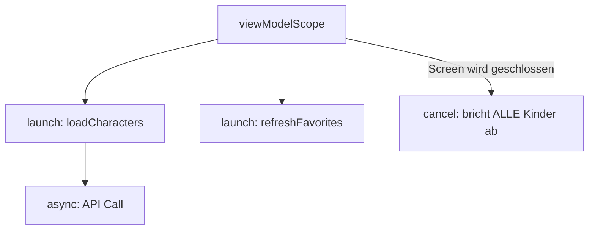
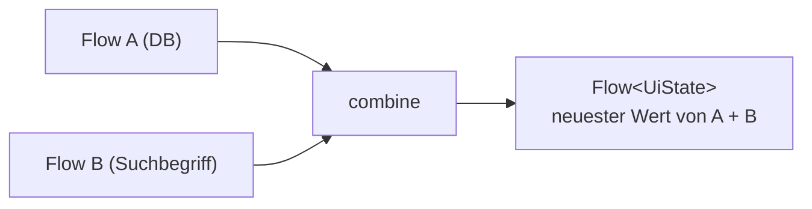
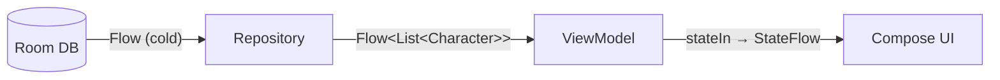
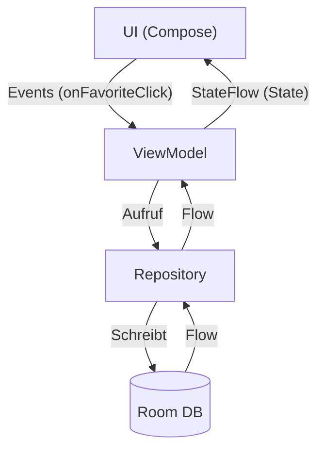
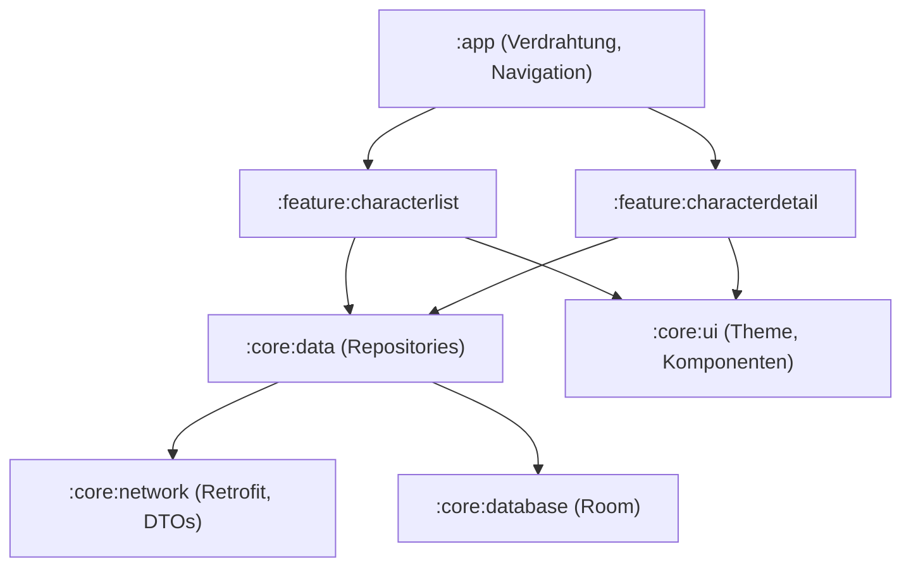
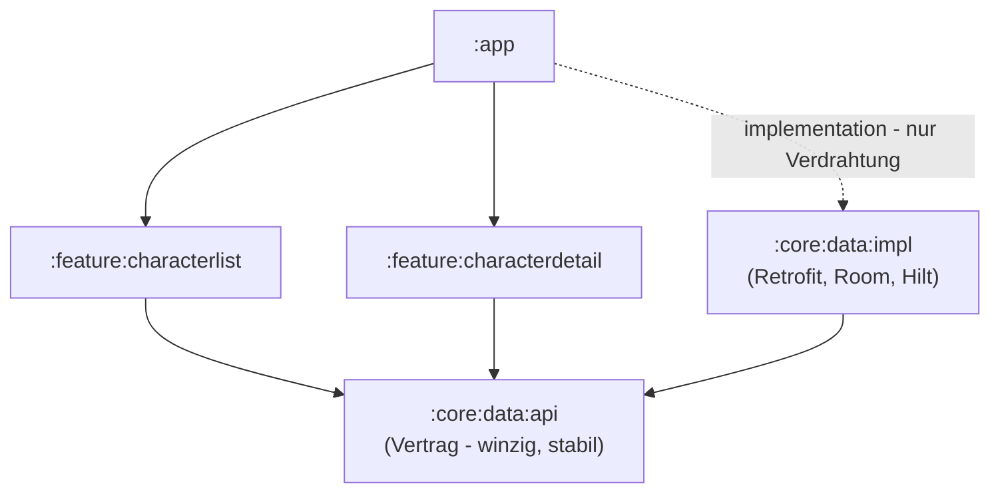
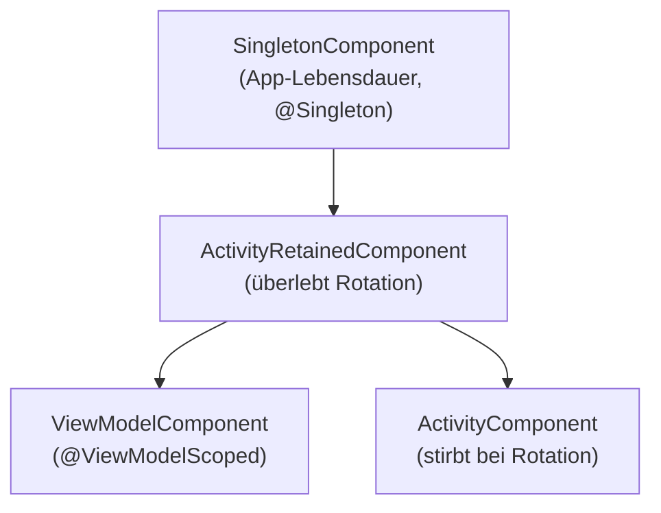
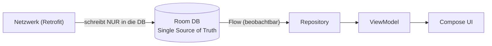

# Workshop: Advanced Android – Architektur für Enterprise-Projekte

## Einführung

Willkommen zurück! Im Einführungs-Workshop haben wir gemeinsam die **Rick & Morty App** gebaut: Compose UI, MVVM, StateFlow, Retrofit und Navigation 3. Die App funktioniert. Aber "funktioniert" heißt noch lange nicht "produktionsreif".

In diesem Workshop stellen wir die Frage, die in jedem Enterprise-Projekt irgendwann kommt: **Was passiert, wenn die App wächst?** Mehr Features, mehr Entwickler, mehr Teams, schlechtes Netz beim Kunden vor Ort. Genau dafür rüsten wir unsere App jetzt auf.

### Die Ausgangslage: Wo drückt der Schuh?

Unsere App aus dem Einführungs-Workshop hat drei Baustellen, die wir heute angehen:

1. **Manuelle Objekt-Erzeugung (`Dependencies.kt`):** Ein globales `object`, aus dem sich die ViewModels ihre Abhängigkeiten selbst holen. Das ist ein *Service Locator*. Bei 2 Screens funktioniert er noch, aber er skaliert nicht: versteckte Abhängigkeiten, keine Austauschbarkeit in Tests, keine Scopes.
2. **Kein lokaler Cache:** Jeder App-Start feuert einen Netzwerk-Request. Flugzeugmodus an? Die App zeigt nur noch eine Fehlermeldung. Für eine Enterprise-App (Außendienst, Lager, Keller-Meetingraum) ist das inakzeptabel.
3. **Ein Monolith:** Alles lebt in einem einzigen Gradle-Modul (`:app`). Architektur-Grenzen existieren nur als Package-Konvention, nichts hindert einen Screen daran, direkt Retrofit anzufassen.

### Die Agenda für Tag 1

| Block | Thema |
| --- | --- |
| Theorie | Kotlin-Idiome für Java-Entwickler (Modul 1) |
| Theorie | Asynchrone Programmierung: Coroutines & Flows (Modul 2) |
| Theorie | Modularisierung in Enterprise-Projekten (Modul 3) |
| Theorie | Dependency Injection mit Hilt (Modul 4) |
| Theorie | Offline-First-Strategien & SSOT (Modul 5) |
| **Praxis** | **Übung 1.1:** Vom Service Locator zu Hilt |
| **Praxis** | **Übung 1.2:** Lokaler Daten-Cache & Offline-First Repository mit Room |
| **Praxis** | **Übung 1.3:** Den Monolithen modularisieren |

> **Hinweis zur Arbeitsweise:** Wie im letzten Workshop gilt: Die Aufgabenstellung der aktuellen Übung steht immer im `README.md` des Branches, auf dem Sie gerade arbeiten. Der jeweils nächste Branch enthält die Musterlösung und gleichzeitig die Aufgabenstellung für die nächste Übung.

---

## Modul 1: Kotlin-Idiome für Java-Entwickler

Die Grundlagen (`val`/`var`, Null Safety, `data class`, Lambdas) kennen wir bereits. In diesem Modul geht es um die Idiome, die Kotlin-Code von "Java mit anderer Syntax" unterscheiden und uns in den heutigen Übungen ständig begegnen werden.

### 1.1 Extension Functions: Das Ende der Util-Klassen

**Das Problem (Java):**
Wir wollen eine fremde Klasse (z.B. `String` oder eine Library-Klasse) um eine Funktion erweitern. In Java landet so etwas in `StringUtils`, `DateHelper` & Co.: statische Methoden-Friedhöfe, die niemand findet.

```java
// Java: utility class graveyard
public class StringUtils {
    public static String capitalizeWords(String input) { ... }
}
StringUtils.capitalizeWords(name); // Who knows this class exists?
```

**Die Lösung (Kotlin):**
Wir "docken" die Funktion direkt an den Typ an. Der Aufruf sieht aus wie eine echte Methode, inklusive Autocomplete!

```kotlin
// Extension function on String
fun String.capitalizeWords(): String =
    split(" ").joinToString(" ") { it.replaceFirstChar(Char::uppercase) }

// Reads like a built-in method
"rick sanchez".capitalizeWords() // "Rick Sanchez"
```

**Wo wir das schon nutzen:**
Unser Mapping von DTO zu Domain-Modell ist eine Extension Function:

```kotlin
fun CharacterDto.toDomain(): Character = Character(id = id, name = name, ...)
```

> **Faustregel:**
> Extension Functions ändern die Klasse **nicht** (kein Zugriff auf `private`). Unter der Haube sind sie schlicht statische Funktionen mit besserer Aufruf-Syntax. Aber genau die macht Code auffindbar und lesbar. Ihre Sichtbarkeit hängt dabei nicht an der erweiterten Klasse, sondern am Deklarationsort: Eine `private`/`internal` Extension bleibt ein Implementierungsdetail ihrer Datei bzw. ihres Moduls. Mapping-Funktionen (`toDomain()`, `toEntity()`, `toUiModel()`) sind der klassische Anwendungsfall in der Datenschicht.

### 1.2 Null Safety für Java-Senioren: Die Interop-Falle

Die Grundwerkzeuge (`String?`, `?.`, `?:`, `let`) kennen wir aus dem Einführungs-Workshop. Im Enterprise-Alltag (mit gewachsenem Java-Code nebenan) gibt es aber drei Themen, die dort nicht vorkamen:

**1. Platform Types – wenn Java-Code ins Spiel kommt:**
Ruft Kotlin eine Java-Methode auf, kennt der Compiler die Nullability nicht: Der Typ ist ein *Platform Type* (in Fehlermeldungen als `String!` zu sehen). Der Compiler prüft dann nichts mehr; die NPE ist zurück im Spiel.

```kotlin
// LegacyUserService.java: public String getNickname() { return null; } // no annotation!
val nickname = legacyService.nickname   // Type is String! - compiler trusts blindly
nickname.length                         // Compiles fine. Crashes at runtime.
```

> **Faustregel:**
> Java-Code, der von Kotlin aus genutzt wird, mit `@Nullable` / `@NonNull` annotieren (JSR-305/JetBrains-Annotations), dann greift Kotlins Prüfung wieder. Bis dahin: Rückgaben aus unannotiertem Java-Code an der Grenze explizit in nullable Typen (`String?`) entgegennehmen und behandeln.

**2. `lateinit` für Framework-initialisierte Properties:**
Manche Properties *können* nicht im Konstruktor gesetzt werden (Field Injection in einer `Activity`, Test-Setup in `@Before`). Statt sie nullable zu machen und überall `?.` zu streuen:

```kotlin
@AndroidEntryPoint
class MainActivity : ComponentActivity() {
    @Inject lateinit var analytics: Analytics // set by Hilt before onCreate
}
```

Zugriff vor der Initialisierung wirft eine präzise `UninitializedPropertyAccessException` statt einer diffusen NPE. In unserem Workshop-Code brauchen wir das kaum, denn Constructor Injection (Modul 4) ist immer die bessere Wahl, wo sie möglich ist.

**3. `!!`, der Not-Aus-Schalter:**
Das Doppel-Ausrufezeichen wirft bei `null` sofort eine NPE. Er sagt: "Ich bin schlauer als der Compiler." Meistens stimmt das nicht.

```kotlin
// Smell: crashes with a meaningless stack trace
val character = cache[id]!!

// Better: crash with context...
val character = requireNotNull(cache[id]) { "Character $id not in cache" }

// ...or don't crash at all
val character = cache[id] ?: return
```

> **Faustregel:**
> `!!` ist in Code-Reviews ein rotes Tuch. Fast immer ist `?:` mit Default/Early-Return, `requireNotNull` mit Meldung oder ein besseres Datenmodell (Modul 5.5) die richtige Antwort.

### 1.3 Scope Functions: `let`, `run`, `apply`, `also`, `with`

Scope Functions führen einen Code-Block im "Kontext" eines Objekts aus. Sie unterscheiden sich in zwei Fragen: Wie heißt das Objekt im Block (`it` oder `this`)? Und was gibt der Block zurück (das Ergebnis oder das Objekt selbst)?

| Funktion | Objekt heißt | Rückgabe | Typischer Einsatz |
| --- | --- | --- | --- |
| `let` | `it` | Block-Ergebnis | Null-Check + Transformation |
| `run` | `this` | Block-Ergebnis | Objekt konfigurieren + Ergebnis berechnen |
| `with` | `this` | Block-Ergebnis | Mehrere Aufrufe auf einem Objekt bündeln |
| `apply` | `this` | **das Objekt** | Objekt-Konfiguration (Builder-Ersatz) |
| `also` | `it` | **das Objekt** | Seiteneffekte (z.B. Logging) in einer Kette |

```kotlin
// apply: configure and return the object (builder replacement)
val json = Json {
    ignoreUnknownKeys = true
}

// let: run only if not null, transform the value
val length = imageUrl?.let { loadImage(it) }

// also: side effect without breaking the chain
val characters = api.getCharacters()
    .also { Log.d("Repo", "Loaded ${it.results.size} characters") }
    .results
```

**Der Sonderling `with`:**
`with` ist die einzige Scope Function, die ihr Objekt als **Argument** bekommt. Alle anderen hängen als Extension daran. Es bündelt mehrere Zugriffe auf ein Objekt:

```kotlin
with(binding) {
    title.text = character.name
    status.text = character.status
    favorite.isVisible = character.isFavorite
}
```

`run` ist die Extension-Variante desselben Verhaltens (`this`-Kontext, Block-Ergebnis), deshalb gibt es `imageUrl?.run { ... }` für den Null-Fall, aber kein `?.with`.

Und für die Performance-Skeptiker unter den Java-Senioren: Alle fünf sind `inline`-Funktionen: Der Compiler setzt den Block direkt an der Aufrufstelle ein, zur Laufzeit existiert kein Lambda-Objekt. Scope Functions kosten nichts.

> **Faustregel:**
> Nicht übertreiben! Verschachtelte Scope Functions (`let` in `apply` in `run`) sind ein Anti-Pattern. Wenn `it` nicht mehr eindeutig ist: benannte Variable verwenden.

### 1.4 Delegation: `by lazy` & Co.

**Das Problem:**
Manche Objekte sind teuer in der Erzeugung (Datenbank, HTTP-Client). Wir wollen sie erst bauen, wenn sie wirklich gebraucht werden, aber ohne fehleranfälliges `if (instance == null)`-Geklapper (das in Java-Singletons gerne mal nicht thread-safe ist).

**Die Lösung (`by lazy`):**
Kotlin delegiert den Property-Zugriff an einen "Delegate", der die Initialisierung beim ersten Zugriff (thread-safe!) übernimmt.

```kotlin
// Created on FIRST access, cached afterwards, thread-safe by default
val retrofit: Retrofit by lazy {
    Retrofit.Builder()
        .baseUrl("https://rickandmortyapi.com/api/")
        .build()
}
```

*Feinjustierung für später: Die Thread-Sicherheit (Default `LazyThreadSafetyMode.SYNCHRONIZED`) kostet ein Lock pro Erstzugriff. Greift ohnehin nur der Main Thread zu (typisch bei UI-nahen Properties), spart `by lazy(LazyThreadSafetyMode.NONE) { ... }` die Synchronisation.*

**Das Prinzip dahinter (`by`):**
Das Keyword `by` bedeutet: "Reiche Zugriffe auf dieses Property/Interface an ein anderes Objekt weiter." Das gibt es auch für ganze Interfaces (Composition statt Vererbung):

```kotlin
// Decorator: override ONE function, delegate the rest
class TimingAnalytics(private val delegate: Analytics) : Analytics by delegate {
    override fun log(event: String) {
        delegate.log("$event (${elapsed()}ms)")
    }
}
```

*Übrigens: `var count by remember { mutableStateOf(0) }` aus Compose ist genau dieses Sprachfeature.*

### 1.5 Collections: Deklarativ statt Schleifen

**Das Problem (Java, klassisch):**
Datenverarbeitung mit `for`-Schleifen und mutablen Zwischenlisten: viel Code, viel Platz für Off-by-One-Fehler. Die Java Streams API hat das verbessert, bleibt aber sperrig (`collect(Collectors.toList())`).

**Die Lösung (Kotlin):**
Collections haben die Operationen direkt als Funktionen. Kein `stream()`, kein `collect()`.

```kotlin
val aliveBySpecies: Map<String, List<Character>> = characters
    .filter { it.status == "Alive" }
    .sortedBy { it.name }
    .groupBy { it.species }

// Common in the data layer: List<Dto> -> List<Domain>
val domainModels = response.results.map { it.toDomain() }

// Lookup tables
val byId: Map<Int, Character> = characters.associateBy { it.id }
```

**Wichtig für Enterprise-Datenmengen – Sequences:**
Jede Operator-Stufe (`filter`, `map`, ...) erzeugt bei Listen eine **neue Zwischenliste**. Bei großen Datenmengen und langen Ketten lohnt sich `asSequence()`, dann wird (wie bei Java Streams) lazy und elementweise verarbeitet:

```kotlin
val result = hugeList.asSequence()
    .filter { it.isActive }
    .map { it.name }
    .take(10)
    .toList() // Terminal operation triggers the evaluation
```

> **Faustregel:**
> Erst lesbar (Listen-Operatoren), dann messen, dann optimieren (`asSequence`). Für unsere 20 Charaktere ist eine Sequence Overkill.

### 1.6 `object`, `companion object` & Top-Level: Wo ist `static`?

Kotlin hat kein `static`. Stattdessen:

*   **Top-Level-Funktionen:** Funktionen dürfen direkt in einer Datei leben, ohne Klasse drumherum. Perfekt für Mapper und Helfer.
*   **`object`:** Ein thread-sicheres Singleton in einer Zeile. Unser `Dependencies`-Objekt ist genau das.
*   **`companion object`:** "Statische" Member innerhalb einer Klasse (Konstanten, Factory-Funktionen).

```kotlin
class CharacterRepository {
    companion object {
        const val PAGE_SIZE = 20 // like: public static final int
    }
}
```

> **Vorsicht, Architektur-Falle:**
> `object` ist verführerisch einfach, und genau deshalb entstehen daraus globale Service Locator wie unser `Dependencies.kt`. Globale Singletons sind versteckter, geteilter Zustand. Warum das ein Problem ist und was die Alternative ist: Modul 4.

### 1.7 Explicit Backing Fields: Das Ende des Underscore-Duos

**Das Problem:**
Ein ViewModel soll seinen Zustand intern ändern dürfen, nach außen aber nur eine lesbare Sicht anbieten. Das klassische Idiom dafür (Sie finden es in praktisch jeder gewachsenen Android-Codebasis) braucht **zwei** Properties für **eine** Sache:

```kotlin
class CharacterListViewModel : ViewModel() {
    // Internal, mutable...
    private val _uiState = MutableStateFlow<CharacterListUiState>(CharacterListUiState.Loading)
    // ...and the public read-only view of the SAME state
    val uiState: StateFlow<CharacterListUiState> = _uiState.asStateFlow()

    fun retry() {
        _uiState.update { CharacterListUiState.Loading } // don't forget the underscore!
    }
}
```

Das funktioniert, ist aber eine Namenskonvention mit Unterstrich (die es in Kotlin sonst nirgends gibt), eine doppelte Deklaration und ein Property mehr, das in Code-Completion und Reviews Rauschen erzeugt.

**Die Lösung (Explicit Backing Fields, stabil seit Kotlin 2.4, kein Compiler-Flag mehr nötig):**
Ein Property darf jetzt ein **explizites Backing Field mit eigenem, mutablem Typ** deklarieren. Genau so steht es in unserem `CharacterListViewModel`:

```kotlin
class CharacterListViewModel : ViewModel() {
    // ONE property: public type StateFlow, backing field type MutableStateFlow
    val uiState: StateFlow<CharacterListUiState>
        field = MutableStateFlow<CharacterListUiState>(CharacterListUiState.Loading)

    fun retry() {
        // Inside the class, uiState resolves to the backing field -> mutable
        uiState.update { CharacterListUiState.Loading }
    }
}
```

Innerhalb der Klasse verhält sich `uiState` wie ein `MutableStateFlow`, außerhalb ist es ein `StateFlow`: exakt die Kapselung von vorher, nur ohne Unterstrich-Zwilling. Die Spielregeln: nur für `val` ohne eigenen Getter (nicht `open`, nicht delegiert), und der Typ des Fields muss ein Subtyp des Property-Typs sein.

> **Vorsicht, Inferenz-Falle:**
> Das Typargument `MutableStateFlow<CharacterListUiState>(...)` ist kein Zierrat: Der Typ des Fields wird aus dem **Initialisierer** inferiert, nicht aus dem Property-Typ. Ohne das Argument wäre das Field ein `MutableStateFlow<CharacterListUiState.Loading>`, und das erste `update` auf `Success` ein Compile-Fehler. (Beim Underscore-Duo galt übrigens exakt dasselbe.)

> **Faustregel:**
> Unser Workshop-Code nutzt durchgehend den neuen Stil. Das Underscore-Duo werden Sie trotzdem noch jahrelang in Bestandscode lesen. Sie sollten also beide Formen fließend beherrschen.

> **Dokumentation:** [kotlinlang.org/docs/properties.html#explicit-backing-fields](https://kotlinlang.org/docs/properties.html#explicit-backing-fields)

---

## Modul 2: Asynchrone Programmierung – Coroutines & Flows

Im Einführungs-Workshop haben wir gelernt: `suspend` + `viewModelScope.launch` = UI friert nicht ein. Jetzt schauen wir unter die Haube, denn in den heutigen Übungen arbeiten wir mit Threading-Regeln, parallelen Requests und reaktiven Datenströmen aus der Datenbank.

### 2.1 Structured Concurrency: Kein Thread geht verloren

**Das Problem (Java):**
`new Thread(...)`, `ExecutorService`, `CompletableFuture`: Gestartete Arbeit hat keinen Bezug zu ihrem Aufrufer. Schließt der User den Screen, läuft der Request weiter, schreibt ins Nichts oder crasht (Memory Leaks, Zombie-Callbacks).

**Die Lösung (Kotlin):**
Jede Coroutine lebt in einem **Scope** und hat damit einen **Eltern-Job**. Daraus folgt ein einfacher Vertrag:

1.  Wird der Scope beendet, werden **alle** Kinder abgebrochen (Cancellation).
2.  Ein Scope endet erst, wenn alle Kinder fertig sind.
3.  Fehler propagieren strukturiert nach oben, nichts verschwindet im Nirwana.



**Im ViewModel:** `viewModelScope` ist an den Lebenszyklus des ViewModels gebunden. Screen zu → ViewModel weg → alle laufenden Coroutinen sauber abgebrochen. Das haben wir bisher "einfach so" benutzt. Jetzt wissen wir, warum es kein Memory Leak gibt.

**Cancellation ist kooperativ:**
Eine Coroutine wird nicht "hart getötet". Sie prüft an jedem Suspension Point (`delay`, Netzwerk-Call, ...) ob sie abgebrochen wurde und wirft dann eine `CancellationException`. Abbrechen heißt dabei nicht töten: Auf dem Weg nach draußen laufen `finally`-Blöcke ganz normal: Die Coroutine darf ihre Ressourcen (offene Dateien, Transaktionen) noch aufräumen.

> **Faustregel:**
> Niemals `catch (e: Exception)` schreiben, ohne an Cancellation zu denken! Wer die `CancellationException` schluckt, sabotiert Structured Concurrency. Im Zweifel: `CancellationException` wieder werfen (rethrow).

```kotlin
try {
    repository.getCharacters()
} catch (e: CancellationException) {
    throw e // Never swallow cancellation!
} catch (e: Exception) {
    uiState.value = UiState.Error(e.message ?: "Unknown error")
}
```

### 2.2 Dispatchers: Wer arbeitet auf welchem Thread?

Ein **Dispatcher** entscheidet, auf welchem Thread(-Pool) eine Coroutine läuft:

*   **`Dispatchers.Main`:** Der UI-Thread. Hier läuft Compose. Nur für kurze, nicht-blockierende Arbeit: Bei 60 Bildern pro Sekunde bleiben pro Frame nur 16 ms, jede Blockade hier ist ein sichtbarer Ruckler.
*   **`Dispatchers.IO`:** Optimiert für *wartende* Operationen (Netzwerk, Datei, Datenbank). Großer Thread-Pool (64 Threads im Default).
*   **`Dispatchers.Default`:** Optimiert für *rechnende* Operationen (JSON-Parsing großer Dateien, Sortieren, Bildverarbeitung). Pool-Größe = CPU-Kerne.

**Thread-Wechsel mit `withContext`:**

```kotlin
suspend fun loadReport(): Report = withContext(Dispatchers.IO) {
    // Runs on the IO pool, caller suspends without blocking
    fileSystem.readReport()
}
```

**Die wichtigste Konvention – Main-Safety:**

> **Faustregel:**
> **Jede `suspend` Funktion muss "main-safe" sein**, also gefahrlos vom Main Thread aufrufbar. Der *Aufgerufene* wechselt den Dispatcher (via `withContext`), nicht der Aufrufer.
> Gute Nachricht: Retrofit und Room machen das automatisch richtig. Deshalb steht in unserem ViewModel-Code nirgendwo `Dispatchers.IO`, und das ist korrekt so.

### 2.3 Parallelität: `async` / `await`

`launch` ist "fire and forget". Wenn wir ein **Ergebnis** brauchen (und mehrere Ergebnisse parallel), nutzen wir `async`. Erst die naive Variante, bei der die Requests aufeinander warten:

```kotlin
// Sequential: ~2 x request time
viewModelScope.launch {
    val character = repository.getCharacter(1)
    val episodes = repository.getEpisodes(1)
    val screen = DetailData(character, episodes)
}
```

Dann dieselben Requests parallel:

```kotlin
// Parallel: ~1 x request time
viewModelScope.launch {
    val characterDeferred = async { repository.getCharacter(1) }
    val episodesDeferred = async { repository.getEpisodes(1) }
    val screen = DetailData(characterDeferred.await(), episodesDeferred.await())
}
```

Auch hier greift Structured Concurrency: Schlägt einer der `async`-Blöcke fehl, wird der andere automatisch mit abgebrochen.

Voraussetzung für die Parallelisierung: Die Aufrufe dürfen nicht voneinander abhängen. Braucht der zweite Request die ID aus dem ersten, bleibt es sequenziell, daran ändert auch `async` nichts.

> **Und wenn Geschwister *nicht* sterben sollen?**
> Manchmal ist das Mit-Abbrechen unerwünscht: Drei unabhängige Dashboard-Kacheln laden parallel, eine darf scheitern, ohne die anderen mitzureißen. Dafür gibt es `supervisorScope { }` (bzw. `SupervisorJob`): Der Fehler eines Kindes lässt die Geschwister weiterlaufen, jedes Kind behandelt sein Scheitern selbst. Structured Concurrency bleibt dabei intakt: Der Scope wartet weiterhin auf alle Kinder. Eine der häufigsten Fragen in echten Projekten, deshalb hier der Name zum Nachschlagen.

### 2.4 Flow: Datenströme statt Einzelwerte

**Das Problem:**
Eine `suspend fun` liefert **einen** Wert und ist fertig. Aber viele Datenquellen liefern **mehrere Werte über die Zeit**: Datenbank-Änderungen, Standort-Updates, Suchergebnisse während des Tippens. Genau das brauchen wir für Offline-First: *"Sag mir Bescheid, wann immer sich die gecachten Charaktere ändern."*

**Die Lösung (`Flow<T>`):**
Ein Flow ist ein **asynchroner Strom** von Werten, konzeptuell eine `List<T>`, deren Elemente nach und nach eintreffen.

```kotlin
// A cold flow: the block runs PER collector, on collect()
fun countdown(): Flow<Int> = flow {
    for (i in 3 downTo 1) {
        delay(1000)
        emit(i) // Push a value into the stream
    }
}

// Consuming (inside a coroutine):
countdown().collect { value -> println(value) } // 3... 2... 1
```

**Cold vs. Hot, der wichtigste Unterschied:**

*   **Cold (z.B. `flow { }`, Room-Queries):** Der Strom "läuft" erst, wenn jemand `collect` aufruft, und zwar für jeden Collector von vorne. Kein Collector = keine Arbeit.
*   **Hot (z.B. `StateFlow`, `SharedFlow`):** Der Strom existiert unabhängig von Collectors. Wer später dazukommt, verpasst ggf. frühere Werte (bzw. bekommt bei `StateFlow` den aktuellen Zustand).

**Operatoren (wie bei Collections, aber asynchron):**

```kotlin
characterDao.observeAll()                  // Flow<List<CharacterEntity>> from Room
    .map { entities -> entities.map { it.toDomain() } } // transform each emission
    .filter { it.isNotEmpty() }
    .collect { characters -> ... }
```

### 2.5 Flows kombinieren: `combine`

**Das Problem:**
Ein UI-Zustand speist sich selten aus nur *einer* Quelle. Typisch: Die Charaktere kommen aus der Datenbank, der "Refresh fehlgeschlagen"-Status aus dem Netzwerk-Pfad, ein Suchbegriff aus dem Textfeld. Drei Ströme, aber die UI braucht einen konsistenten Zustand.

**Die Lösung (`combine`):**
`combine` verschmilzt mehrere Flows zu einem neuen Flow. Der Transformations-Block läuft, sobald **irgendeiner** der Quell-Flows einen neuen Wert liefert, immer mit den jeweils letzten Werten aller Quellen. Eine Anlaufregel gehört dazu: Das **erste** Ergebnis kommt erst, wenn *jede* Quelle mindestens einen Wert geliefert hat. Ein `MutableStateFlow` mit Startwert (wie der Suchbegriff `""` unten) erfüllt das sofort.

```kotlin
val characters: Flow<List<Character>> = dao.observeAll().map { ... }
val searchQuery = MutableStateFlow("")

// Re-evaluates when EITHER the database changes OR the user types
val filtered: Flow<List<Character>> =
    combine(characters, searchQuery) { list, query ->
        list.filter { it.name.contains(query, ignoreCase = true) }
    }
```



**Verwandte Operatoren (zur Abgrenzung):**

*   **`combine`:** Feuert bei *jeder* Änderung *irgendeiner* Quelle, mit den letzten Werten aller Quellen. → Der Standard für UI State.
*   **`zip`:** Wartet auf ein *Paar* (Wert 1 von A + Wert 1 von B). → Selten in UIs.
*   **`flatMapLatest`:** Wechselt auf einen *neuen* Upstream-Flow, wenn die Quelle einen neuen Wert liefert (z.B. neue DB-Query pro Suchbegriff), und bricht den alten ab.

Wie wir mit `combine` unseren kompletten Listen-UI-State bauen, sehen wir in Modul 5.5.

### 2.6 StateFlow & `stateIn`: Vom kalten Strom zum UI State

Unser `MutableStateFlow` im ViewModel kennen wir schon: ein **hot** Flow mit genau einem aktuellen Wert, perfekt für UI State.

Neu ist heute die Gegenrichtung: Wir bekommen von Room einen **kalten** Flow und wollen ihn als StateFlow an die UI geben. Dafür gibt es `stateIn`:

```kotlin
val uiState: StateFlow<CharacterListUiState> = repository
    .observeCharacters()                          // cold Flow from the database
    .map { CharacterListUiState.Success(it) }     // map to UI state
    .stateIn(
        scope = viewModelScope,
        // Stop collecting 5s after the last subscriber left.
        // Survives configuration changes, stops when app is backgrounded.
        started = SharingStarted.WhileSubscribed(5.seconds),
        initialValue = CharacterListUiState.Loading
    )
```

**Warum die magischen 5 Sekunden?**
Bei einer Rotation verschwindet der Collector kurz (UI wird neu aufgebaut). Ohne Timeout würde der Upstream-Flow (die DB-Query) gestoppt und sofort neu gestartet. Mit 5 Sekunden Puffer überlebt er die Rotation; geht die App aber wirklich in den Hintergrund, wird gestoppt und Ressourcen gespart. Dieser Wert ist der offizielle Google-Standard. *(Zur Schreibweise: `5.seconds` ist eine `kotlin.time.Duration`: Die Duration-Overloads von `WhileSubscribed`, `delay` & Co. machen die Einheit im Code sichtbar, wo `5_000` nur eine nackte Zahl wäre. Der Import dazu: `kotlin.time.Duration.Companion.seconds`.)*

**In der UI ändert sich: nichts.**
`collectAsStateWithLifecycle()` funktioniert für beide Varianten (manuell gepflegter `MutableStateFlow` und `stateIn`) identisch.



### 2.7 Das große Ganze: Unidirectional Data Flow (UDF)

Alles aus diesem Modul fügt sich zu **einem** Architektur-Muster zusammen, das wir schon aus dem Einführungs-Workshop kennen, nur dass der Kreis jetzt reaktiv und vollständig ist:

*   **State fließt abwärts:** Repository → `Flow` → ViewModel (`combine` + `stateIn`) → `StateFlow` → `collectAsStateWithLifecycle()` → UI. Die UI ist eine reine Funktion dieses Zustands (`UI = f(State)`).
*   **Events fließen aufwärts:** Klick → ViewModel-Funktion → Repository → Datenquelle.



Das Entscheidende: **Es gibt keine Abkürzungen.** Ein Klick auf das Favoriten-Herz ändert nicht die UI. Er ändert die *Datenbank*, und die geänderte Datenbank ändert (über den Flow) die UI. Dadurch ist der Zustand an jeder Stelle vorhersagbar, reproduzierbar und testbar. Genau dieses Muster bauen wir in Übung 1.2.

> **Dokumentation:** [developer.android.com/kotlin/flow](https://developer.android.com/kotlin/flow) und [developer.android.com/develop/ui/compose/architecture#udf](https://developer.android.com/develop/ui/compose/architecture#udf)

---

## Modul 3: Modularisierung in Enterprise-Android-Projekten

### 3.1 Warum modularisieren?

Unsere App ist ein einziges Modul (`:app`). Für ein Workshop-Projekt: völlig okay. Aber in Enterprise-Projekten mit 30+ Entwicklern und Millionen Zeilen Code bricht der Monolith zusammen:

*   **Build-Zeiten:** Gradle kompiliert nur geänderte Module neu (und Module parallel). Im Monolith heißt jede Änderung: fast alles neu bauen.
*   **Ownership:** Team "Checkout" besitzt `:feature:checkout`. Klare Verantwortung, weniger Merge-Konflikte.
*   **Erzwungene Grenzen:** Im Monolith kann jede Klasse jede andere aufrufen, Architektur-Regeln sind nur Konvention. Modul-Grenzen macht der **Compiler** zur Regel: Was nicht als Dependency deklariert ist, ist unsichtbar.
*   **Wiederverwendung:** `:core:network` kann von der Phone-App, der Wear-App und dem internen Tool genutzt werden.

### 3.2 Der typische Modul-Schnitt

Bewährt hat sich die Aufteilung in drei Kategorien (vgl. Google's "Now in Android"-Projekt):



*   **`:app`**: dünne Schale (`Application`, `MainActivity`, Navigation). Kennt alle Features, verdrahtet sie.
*   **`:feature:*`**: je ein User-Facing-Feature (Screen + ViewModel). Features kennen sich **gegenseitig nicht**.
*   **`:core:*`**: geteilte Infrastruktur (Datenzugriff, Netzwerk, Datenbank, Design System).

**Die goldene Regel:** Abhängigkeiten zeigen nur nach "unten" (app → feature → core). Niemals feature → feature, niemals core → feature.

**`api` vs. `implementation`:**
In `build.gradle.kts` entscheidet das Konfigurationswort, ob eine Dependency an die Konsumenten des Moduls "durchsickert":

```kotlin
dependencies {
    // Consumers of :core:data do NOT see Room types -> faster builds, clean API
    implementation(projects.core.database)

    // Consumers DO see these types (part of our public API) -> use sparingly!
    api(projects.core.model)
}
```

*(Die Schreibweise `projects.core.model` sind Gradles typsichere **Project Accessors**, aktiviert per `enableFeaturePreview("TYPESAFE_PROJECT_ACCESSORS")` in der `settings.gradle.kts`, in unserem Projekt bereits geschehen. Semantisch identisch zu `project(":core:model")`, aber mit Autocomplete und Compile-Fehler statt Tippfehler im String.)*

> **Faustregel:**
> Standardmäßig immer `implementation`. `api` nur, wenn Typen der Dependency in der eigenen öffentlichen Schnittstelle auftauchen. Jedes unnötige `api` verlangsamt inkrementelle Builds im ganzen Projekt.

### 3.3 Der nächste Reifegrad: api- und impl-Module

**Das Problem (auch mit sauberem Schnitt):**
Selbst wenn `:feature:characterlist` nur per `implementation` an `:core:data` hängt, gilt: Das Feature hängt am **ganzen** Modul. Jede Änderung an der Datenbank-Implementierung (ein neuer Room-Converter, ein Retrofit-Interceptor) kompiliert alle Features neu. Und nichts hindert ein Feature daran, statt eines Interfaces direkt die konkrete Repository-Klasse zu benutzen: Sie ist ja `public` im selben Modul.

**Die Lösung (api/impl-Trennung):**
Enterprise-Projekte spalten solche Module in ein Paar:

*   **`:core:data:api`** enthält nur den **Vertrag**: Interfaces und die Typen ihrer Signaturen. Winzig, ändert sich selten.
*   **`:core:data:impl`** enthält die **Implementierung**: Retrofit, Room, Hilt-Bindings. Ändert sich oft, kennt `:api`.

Die Regeln:

1.  **Konsumenten (Features) hängen nur an `:api`.** Die Implementierung ist für sie nicht einmal mehr sichtbar: Dependency Inversion, vom Compiler erzwungen.
2.  **Nur `:app` hängt (per `implementation`) an `:impl`**, damit die Hilt-`@Binds` beim Zusammenbau auf dem Klassenpfad landen (Modul 4.4).



**Der Build-Gewinn:** Ändert sich `:impl`, bleiben die Features unberührt: Ihr Klassenpfad (`:api`) hat sich nicht bewegt. In großen Projekten ist das der Unterschied zwischen Sekunden und Minuten pro inkrementellem Build.

> **Faustregel:**
> Ein api/impl-Paar lohnt sich erst, **wenn es einen Vertrag gibt**: Ein api-Modul ohne Interface ist eine leere Hülle. Deshalb gehen wir in zwei Schritten vor: In **Übung 1.3** vollziehen wir den einfachen Modul-Schnitt (das Repository ist dort noch eine konkrete Klasse). Sobald in **Übung 2.2** das Repository-Interface existiert, ziehen wir das api/impl-Upgrade nach, und Module, die danach neu entstehen (`:core:analytics` in Übung 2.1, `:core:settings` in Übung 3.3), starten von Anfang an als Paar.

### 3.4 Convention Plugins: Build-Logik ohne Copy-Paste

**Das Problem:**
Modularisierung hat einen Preis, den 3.1 verschwiegen hat: Jedes Modul bringt eine eigene `build.gradle.kts` mit, und die sehen einander verdächtig ähnlich. `compileSdk`, `minSdk`, Java-Version, der immer gleiche Compose- und Hilt-Block: alles Copy-Paste. Die api/impl-Trennung aus 3.3 verdoppelt die Modulzahl dann noch einmal. Bei 40 Modulen heißt "wir heben auf compileSdk 38 an": 40 Dateien anfassen, und bei Datei 23 vertippt sich jemand. Dieser **Copy-Paste-Drift** ist in gewachsenen Projekten der Normalfall: Kein Mensch weiß mehr, ob `:core:legacy` absichtlich anders konfiguriert ist oder aus Versehen.

**Die Lösung (Convention Plugins):**
Gradle kann die eigenen Build-Konventionen als **eigenes kleines Plugin** ausdrücken, das im Projekt mitgeliefert wird, und zwar in einem *Included Build*, üblicherweise `build-logic` genannt:

```text
build-logic/
├── settings.gradle.kts     // sees the same libs.versions.toml
├── build.gradle.kts        // `kotlin-dsl` + AGP as dependency, registers the plugin IDs
└── src/main/kotlin/
    ├── AndroidLibraryConventionPlugin.kt
    └── AndroidFeatureConventionPlugin.kt
```

Eingebunden wird der Build in der `settings.gradle.kts` des Hauptprojekts:

```kotlin
pluginManagement {
    includeBuild("build-logic")
    // ...
}
```

Ein Convention Plugin ist eine ganz normale `Plugin<Project>`-Klasse: Sie wendet die "echten" Plugins an und setzt darauf unsere Hausregeln, an **einer** Stelle:

```kotlin
class AndroidLibraryConventionPlugin : Plugin<Project> {
    override fun apply(target: Project) = with(target) {
        pluginManager.apply("com.android.library")
        extensions.configure<LibraryExtension> {
            compileSdk {
                version = release(37)
            }
            defaultConfig {
                minSdk = 24
            }
            compileOptions {
                sourceCompatibility = JavaVersion.VERSION_11
                targetCompatibility = JavaVersion.VERSION_11
            }
        }
    }
}
```

Darauf bauen weitere Konventionen auf: Ein Feature-Convention-Plugin wendet das Library-Plugin an und ergänzt alles, was *jedes* Feature-Modul braucht: Compose, Hilt, die Standard-Dependencies.

Referenziert werden die eigenen Plugins genauso typsicher wie alle anderen: per `alias` über den Version Catalog. Dafür bekommen die IDs einen Eintrag in der `libs.versions.toml`, **ohne Version**: Der Code kommt aus dem Included Build, nicht aus einem Repository.

```toml
[plugins]
# Convention plugins from build-logic (no version - resolved from the included build)
rickandmorty-android-library = { id = "rickandmorty.android.library" }
rickandmorty-android-feature = { id = "rickandmorty.android.feature" }
```

Die `build.gradle.kts` eines Feature-Moduls schrumpft damit auf ihren tatsächlichen Informationsgehalt:

```kotlin
plugins {
    alias(libs.plugins.rickandmorty.android.feature)
}

android {
    namespace = "ninja.droiddojo.rickandmorty.feature.characterlist"
}

dependencies {
    // only what THIS module specifically needs
    implementation(projects.core.data)
}
```

**Der Effekt:** Ein neues Feature-Modul anlegen kostet drei Zeilen statt dreißig, und die Konvention selbst steht an genau einer Stelle. Das compileSdk-Upgrade für alle 40 Module ist wieder ein Ein-Zeilen-Commit. *(Falls Sie in älteren Projekten `buildSrc` für denselben Zweck finden: gleiche Idee, aber jede Änderung dort invalidiert den gesamten Build-Cache. Der Included Build ist heute der empfohlene Weg.)*

> **Faustregel:**
> Convention Plugins lohnen sich ab einer Handvoll Module: genau dann, wenn das zweite oder dritte Copy-Paste einer `build.gradle.kts` ansteht. Für `:app` lassen wir die Build-Datei dagegen klassisch: Ein Convention Plugin für genau *ein* Modul wäre Indirektion ohne Gewinn (anders, sobald mehrere App-Module existieren: Phone, Wear, internes Tool).

**Und bei uns?** Unsere Packages sind bereits entlang dieser Linien geschnitten (`character/data`, `character/list`, `character/detail`). In **Übung 1.3** vollziehen wir den Schnitt dann physisch und zerlegen die App in echte Gradle-Module. Dabei verdrahten Sie die Module zuerst von Hand (damit Sie den Boilerplate-Schmerz einmal selbst spüren) und refactoren die Build-Dateien anschließend auf zwei Convention Plugins: `rickandmorty.android.library` und `rickandmorty.android.feature`. Alle Module, die später entstehen (`:core:analytics` in Übung 2.1, `:core:settings` in Übung 3.3), starten dann von Anfang an im Convention-Stil. Vorher müssen wir aber eine Frage klären, an der jede Modularisierung sonst scheitert: *Wie kommen Objekte über Modul-Grenzen hinweg zueinander?* Das ist das Thema von Modul 4.

> **Dokumentation:** [developer.android.com/topic/modularization](https://developer.android.com/topic/modularization); zu Convention Plugins: [docs.gradle.org/current/samples/sample_convention_plugins.html](https://docs.gradle.org/current/samples/sample_convention_plugins.html) und als Referenz in groß das [build-logic von "Now in Android"](https://github.com/android/nowinandroid/tree/main/build-logic)

---

## Modul 4: Dependency Injection mit Hilt

### 4.1 Das Verdrahtungs-Problem: Vom Service Locator zur Dependency Injection

**Das Problem (unser Status Quo):**
Werfen wir einen ehrlichen Blick auf unseren Code:

```kotlin
// Dependencies.kt - a global service locator
object Dependencies {
    private val retrofit = Retrofit.Builder()...build()
    val characterRepository = CharacterRepository(retrofit.create())
}

// CharacterListViewModel.kt - the ViewModel serves itself
class CharacterListViewModel : ViewModel() {
    private val repository = Dependencies.characterRepository // hidden dependency!
}
```

Das nennt man einen **Service Locator**, und er hat vier handfeste Probleme:

1.  **Versteckte Abhängigkeiten:** Von außen (Konstruktor!) sieht niemand, dass das ViewModel ein Repository braucht. Man muss den Body lesen.
2.  **Nicht testbar:** Im Unit Test können wir `Dependencies.characterRepository` nicht durch einen Fake ersetzen: Das `object` ist hart verdrahtet (und zieht Retrofit gleich mit hoch).
3.  **Keine Scopes:** Alles lebt für immer (App-Lebensdauer). "Ein Objekt pro Screen" oder "pro User-Session" ist nicht abbildbar.
4.  **Skaliert nicht mit Modulen:** In einem modularen Projekt müsste jedes Modul das globale `object` kennen: eine Abhängigkeit von jedem Modul auf einen zentralen Gott-Klumpen. Genau das wollten wir mit Modularisierung verhindern.

**Die Lösung (Dependency Injection):**
Wir drehen den Spieß um (*Inversion of Control*): Eine Klasse **bekommt** ihre Abhängigkeiten von außen (sichtbar im Konstruktor), statt sie sich selbst zu besorgen.

```kotlin
// Dependencies are visible, replaceable, testable
class CharacterListViewModel(
    private val repository: CharacterRepository
) : ViewModel()
```

Das Prinzip ist trivial. Die Fleißarbeit ist die **Verdrahtung**: *Irgendjemand* muss Retrofit bauen, daraus das Api-Objekt, daraus das Repository, daraus das ViewModel, in der richtigen Reihenfolge und mit der richtigen Lebensdauer. Bei 5 Klassen geht das von Hand. Bei 500 nicht.

### 4.2 Hilt: DI als Framework

**Hilt** ist Googles Standard-DI-Framework für Android (aufgebaut auf *Dagger*). Es generiert den Verdrahtungs-Code **zur Compile-Zeit**: Fehler wie "diese Abhängigkeit kann niemand liefern" sind Compile-Fehler, keine Laufzeit-Crashes. (Das unterscheidet Hilt von Spring, das zur Laufzeit reflektiert. Auf einem Smartphone wäre das zu teuer.)

**Baustein 1: Die Annotationen zum Start**

```kotlin
// 1. Application class: birthplace of the DI graph
@HiltAndroidApp
class RickAndMortyApplication : Application()

// 2. Android entry points get access to the graph
@AndroidEntryPoint
class MainActivity : ComponentActivity()
```

*Nicht vergessen: Die Application-Klasse muss im `AndroidManifest.xml` unter `<application android:name=".RickAndMortyApplication">` registriert werden!*

**Baustein 2: Constructor Injection, der Normalfall**

Für eigene Klassen reicht ein `@Inject` am Konstruktor. Hilt weiß dann: "So baue ich dieses Objekt."

```kotlin
// @Singleton: exactly ONE instance for the whole app
@Singleton
class CharacterRepository @Inject constructor(
    private val api: RickAndMortyApi
)
```

`@Singleton` ist dabei keine Bau-, sondern eine Scoping-Anweisung: Ohne Scope-Annotation baut Hilt für jeden Injektionspunkt ein frisches Objekt: beim zustandsbehafteten Repository falsch, bei einem zustandslosen Mapper genau richtig.

**Baustein 3: Module für Klassen, die uns nicht gehören**

An den Konstruktor von `Retrofit` können wir kein `@Inject` schreiben (fremde Library, Builder-Pattern). Für solche Fälle schreiben wir "Rezepte" in ein Modul:

```kotlin
@Module
@InstallIn(SingletonComponent::class) // These recipes live app-wide
object NetworkModule {

    @Provides
    @Singleton
    fun provideRetrofit(): Retrofit =
        Retrofit.Builder()
            .baseUrl("https://rickandmortyapi.com/api/")
            .addConverterFactory(...)
            .build()

    @Provides
    @Singleton
    fun provideRickAndMortyApi(retrofit: Retrofit): RickAndMortyApi =
        retrofit.create() // Hilt passes retrofit in - recipes compose!
}
```

Beachten Sie die Eleganz: `provideRickAndMortyApi` deklariert `retrofit` einfach als Parameter. Hilt findet das passende Rezept und reicht es durch. Die Reihenfolge der Erzeugung managt der Graph.

**Baustein 3b: `@Binds` bindet Interfaces an Implementierungen**

Ein Interface hat keinen Konstruktor, an den man `@Inject` schreiben könnte. Wer ein Interface injiziert, bekommt von Dagger nur die Fehlermeldung `CharacterRepository cannot be provided without an @Provides-annotated method`. Ein `@Provides`-Rezept, das die Implementierung bloß durchreicht, würde funktionieren, wäre aber reine Zeremonie: Bauen kann Hilt die Implementierung ja längst selbst, über deren `@Inject constructor`. Für genau diesen Fall gibt es `@Binds`:

```kotlin
@Module
@InstallIn(SingletonComponent::class)
interface DataModule {

    @Binds
    fun bindCharacterRepository(impl: OfflineFirstCharacterRepository): CharacterRepository
}
```

Der Unterschied in einem Satz: **`@Provides` beschreibt, *wie* ein Objekt entsteht; `@Binds` nur, *welcher Typ welchen erfüllt*** (und generiert dafür nicht einmal eine Factory). Die Merkregel: **Parameter = Implementierung, Rückgabetyp = Interface, nie umgekehrt.** Statt des `interface`-Moduls funktioniert auch eine `abstract class` mit `abstract fun` identisch; Googles "Now in Android" nutzt die Interface-Form.

*(Vorgriff: Unser `CharacterRepository` ist an Tag 1 noch eine konkrete Klasse; das Interface samt `OfflineFirstCharacterRepository` ziehen wir in Übung 2.2 ein. `@Binds` begegnet uns in Modul 7.3 und 8.1 wieder.)*

**Baustein 4: ViewModels**

```kotlin
@HiltViewModel
class CharacterListViewModel @Inject constructor(
    private val repository: CharacterRepository
) : ViewModel()
```

```kotlin
// In the composable: hiltViewModel() instead of viewModel()
import androidx.hilt.lifecycle.viewmodel.compose.hiltViewModel

@Composable
fun CharacterListScreen(
    viewModel: CharacterListViewModel = hiltViewModel(),
    ...
)
```

> **Hinweis zum Import:** `hiltViewModel()` kommt aus dem Artefakt `androidx.hilt:hilt-lifecycle-viewmodel-compose`. (Bis Version 1.3 lag die Funktion in `hilt-navigation-compose` unter `androidx.hilt.navigation.compose`, seit 1.4 lebt sie navigationsunabhängig, was perfekt zu Nav 3 passt.)

**Baustein 5: Assisted Injection für Laufzeit-Parameter**

Unser `CharacterDetailViewModel` braucht neben dem Repository (kommt aus dem Graphen) eine `id` (kommt zur **Laufzeit** aus der Navigation). Dafür gibt es *Assisted Injection*, und unsere handgeschriebene `ViewModelProvider.Factory` fliegt raus:

```kotlin
@HiltViewModel(assistedFactory = CharacterDetailViewModel.Factory::class)
class CharacterDetailViewModel @AssistedInject constructor(
    private val repository: CharacterRepository, // from the Hilt graph
    @Assisted private val id: Int,               // provided at call time
) : ViewModel() {

    @AssistedFactory
    interface Factory {
        fun create(id: Int): CharacterDetailViewModel
    }
}
```

```kotlin
// At the navigation entry:
entry<CharacterDetailRoute> { key ->
    CharacterDetailScreen(
        viewModel = hiltViewModel<CharacterDetailViewModel, CharacterDetailViewModel.Factory>(
            creationCallback = { factory -> factory.create(key.id) }
        ),
        ...
    )
}
```

### 4.3 Komponenten & Scopes: Die Landkarte

Hilt organisiert Objekte in einer Hierarchie von Komponenten, jede mit eigener Lebensdauer:



Wann stirbt was?

| Komponente | Scope-Annotation | Lebt bis … |
| --- | --- | --- |
| `SingletonComponent` | `@Singleton` | zum Ende des Prozesses |
| `ActivityRetainedComponent` | `@ActivityRetainedScoped` | die Activity *endgültig* endet, überlebt Rotation |
| `ViewModelComponent` | `@ViewModelScoped` | `onCleared()` des ViewModels |
| `ActivityComponent` | `@ActivityScoped` | die Activity-Instanz stirbt, also bei **jeder** Rotation |

> **Vorsicht, klassischer Fehlgriff:**
> Zustand ins `ActivityComponent` scopen und sich wundern, dass er die Rotation nicht überlebt. Was Rotation überleben soll, gehört in den `ActivityRetained`- oder `ViewModel`-Scope.

Für uns heute relevant: `SingletonComponent` (Retrofit, Repository, später die Datenbank) und ViewModels.

### 4.4 Hilt im modularen Projekt

Hier schließt sich der Kreis zu Modul 3, denn im modularen Projekt zahlt sich Hilt doppelt aus: Jedes Gradle-Modul bringt seine eigenen `@Module`-Rezepte mit (`:core:network` das `NetworkModule`, `:core:database` das `DatabaseModule`). Beim Kompilieren der App sammelt Hilt automatisch alle Rezepte aus allen Modulen ein und baut den Gesamtgraphen. Kein zentraler Gott-Klumpen: Jedes Modul bleibt für seine eigene Verdrahtung verantwortlich, und `:app` muss nur noch die Hilt-Plugins aktivieren. In api/impl-getrennten Projekten (Modul 3.3) heißt das konkret: Die `@Binds`-Rezepte wohnen im `:impl`-Modul, und `:app` ist die einzige Stelle, die die `:impl`-Module per `implementation` in den Graphen hebt.

Genau dieses Zusammenspiel erleben wir in den Übungen in beide Richtungen: In **Übung 1.1** führen wir Hilt im Monolithen ein, in **Übung 1.3** ziehen die `@Module`-Rezepte dann mit ihren Schichten in eigene Gradle-Module um, ohne dass sich an den ViewModels irgendetwas ändert.

> **Zwei Hilt-Werkzeuge zum Vormerken** (brauchen wir im Workshop nicht, im Enterprise-Alltag garantiert):
> *   **`@EntryPoint`:** Der saubere Zugang zum Hilt-Graphen aus Klassen, die Hilt nicht selbst instanziiert (`ContentProvider`, manche `WorkManager`-Setups). Statt zum Service Locator zurückzufallen, definiert man ein kleines Interface als getypten Einstiegspunkt.
> *   **Multibindings (`@IntoSet` / `@IntoMap`):** Mehrere Implementierungen desselben Interfaces als `Set` injizieren: das Plugin-Muster im DI-Graphen. Klassiker: mehrere Analytics-Tracker oder OkHttp-Interceptors, bei denen jedes Modul per `@Binds @IntoSet` seinen Beitrag liefert, ohne dass irgendwo eine zentrale Liste gepflegt wird.

> **Dokumentation:** [developer.android.com/training/dependency-injection/hilt-android](https://developer.android.com/training/dependency-injection/hilt-android)

---

## Modul 5: Offline-First-Strategien

### 5.1 Warum Offline-First?

**Das Problem (unser Status Quo):**
Unsere App ist **online-only**. Der Datenfluss: UI → ViewModel → Repository → API. Ohne Netz: Fehlermeldung, leere App.

Im echten Leben ist das Netz aber keine Konstante, sondern ein Spektrum: Fahrstuhl, ICE-Funkloch, Lagerhalle, Roaming, überlasteter Messe-Hotspot. Enterprise-Nutzer (Außendienst, Logistik, Pflege) arbeiten oft *gerade dann*, wenn kein Netz da ist.

**Die Lösung (Offline-First):**
Wir drehen die Standard-Annahme um: Die App arbeitet **primär gegen eine lokale Datenbank**. Das Netzwerk ist nur noch der Mechanismus, der diese Datenbank aktualisiert.

*   **Verfügbarkeit:** App startet immer mit Inhalt, auch im Flugzeugmodus.
*   **Geschwindigkeit:** Lokale Reads sind in Millisekunden da. Die UI fühlt sich sofort an, das Netz lädt im Hintergrund nach.
*   **Weniger Traffic:** Nicht bei jedem Screen-Aufruf die identischen 20 Charaktere neu laden.

### 5.2 Das SSOT-Prinzip: Single Source of Truth

Die zentrale Design-Entscheidung: **Es gibt genau eine Quelle der Wahrheit, und das ist die lokale Datenbank.**



Die Regeln:

1.  **Die UI liest niemals direkt aus dem Netzwerk.** Sie beobachtet (Flow!) ausschließlich die Datenbank.
2.  **Das Netzwerk schreibt niemals in die UI.** Ein erfolgreicher API-Call aktualisiert die Datenbank, fertig.
3.  Die UI aktualisiert sich dann **von selbst**, weil sie die Datenbank beobachtet.

**Warum ist das so mächtig?**
Der Lese-Pfad (DB → UI) und der Schreib-Pfad (API → DB) sind **entkoppelt**. Es gibt keinen Zustand "Netzwerkdaten und Cache-Daten widersprechen sich in der UI" mehr: Die UI zeigt immer das, was in der DB steht. Fehlerbehandlung wird trivial: Schlägt der Refresh fehl, bleiben einfach die alten Daten sichtbar.

**Zwei getrennte Operationen im Repository:**

```kotlin
class CharacterRepository @Inject constructor(
    private val api: RickAndMortyApi,
    private val dao: CharacterDao,
) {
    // READ path: observe the database (never suspends, never fails)
    fun observeCharacters(): Flow<List<Character>> =
        dao.observeAll().map { entities -> entities.map { it.toDomain() } }

    // WRITE path: network -> database (can fail, caller decides how to react)
    suspend fun refreshCharacters() {
        val characters = api.getCharacters().results
        dao.upsertAll(characters.map { it.toEntity() })
    }
}
```

> **Faustregel:**
> **Beobachten und Aktualisieren sind zwei getrennte Funktionen.** Eine Funktion, die "erst Cache, dann Netzwerk, dann irgendwas" zurückgibt, vermischt die Pfade wieder, genau das wollen wir nicht.

### 5.3 Cache-Strategien im Überblick

Offline-First ist ein Spektrum. Die gängigen Stufen:

| Strategie | Verhalten | Aufwand |
| --- | --- | --- |
| **HTTP-Cache** (OkHttp) | Antworten werden nach Cache-Headern wiederverwendet | Minimal, aber unzuverlässig (Server muss mitspielen) |
| **Cache-then-Network (SSOT)** | DB sofort anzeigen, parallel Refresh, DB-Update fließt automatisch in die UI | Mittel, **unser Ziel heute** |
| **Offline-Write & Sync** | Auch Schreiboperationen landen lokal und werden später synchronisiert (Queue, `WorkManager`) | Hoch (Konflikt-Auflösung!) |

Für Lese-lastige Apps (wie unsere) ist Cache-then-Network der Sweet Spot. Offline-Writes mit Synchronisation und Konfliktbehandlung (Wer gewinnt, wenn zwei Geräte offline denselben Datensatz ändern?) sind ein eigenes, großes Thema. Dafür sei auf `WorkManager` und das "outbox pattern" verwiesen.

**Was passiert mit unseren Favoriten?**
Aktuell leben Favoriten nur im `StateFlow`: App-Neustart, alles weg. Mit SSOT wandern sie als Spalte in die Datenbank und überleben. Aber Achtung: Der API-Refresh darf lokale Zustände nicht überbügeln! Konkret: Ersetzt der `@Upsert` (Modul 5.4) die ganze Zeile durch die API-Antwort, ist das Favoriten-Flag weg. Der Refresh muss deshalb die lokalen Flags vor dem Schreiben auslesen und in die neuen Entities übernehmen. Das ist unsere erste Kostprobe von "Sync-Konflikten" und ein bewusster Teil von Übung 1.2.

### 5.4 Room: Die Datenbank-Schicht

**Room** ist Googles Abstraktionsschicht über SQLite (dieselbe Rolle, die JPA/Hibernate in der Java-Enterprise-Welt spielt), nur ohne Laufzeit-Magie: SQL wird **zur Compile-Zeit validiert**.

Room besteht aus drei Bausteinen:

**1. Entity, die Tabelle:**

```kotlin
@Entity(tableName = "characters")
data class CharacterEntity(
    @PrimaryKey val id: Int,
    val name: String,
    val status: String,
    val imageUrl: String,
    val isFavorite: Boolean,
)
```

**2. DAO (Data Access Object), die Queries:**

```kotlin
@Dao
interface CharacterDao {
    // Returns a Flow: Room re-emits automatically on EVERY table change!
    @Query("SELECT * FROM characters ORDER BY id")
    fun observeAll(): Flow<List<CharacterEntity>>

    // suspend: Room handles the IO dispatcher for us (main-safe)
    @Upsert
    suspend fun upsertAll(characters: List<CharacterEntity>)
}
```

**3. Database, die Klammer:**

```kotlin
@Database(entities = [CharacterEntity::class], version = 1, exportSchema = false)
abstract class RickAndMortyDatabase : RoomDatabase() {
    abstract fun characterDao(): CharacterDao
}
```

**Zwei Features machen Room zum Motor hinter SSOT:**

1.  **Observable Queries:** Eine `@Query`, die einen `Flow` zurückgibt, feuert **automatisch neu**, sobald sich die Tabelle ändert. Das ist der Motor hinter SSOT: Niemand muss die UI manuell benachrichtigen.
2.  **`@Upsert`:** *Update or Insert*: Neue Datensätze werden eingefügt, existierende (gleicher Primary Key) aktualisiert. Perfekt für "API-Antwort in die DB mergen".

> **Vorsicht, Produktions-Falle – Migrationen:**
> `version = 1` bleibt nicht ewig. Wer das Schema ändert, schreibt eine `Migration`, und wer stattdessen `fallbackToDestructiveMigration()` aus einem Tutorial übernimmt, löscht beim ersten Schema-Update **die komplette lokale Datenbank aller Nutzer**. In einer Offline-First-App ist das Datenverlust, kein Komfort-Feature: Unsere Favoriten wären weg. Destruktive Migration höchstens für rein wiederbeschaffbare Caches, nie für Daten, die nur lokal existieren.

> **Hinweis: noch ein DTO?**
> Ja: Wir haben jetzt `CharacterDto` (API-Format), `CharacterEntity` (DB-Format) und `Character` (Domain-Modell). Das wirkt redundant, ist aber Absicht: API und DB-Schema können sich unabhängig voneinander ändern, ohne dass ViewModels und UI etwas merken. Die Mapper (`toDomain()`, `toEntity()`) sind der Preis, Extension Functions machen ihn klein (siehe Modul 1.1).

> **Dokumentation:** [developer.android.com/training/data-storage/room](https://developer.android.com/training/data-storage/room)

### 5.5 Der neue UI-Zustand: Wenn Daten *und* Fehler koexistieren

Online-only war der UI-Zustand eine simple Weiche: Loading **oder** Daten **oder** Fehler. Offline-First macht die Zustände reicher: *"Ich habe gecachte Daten **und** der Refresh ist gerade fehlgeschlagen"*. Die UI soll die Liste zeigen **und** dezent auf das Netzproblem hinweisen (z.B. Snackbar), statt die Liste durch einen Fehler-Screen zu ersetzen.

Das exklusive `sealed interface` ergänzen wir dafür um orthogonale Flags:

```kotlin
sealed interface CharacterListUiState {
    data object Loading : CharacterListUiState
    data class Success(
        val characters: List<Character>,
        val isRefreshFailed: Boolean = false, // data AND error can coexist now
    ) : CharacterListUiState
    data class Error(val message: String) : CharacterListUiState // only if cache is empty too
}
```

**Und wie entsteht dieser Zustand?**
Hier kommt alles aus Modul 2 zusammen. Der Zustand hat zwei Quellen: den Datenbank-Flow (die Charaktere) und einen kleinen `MutableStateFlow` für den Refresh-Status. `combine` (Modul 2.5) verschmilzt beide, `stateIn` (Modul 2.6) macht daraus den `StateFlow` für die UI:

```kotlin
@HiltViewModel
class CharacterListViewModel @Inject constructor(
    private val repository: CharacterRepository,
) : ViewModel() {

    // Source 2: did the last refresh fail?
    private val isRefreshFailed = MutableStateFlow(false)

    // Source 1 (DB flow) + Source 2 -> ONE consistent UI state
    val uiState: StateFlow<CharacterListUiState> =
        combine(repository.observeCharacters(), isRefreshFailed) { characters, refreshFailed ->
            when {
                // Cache has data -> always show it (offline hint via flag)
                characters.isNotEmpty() -> CharacterListUiState.Success(characters, refreshFailed)
                // Cache empty AND refresh failed -> now it's a real error
                refreshFailed -> CharacterListUiState.Error("Keine Verbindung")
                // Cache empty, refresh still running -> loading
                else -> CharacterListUiState.Loading
            }
        }.stateIn(
            scope = viewModelScope,
            started = SharingStarted.WhileSubscribed(5.seconds),
            initialValue = CharacterListUiState.Loading,
        )

    init {
        refresh()
    }

    fun refresh() {
        viewModelScope.launch {
            isRefreshFailed.value = false
            try {
                repository.refreshCharacters()
            } catch (e: CancellationException) {
                throw e // never swallow cancellation (Modul 2.1)!
            } catch (e: Exception) {
                isRefreshFailed.value = true // no error screen - just flip the flag
            }
        }
    }
}
```

Beachten Sie, was hier **nicht** mehr passiert: Kein manuelles `uiState.value = ...` weit und breit. Das ViewModel *beschreibt*, wie sich der Zustand aus den Quellen ableitet. Die Neuberechnung übernimmt `combine` bei jeder Änderung automatisch. Ändert der Refresh die Datenbank, feuert der DB-Flow; schlägt er fehl, feuert das Flag. Die UI bekommt in beiden Fällen den korrekten neuen Zustand.

### 5.6 Offline-First testen

Der Umbau auf DI + SSOT macht das Repository zum ersten Mal *wirklich* testbar, und zwar ohne Emulator, ohne Netzwerk, als schneller JVM-Unit-Test:

*   **Fakes statt Mocks:** Wir schreiben eine `FakeRickAndMortyApi` (liefert feste DTOs oder wirft `IOException`) und einen `FakeCharacterDao` (eine `MutableStateFlow`-basierte In-Memory-"Tabelle"). Fakes sind kleine, echte Implementierungen der Interfaces, robuster und lesbarer als Mock-Frameworks.
*   **`runTest`:** Aus `kotlinx-coroutines-test`. Führt suspend-Code in einer Test-Umgebung aus, in der `delay` übersprungen wird (virtuelle Zeit).

```kotlin
@Test
fun `refresh failure keeps cached data available`() = runTest {
    val api = FakeRickAndMortyApi(failing = true)
    val dao = FakeCharacterDao(initial = listOf(rickEntity))
    val repository = CharacterRepository(api, dao)

    assertFailsWith<IOException> { repository.refreshCharacters() }

    // SSOT: the cache is untouched, UI would still show Rick
    assertEquals(listOf(rick), repository.observeCharacters().first())
}
```

Genau solche Tests schreiben wir in Übung 1.2: Sie sind die "Definition of Done" für unser Offline-Verhalten.

---

## Anhang A: Setup & Dependencies für Tag 1

Wie gewohnt pflegen wir alle Versionen zentral in `gradle/libs.versions.toml`.

### Schritt 1: `gradle/libs.versions.toml` erweitern

```toml
[versions]
# ... existing versions ...
ksp = "2.3.11"
hilt = "2.60.1"
androidxHilt = "1.4.0"
room = "2.8.4"
coroutinesTest = "1.11.0"

[libraries]
# ... existing libraries ...

# Übung 1.1: Hilt
hilt-android = { group = "com.google.dagger", name = "hilt-android", version.ref = "hilt" }
hilt-compiler = { group = "com.google.dagger", name = "hilt-compiler", version.ref = "hilt" }
androidx-hilt-lifecycle-viewmodel-compose = { group = "androidx.hilt", name = "hilt-lifecycle-viewmodel-compose", version.ref = "androidxHilt" }

# Übung 1.2: Room
androidx-room-runtime = { group = "androidx.room", name = "room-runtime", version.ref = "room" }
androidx-room-ktx = { group = "androidx.room", name = "room-ktx", version.ref = "room" }
androidx-room-compiler = { group = "androidx.room", name = "room-compiler", version.ref = "room" }

# Übung 1.2: Unit Tests
junit = { group = "junit", name = "junit", version = "4.13.2" }
kotlinx-coroutines-test = { group = "org.jetbrains.kotlinx", name = "kotlinx-coroutines-test", version.ref = "coroutinesTest" }

[plugins]
# ... existing plugins ...
ksp = { id = "com.google.devtools.ksp", version.ref = "ksp" }
hilt = { id = "com.google.dagger.hilt.android", version.ref = "hilt" }
```

**Was ist KSP?**
Das *Kotlin Symbol Processing* Plugin führt Annotation-Prozessoren aus: Es lässt Hilt und Room ihren Code zur Compile-Zeit generieren. (Der Vorgänger `kapt` ist deutlich langsamer und gilt als Legacy.)

### Schritt 2: `app/build.gradle.kts` erweitern

```kotlin
plugins {
    // ... existing plugins ...
    alias(libs.plugins.ksp)
    alias(libs.plugins.hilt)
}

dependencies {
    // ... existing dependencies ...

    // Übung 1.1: Hilt
    implementation(libs.hilt.android)
    ksp(libs.hilt.compiler)
    implementation(libs.androidx.hilt.lifecycle.viewmodel.compose)

    // Übung 1.2: Room
    implementation(libs.androidx.room.runtime)
    implementation(libs.androidx.room.ktx)
    ksp(libs.androidx.room.compiler)

    // Übung 1.2: Unit Tests
    testImplementation(libs.junit)
    testImplementation(libs.kotlinx.coroutines.test)
}
```

> **Tipp:** Nach Änderungen an den Gradle-Dateien nicht das **"Sync Now"** (der Elefant oben rechts) vergessen. Fügen Sie pro Übung nur hinzu, was Sie gerade brauchen: Übung 1.1 kommt komplett ohne Room aus.

### Schritt 3 (erst für Übung 1.3): Library-Module

Für die Modularisierung brauchen wir zusätzlich das `com.android.library` Plugin, die Version haben wir schon (`agp`):

```toml
[plugins]
# ... existing plugins ...
android-library = { id = "com.android.library", version.ref = "agp" }
```

> [!IMPORTANT]
> **Root-`build.gradle.kts` nicht vergessen:** Sobald mehrere Module dasselbe Plugin verwenden, muss **jedes** Plugin im Root-Buildfile mit `apply false` deklariert sein, sonst meldet Gradle "plugin is already on the classpath". Ergänzen Sie dort:
>
> ```kotlin
> plugins {
>     alias(libs.plugins.android.application) apply false
>     alias(libs.plugins.android.library) apply false
>     alias(libs.plugins.kotlin.compose) apply false
>     alias(libs.plugins.kotlin.serialization) apply false
>     alias(libs.plugins.ksp) apply false
>     alias(libs.plugins.hilt) apply false
> }
> ```

Neue Module werden in der `settings.gradle.kts` registriert:

```kotlin
include(":app")
include(":core:model")
include(":core:data")
// ...
```

Und jedes Library-Modul bekommt seine eigene, schlanke `build.gradle.kts`. Als Vorlage:

```kotlin
plugins {
    alias(libs.plugins.android.library)
    // plus what THIS module needs, e.g.:
    // alias(libs.plugins.kotlin.compose)   // feature modules (UI)
    // alias(libs.plugins.ksp)              // modules using Hilt/Room
    // alias(libs.plugins.hilt)             // modules using Hilt
}

android {
    namespace = "ninja.droiddojo.rickandmorty.core.data" // unique per module!
    compileSdk {
        version = release(37)
    }
    defaultConfig {
        minSdk = 24
    }
    compileOptions {
        sourceCompatibility = JavaVersion.VERSION_11
        targetCompatibility = JavaVersion.VERSION_11
    }
}

dependencies {
    // only what THIS module needs
}
```

*Beachten Sie, was in Library-Modulen alles **fehlt** gegenüber `:app`: `applicationId`, `versionCode`, `targetSdk`, `buildTypes`: all das ist Sache der App, nicht der Bibliothek.*

> **Ausblick:** Diese Vorlage werden Sie in Übung 1.3 mehrfach kopieren: genau der Schmerz, den Modul 3.4 beschreibt. Im letzten Schritt der Übung wandert sie deshalb in ein Convention Plugin (`rickandmorty.android.library`), und die Modul-Build-Dateien schrumpfen auf Namespace + Dependencies.

---

## Anhang B: Spickzettel – Von Java nach Kotlin (Tag 1 Edition)

| Java | Kotlin |
| --- | --- |
| `StringUtils.foo(s)` | Extension Function: `s.foo()` |
| `Optional<String>` / `@Nullable String` | `String?` mit `?.` und `?:` |
| Builder Pattern | `apply { }` oder Named/Default Arguments |
| `static final` Konstante | `const val` im `companion object` |
| Lazy Singleton (double-checked locking) | `by lazy { }` |
| `private` Feld + Getter mit Read-only-Sicht | Explicit Backing Field: `val x: StateFlow<T>` + `field = MutableStateFlow(...)` |
| `stream().filter().collect(toList())` | `.filter { }` (direkt auf der Liste) |
| `ExecutorService` / `CompletableFuture` | Coroutines (`launch`, `async`) in einem Scope |
| Callback-Listener für Datenänderungen | `Flow` + `collect` |
| Spring `@Autowired` / `@Component` | Hilt `@Inject constructor` / `@Provides` |
| JPA / Hibernate | Room (`@Entity`, `@Dao`, `@Database`) |
