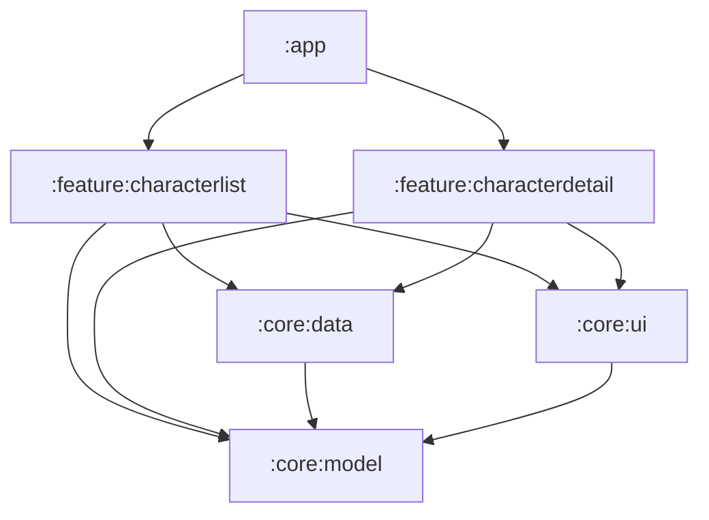

# 🧪 Lab 1 – Übung 1.3: Den Monolithen modularisieren

Dieser Branch (`lab-1-uebung-1.3`) enthält die **Musterlösung zu Übung 1.2** und ist gleichzeitig der Startpunkt für Übung 1.3.

> 📘 Die Theorie zu dieser Übung finden Sie im [HANDOUT.md](HANDOUT.md), **Modul 3** (Modularisierung) und **Modul 4.4** (Hilt im modularen Projekt). Das Gradle-Setup für Library-Module steht in **Anhang A, Schritt 3**. Für den letzten Schritt brauchen Sie **Modul 3.4** (Convention Plugins).

---

## ✅ Rückblick: Die Lösung zu Übung 1.2

Das ist neu bzw. anders gegenüber dem Branch `lab-1-uebung-1.2`:

* **`character/data/db/`**: die neue Datenbank-Schicht mit `CharacterEntity` (mit `isFavorite`-Spalte und abgeflachten `origin`/`location`-Feldern), `CharacterDao` (beobachtbare `Flow`-Queries + `@Upsert`) und `RickAndMortyDatabase`.
* **`di/DatabaseModule.kt`**: stellt Datenbank und DAO im `SingletonComponent` bereit.
* **`CharacterRepository`**: strikt getrennte Pfade. `observeCharacters()`/`observeCharacter(id)` lesen **nur** aus der DB, `refreshCharacters()`/`refreshCharacter(id)` schreiben **nur** API → DB. Die Denksportaufgabe: Vor dem Upsert werden die aktuellen Favoriten-IDs gelesen, damit der Refresh sie nicht plattmacht.
* **`CharacterListViewModel`**: kein manuell gepflegter `MutableStateFlow` für Daten mehr, `combine(observeCharacters(), isRefreshFailed)` + `stateIn` erzeugen den UI State deklarativ (exakt der Code aus Handout 5.5). `toggleFavorite` delegiert nur noch an das Repository, die UI aktualisiert sich über den Flow von selbst.
* **`CharacterListUiState.Success`**: hat jetzt das Flag `isRefreshFailed`; der Screen zeigt dann ein dezentes Offline-Banner statt eines Fehler-Screens.
* **`app/src/test/`**: Repository-Tests mit `FakeRickAndMortyApi` und `FakeCharacterDao` (`./gradlew test`): Refresh schreibt in die DB, fehlgeschlagener Refresh lässt den Cache intakt, Favoriten überleben Neustart *und* Refresh.

Vergleichen Sie gerne mit Ihrer eigenen Lösung: `git diff lab-1-uebung-1.2 lab-1-uebung-1.3`

---

## 🔍 Die Ausgangslage

Unsere App ist jetzt sauber geschichtet, aber alle Schichten leben in **einem** Gradle-Modul. Die Architektur-Grenzen (UI greift nicht auf Retrofit zu, Repository kennt kein Compose) sind reine Disziplin: Nichts hindert den nächsten Commit daran, sie zu verletzen. Und bei jedem Build kompiliert Gradle potenziell alles neu.

In Enterprise-Projekten zieht man diese Grenzen physisch: als **Gradle-Module**, deren Abhängigkeiten der Compiler erzwingt (Handout, Modul 3).

## 🎯 Das Ziel

Zerlegen Sie die App in Module nach dem Schema aus Modul 3.2, **ohne eine einzige Zeile Logik zu ändern**. Reines Verschieben plus Gradle-Verdrahtung:



| Modul | Inhalt |
| --- | --- |
| `:app` | `RickAndMortyApplication`, `MainActivity` (Navigation-Verdrahtung) |
| `:feature:characterlist` | `CharacterListScreen`, `CharacterItem`, ViewModel, UiState, `CharacterListRoute` |
| `:feature:characterdetail` | `CharacterDetailScreen`, ViewModel, UiState, `CharacterDetailRoute` |
| `:core:data` | `CharacterRepository`, `api/` (Retrofit), `db/` (Room), Hilt-Module, **die Tests!** |
| `:core:model` | `Character`, `Place`, `CharacterSampleData` |
| `:core:ui` | `Theme`, `PreviewContainer` |

## 🛠 Die Aufgaben im Detail

### Schritt 1: Gradle vorbereiten

1. Ergänzen Sie den `android-library`-Plugin-Alias in der `libs.versions.toml` (Anhang A, Schritt 3).
2. Registrieren Sie die fünf neuen Module in der `settings.gradle.kts` (`include(":core:model")`, ...).
3. Geben Sie jedem Modul eine `build.gradle.kts` nach der Vorlage aus Anhang A, mit **eindeutigem `namespace`** (z.B. `ninja.droiddojo.rickandmorty.core.data`).

### Schritt 2: Code umziehen

Verschieben Sie die Dateien gemäß der Tabelle oben (die Kotlin-Packages können dabei bleiben, wie sie sind; nur der physische Ort ändert sich). Arbeiten Sie sich **von unten nach oben** durch den Graphen: erst `:core:model`, dann `:core:ui` und `:core:data`, dann die Features, zuletzt `:app`.

### Schritt 3: Abhängigkeiten verdrahten

Deklarieren Sie in jedem Modul **nur, was es wirklich braucht**: Plugins (`ksp`/`hilt` nur, wo Hilt oder Room verwendet wird; `kotlin-compose` nur in UI-Modulen; `kotlin-serialization` nur, wo `@Serializable` vorkommt) und Dependencies.

**Die Knobelfrage dabei:** `CharacterRepository` gibt in seiner öffentlichen API `Flow<List<Character>>` zurück. Der Typ `Character` aus `:core:model` sickert also zu allen Konsumenten von `:core:data` durch. Was heißt das für die Wahl zwischen `implementation(projects.core.model)` und `api(projects.core.model)` in `:core:data`? (Handout, Modul 3.2)

### Schritt 4: Kleinigkeiten reparieren

* **Ressourcen:** Der Detail-Screen nutzt `stringResource(R.string...)`: der String muss mit ins Feature-Modul umziehen, und der `R`-Import zeigt danach auf den Namespace des Feature-Moduls.
* **Sichtbarkeit:** Alles, was ein anderes Modul benutzt, muss `public` sein (in Kotlin der Default; prüfen Sie trotzdem, ob nichts `internal`/`private` im Weg ist).
* **Hilt:** Die `@Module`-Rezepte ziehen einfach mit in `:core:data`, Hilt sammelt sie beim Bauen von `:app` automatisch ein (Handout, Modul 4.4). An den ViewModels und Screens ändert sich **nichts**.

### Schritt 5: Convention Plugins – das Boilerplate wieder abbauen

Halten Sie kurz inne und zählen Sie: Fünfmal `compileSdk`, fünfmal `minSdk`, fünfmal Java 11. Sie haben gerade eigenhändig den Copy-Paste-Drift aus Modul 3.4 angelegt. Zeit, ihn wieder einzufangen.

1. Ergänzen Sie in der `libs.versions.toml` den Library-Eintrag `android-gradle-plugin` (Group `com.android.tools.build`, Name `gradle`, Version-Ref `agp`), denn der Included Build braucht AGP als Dependency, um `LibraryExtension` konfigurieren zu können.
2. Legen Sie den Included Build `build-logic` an (Struktur und Plugin-Code: Modul 3.4):
   * `build-logic/settings.gradle.kts`: bindet u.a. die `libs.versions.toml` des Hauptprojekts als Version Catalog ein.
   * `build-logic/build.gradle.kts`: `kotlin-dsl`-Plugin, AGP als `compileOnly`-Dependency und der `gradlePlugin`-Block, der die Plugin-IDs auf die Klassen mappt.
   * `AndroidLibraryConventionPlugin` → `rickandmorty.android.library`: wendet `com.android.library` an und setzt compileSdk/minSdk/Java (exakt die Vorlage aus Anhang A, nur eben **einmal**).
   * `AndroidFeatureConventionPlugin` → `rickandmorty.android.feature`: wendet die Library-Convention an und ergänzt alles, was **beide** Feature-Module gemeinsam haben (Compose, Hilt/KSP und die geteilten Dependencies).
3. Binden Sie `build-logic` im Hauptprojekt ein: `pluginManagement { includeBuild("build-logic") }` ganz oben in der `settings.gradle.kts`.
4. Registrieren Sie die beiden Plugin-IDs im `[plugins]`-Block der `libs.versions.toml`, **ohne Version**, denn die Plugins kommen aus dem Included Build (Snippet: Modul 3.4).
5. Refactoren Sie die fünf Modul-Build-Dateien: Feature-Module → `alias(libs.plugins.rickandmorty.android.feature)`; `:core:model` → `alias(libs.plugins.rickandmorty.android.library)`; `:core:ui` und `:core:data` → Library-Convention plus ihre modul-spezifischen Extras (`kotlin-compose` bzw. `ksp`/`hilt`/`kotlin-serialization`). Übrig bleiben pro Modul: `namespace` und das, was genau dieses Modul braucht.
6. `:app` bleibt klassisch. Warum, steht in der Faustregel von Modul 3.4.

## ✅ Definition of Done

- [ ] Die App baut und verhält sich exakt wie vorher (Liste, Detail, Favoriten, Offline-Banner).
- [ ] Kein Feature-Modul hängt von einem anderen Feature-Modul ab.
- [ ] Kein `:core:*`-Modul hängt von einem `:feature:*`-Modul oder von `:app` ab.
- [ ] Die Repository-Tests liegen jetzt in `:core:data` und `./gradlew test` läuft weiterhin grün.
- [ ] Bonus-Check: Versuchen Sie testweise, aus dem Listen-Screen direkt `RickAndMortyApi` zu importieren, während `:core:data` den Modell-Typ nur per `implementation` weitergibt, und beobachten Sie, wie der Compiler die Architektur-Grenze durchsetzt.
- [ ] Nach Schritt 5: `compileSdk`, `minSdk` und die Java-Version stehen (außer in `:app`) nur noch an **einer** Stelle im Projekt: in `build-logic`.
- [ ] Die `build.gradle.kts` der Feature-Module besteht nur noch aus Convention-Plugin, `namespace` und modul-spezifischen Dependencies.

## 💡 Tipps

* Nach jedem Modul-Umzug: **Sync + Build**. Verschieben Sie nie alles auf einmal, sonst werden die Fehlermeldungen unübersichtlich.
* Android Studio hilft beim Verschieben (Drag & Drop im Project-View behält die Packages bei).
* Die Fehlermeldung "Unresolved reference" in einem Modul heißt fast immer: fehlende `implementation(projects.…)`-Zeile oder fehlende Library-Dependency in **diesem** Modul. Module erben keine Dependencies!
* Für Schritt 5: Meldet Gradle *"Plugin with id 'rickandmorty.android.library' not found"*, fehlt fast immer das `includeBuild("build-logic")` in der `settings.gradle.kts` oder der Gradle-Sync nach der Änderung. Fehlt dagegen der `libs.plugins.rickandmorty...`-Accessor, ist der `[plugins]`-Eintrag in der `libs.versions.toml` nicht da.
* An den Version Catalog kommt ein Convention Plugin nicht über die `libs`-Accessors, sondern so:

  ```kotlin
  val libs = extensions.getByType<VersionCatalogsExtension>().named("libs")
  dependencies {
      add("implementation", platform(libs.findLibrary("androidx-compose-bom").get()))
  }
  ```
* **Ausblick:** Den nächsten Reifegrad (die api/impl-Trennung aus Modul 3.3) heben wir uns für Übung 2.2 auf: Sie lohnt erst, wenn das Repository ein Interface hat.

---

**Fertig?** Die Musterlösung finden Sie im Branch `lab-1-final`, dem Abschluss von Tag 1.
